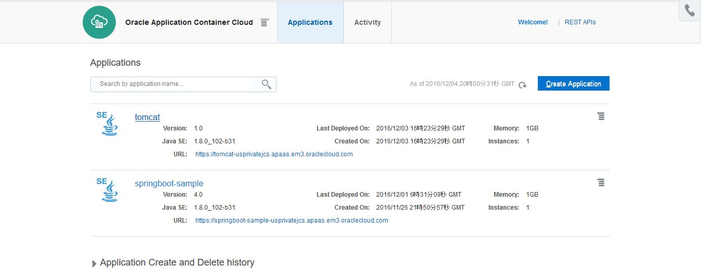
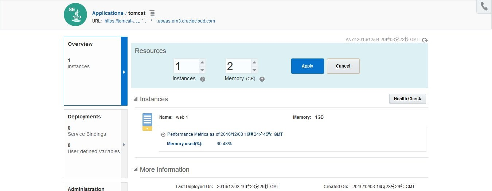
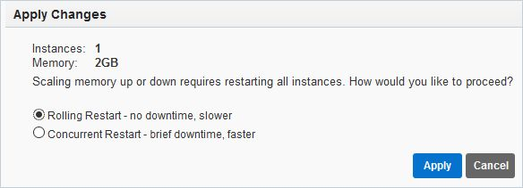
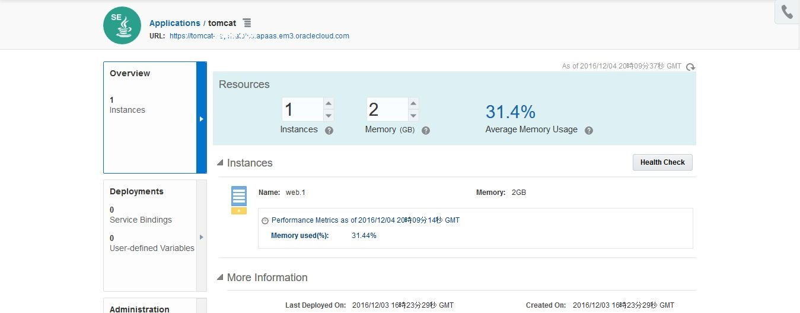

---
# ORACLE Cloud-Native DevOps workshop
----
## UI 及び PSM CLI を用いた Application Cloud Service のスケールアップ/スケールダウン

### 説明

Application Container Cloud Service は Java SE Cloud Service, Node CLoud Service 及び PHP Cloud Service を含んでいる。Application Container Cloud Service は 軽量なアプリケーション実行環境の基盤を提供しており、Oracle Cloud 上で Java SE 7, Java SE 8, Node.js そして PHP のアプリケーションを稼働させる事ができる。

Oracle は、PaaS Service Manager (PSM) コマンド・ライン・インターフェースを提供しており、これを使って Application Container Cloud Service や、Database Cloud Service, Java Cloud Service をコマンドやシェルスクリプトから作成、監視、また管理を行う事ができる。

PSM に関するさらなる情報は、[documentation](https://docs.oracle.com/cloud/latest/jcs_gs/jcs_cli.htm) を参照。

### チュートリアルについて
このチュートリアルは、以下を実施する:

- PaaS Service Manager Command Line (PSM CLI) のインストールと構成
- UI を用いた Application Container Cloud Service のスケールアップ
- PSM コマンド・ラインを用いた Application Container Cloud Service のスケールダウン

### 前提

- [cURL command-line tool](http://curl.haxx.se/download.html) を使用できる事。Linux では多くのディストリビューションでcURLはインストール済である。また、Windowsへのインストールも容易に行える。また、REST APIを実行するその他のツールをダウンロードして使用する事もできる。 (cURLのインストール方法はこのチュートリアルの対象外である。)
- Python 3.3 以降がインストールされている事。(Python のインストール方法はこのチュートリアルの対象外である。)
- チュートリアル: [Tomcat ベースのアプリケーションを Application Container Cloud Service へデプロイ](accs-tomcat/README.md) を実施済みである事。

### 手順

#### コマンド・ライン・ツールの最新版のダウンロード

まず、PSM CLI コマンド・ライン・ツールの最新版をダウンロードするために、REST API のサーバ名を確認する。
- **psm.us.oraclecloud.com**: US のデータセンターにログインするアカウントの場合
- **psm.europe.oraclecloud.com**: US 以外のアカウントの場合

cURL でリクエスト送信する。次のフォーマットで実施:

``` bash
curl -X GET -u username:password -H X-ID-TENANT-NAME:<identitydomain> https://<rest-server>/paas/core/api/v1.1/cli/<identitydomain>/client -o /u01/psmcli.zip
```

これにより、レスポンスデータを `psmcli.zip` に書き込む。

ターミナルを開き、上記 cURL コマンドに認証情報、REST API サーバ名、アイデンティティ・ドメイン名をつけて実行する。

```bash
$ curl -X GET -u shinyay:password -H X-ID-TENANT-NAME:iddomain https://psm.europe.oraclecloud.com/paas/core/api/v1.1/cli/iddomain/client -o /u01/psmcli.zip

% Total    % Received % Xferd  Average Speed   Time    Time     Time  Current
                               Dload  Upload   Total   Spent    Left  Speed
100 47570    0 47570    0     0  18415      0 --:--:--  0:00:02 --:--:-- 18982
```


`/u01` に移動し、ダウンロードした **psmcli.zip** ファイルを確認する。

```bash
$ cd /u01
$ ls -l
合計 56060
drwxr-xr-x 1 syanagih なし        0 12月  4 01:15 apache-tomcat-8.5.6
-rw-r--r-- 1 syanagih なし  9304958 10月  7 05:39 apache-tomcat-8.5.6.tar.gz
-rw-r--r-- 1 syanagih なし    47570 12月  5 04:32 psmcli.zip
-rw-r--r-- 1 syanagih なし 48044089 12月  4 00:50 tomcat.sample.tgz
```

#### PSM コマンド・ライン・インターフェースのインストール

Python のパッケージとして、PSM CLI をインストールする。

ターミナルを開き、`/u01` ディレクトリに移動し、***PIP*** を使って Python パッケージにインストールする。

```bash
$ cd /u01
$ pip install -U ./psmcli.zip
Processing ./psmcli.zip
Collecting requests<=2.8.1,>=2.7.0 (from psmcli==1.1.10)
  Downloading requests-2.8.1-py2.py3-none-any.whl (497kB)
    100% |████████████████████████████████| 501kB 1.5MB/s
Collecting keyring<=5.6,>=5.4 (from psmcli==1.1.10)
  Downloading keyring-5.6.tar.gz (69kB)
    100% |████████████████████████████████| 71kB 3.5MB/s
Collecting colorama==0.3.3 (from psmcli==1.1.10)
  Downloading colorama-0.3.3.tar.gz
Collecting PyYAML==3.11 (from psmcli==1.1.10)
  Downloading PyYAML-3.11.zip (371kB)
    100% |████████████████████████████████| 378kB 1.9MB/s
Building wheels for collected packages: keyring, colorama, PyYAML
  Running setup.py bdist_wheel for keyring ... done
  Stored in directory: /home/syanagih/.cache/pip/wheels/19/3c/d7/44703da2a323b0126bd306331a1930ef7491ef021d3998aa28
  Running setup.py bdist_wheel for colorama ... done
  Stored in directory: /home/syanagih/.cache/pip/wheels/21/c5/cf/63fb92293f3ad402644ccaf882903cacdb8fe87c80b62c84df
  Running setup.py bdist_wheel for PyYAML ... done
  Stored in directory: /home/syanagih/.cache/pip/wheels/4a/bf/14/d79994d19a59d4f73efdafb8682961f582d45ed6b459420346
Successfully built keyring colorama PyYAML
Installing collected packages: requests, keyring, colorama, PyYAML, psmcli
  Running setup.py install for psmcli ... done
Successfully installed PyYAML-3.11 colorama-0.3.3 keyring-5.6 psmcli-1.1.10 requests-2.8.1
```

#### コマンド・ライン・インターフェースの確認

PSM CLI コマンドを実施する前に、Oracle Cloud への接続を確認する

ターミナルを開き、`psm setup` コマンドを実行する。そして、クラウド・ユーザ名と、パスワード、アイデンティティ・ドメイン名を入力する。

```bash
$ psm setup
Username: shinyay
Password:
Retype Password:
Identity domain: iddomain
Region [us]: emea
Output format [json]:
----------------------------------------------------
'psm setup' was successful. Available services are:

  o CONTAINER : Oracle Container Cloud Service
  o CloudStack : Oracle Cloud Stack
  o IDCS : Oracle Identity Cloud Service
  o MySQLCS : Oracle MySQL Cloud Service
  o accs : Oracle Application Container Cloud Service
  o dbcs : Oracle Database Cloud Service
  o ggcs : Oracle GoldenGate Cloud Service
  o jcs : Oracle Java Cloud Service
  o stack : Oracle Cloud Stack Manager
----------------------------------------------------
```

CLI は使用できるコマンドをヘルプを提供している。使用するには、`psm help` を実行する。

```bash
$ psm help

DESCRIPTION
  A command line tool to interact with Oracle Cloud Platform Services (PaaS)

SYNOPSIS
  psm <service> <command> [parameters]

AVAILABLE SERVICES
  o CONTAINER
       Oracle Container Cloud Service
  o CloudStack
       Oracle Cloud Stack
  o IDCS
       Oracle Identity Cloud Service
  o MySQLCS
       Oracle MySQL Cloud Service
  o accs
       Oracle Application Container Cloud Service
  o dbcs
       Oracle Database Cloud Service
  o ggcs
       Oracle GoldenGate Cloud Service
  o jcs
       Oracle Java Cloud Service
  o stack
       Oracle Cloud Stack Manager
  o setup
       Configure psm client options
  o update
       Update psm client to latest version
  o log
       View or update psm client log level
  o help
       Show help

AVAILABLE PARAMETERS
  -v, --version
       Show current version of psm client
```


#### UI を用いた Application Container Cloud Service のスケールアップ

Application Conainer Cloud Service コンソールへ移動する。コンソールをまだ開いていない場合は、Oracle Cloud へ[サインイン](../common/sign.in.to.oracle.cloud.md) し [(https://cloud.oracle.com/sign-in)](https://cloud.oracle.com/sign-in)、ログイン後、ダッシュボード画面の Application Container Cloud Service のドロップダウンメニューから **サービス・コンソールを開く** を選択する。


Application Container Cloud Service のサービス・コンソールから、**tomcat** リンクをクリックする。




概要ページでは、サービスに割り当てられているリソースが表示される。メモリの構成を **1GB から 2GB** へ変更し、**Apply** をクリックする。




スケーリング操作の確認では、**Apply** をクリックする。サービスが変更を適用するために再起動する。




再起注は、Application Container Cloud Service のアイコンに砂時計が表示される。数分後、ページの更新のため、リフレッシュアイコンをクリックする。


再起動が終わると、砂時計は消えて設定したメモリサイズが表示される。




#### PSM コマンド・ライン・インターフェースを用いた Application Container Cloud Service のスケールダウン

インスタンスをスケールダウンして元に戻すために、PSM CLI を使用する。ターミナルを開き、Application Container Cloud Service にデプロイされているアプリケーションの一覧を表示する。
`psm accs apps` コマンドでアプリケーションの一覧を表示できる。

```json
$ psm accs apps
{
    "applications":[
        {
            "identityDomain":"iddomain",
            "appId":"834fcd58-e4a7-43ea-b0fa-b30ef0625afb",
            "name":"tomcat",
            "status":"RUNNING",
            "createdBy":"shinyay",
            "creationTime":"2016-12-03T16:23:29.372+0000",
            "lastModifiedTime":"2016-12-03T16:23:29.323+0000",
            "subscriptionType":"MONTHLY",
            "isClustered":false,
            "requiresAntiAffinity":false,
            "instances":[
                {
                    "name":"web.1",
                    "status":"RUNNING",
                    "memory":"2G",
                    "instanceURL":"https://psm.europe.oraclecloud.com/paas/service/apaas/api/v1.1/apps/iddomain/tomcat/instances/web.1"
                }
            ],
            "runningDeployment":{
                "deploymentId":"63f92478-e659-477f-8bbb-af407a198be5",
                "deploymentStatus":"READY",
                "deploymentURL":"https://psm.europe.oraclecloud.com/paas/service/apaas/api/v1.1/apps/iddomain/tomcat/deployments/63f92478-e659-477f-8bbb-af407a198be5"
            },
            "lastestDeployment":{
                "deploymentId":"63f92478-e659-477f-8bbb-af407a198be5",
                "deploymentStatus":"READY",
                "deploymentURL":"https://psm.europe.oraclecloud.com/paas/service/apaas/api/v1.1/apps/iddomain/tomcat/deployments/63f92478-e659-477f-8bbb-af407a198be5"
            },
            "appURL":"https://psm.europe.oraclecloud.com/paas/service/apaas/api/v1.1/apps/iddomain/tomcat",
            "webURL":"https://tomcat-iddomain.apaas.em3.oraclecloud.com"
        },
        {
            "identityDomain":"iddomain",
            "appId":"5cb70c95-c2dc-4661-8557-f5f1ffb855b8",
            "name":"springboot-sample",
            "status":"RUNNING",
            "createdBy":"shinyay",
            "creationTime":"2016-11-26T21:50:57.321+0000",
            "lastModifiedTime":"2016-12-01T06:31:09.463+0000",
            "subscriptionType":"HOURLY",
            "isClustered":false,
            "requiresAntiAffinity":false,
            "instances":[
                {
                    "name":"web.1",
                    "status":"RUNNING",
                    "memory":"1G",
                    "instanceURL":"https://psm.europe.oraclecloud.com/paas/service/apaas/api/v1.1/apps/iddomain/springboot-sample/instances/web.1"
                }
            ],
            "runningDeployment":{
                "deploymentId":"79952c99-6619-4c39-bff6-884ff7bb0f13",
                "deploymentStatus":"READY",
                "deploymentURL":"https://psm.europe.oraclecloud.com/paas/service/apaas/api/v1.1/apps/iddomain/springboot-sample/deployments/79952c99-6619-4c39-bff6-884ff7bb0f13"
            },
            "lastestDeployment":{
                "deploymentId":"79952c99-6619-4c39-bff6-884ff7bb0f13",
                "deploymentStatus":"READY",
                "deploymentURL":"https://psm.europe.oraclecloud.com/paas/service/apaas/api/v1.1/apps/iddomain/springboot-sample/deployments/79952c99-6619-4c39-bff6-884ff7bb0f13"
            },
            "appURL":"https://psm.europe.oraclecloud.com/paas/service/apaas/api/v1.1/apps/iddomain/springboot-sample",
            "webURL":"https://springboot-sample-iddomain.apaas.em3.oraclecloud.com"
        }
    ]
}

```

**tomcat** アプリケーションのメモリ構成が **2GB** になっている事が確認できる。次に、PSM CLI を使って Application Container Cloud Service をスケールダウンする。まず、`accs scale` コマンドの使用法を確認する。

```bash
$ psm accs scale help

DESCRIPTION
  Scale an Oracle Application Container Cloud Service instance for a specified
  application to change instance count and memory limit

SYNOPSIS
  psm accs scale [parameters]
       -n, --app-name <value>
       [-i, --instances <value>]
       [-m, --memory <value>]
       [-o, --mode <value>]
       [-of, --output-format <value>]

AVAILABLE PARAMETERS
  -n, --app-name    (string)
       Name of the application

  -i, --instances    (integer)
       Number of instances

  -m, --memory    (string)
       Memory limit

  -o, --mode    (string)
       Mode

  -of, --output-format    (string)
       Desired output format. Valid values are [json, html]

EXAMPLES
  psm accs scale -n ExampleApp -i 2 -m 2G -o rolling

```

このように、`<コマンド> help` を実行すると、各コマンドのヘルプを参照できる。

ヘルプによるとメモリをスケールするには、アプリケーションとメモリサイズ(上限/下限)を必要とする。次のように実行する:

```json
$ psm accs scale -n tomcat -m 1G
{
    "processes":[
        {
            "processName":"web",
            "instances":[
                {
                    "name":"web.1",
                    "status":"RUNNING",
                    "memory":"2G",
                    "instanceURI":"https://psm.europe.oraclecloud.com/paas/service/apaas/api/v1.1/apps/iddomain/tomcat/instances/web.1"
                }
            ]
        }
    ],
    "identityDomain":"iddomain",
    "applicationDetails":"tomcat"
}
Job ID : 3067407
```

ジョブが作成されてサービスのメモリサイズが変更される。PSM CLI を使用してアプリケーションに発生した詳細情報を確認する事ができる。 `psm accs app -n tomcat` を実行する:

```json
$ psm accs app -n tomcat
{
    "identityDomain":"iddomain",
    "appId":"834fcd58-e4a7-43ea-b0fa-b30ef0625afb",
    "name":"tomcat",
    "status":"RUNNING",
    "createdBy":"shinyay",
    "creationTime":"2016-12-03T16:23:29.372+0000",
    "lastModifiedTime":"2016-12-03T16:23:29.323+0000",
    "subscriptionType":"MONTHLY",
    "isClustered":false,
    "requiresAntiAffinity":false,
    "instances":[
        {
            "name":"web.1",
            "status":"RUNNING",
            "memory":"2G",
            "instanceURL":"https://psm.europe.oraclecloud.com/paas/service/apaas/api/v1.1/apps/iddomain/tomcat/instances/web.1"
        }
    ],
    "runningDeployment":{
        "deploymentId":"63f92478-e659-477f-8bbb-af407a198be5",
        "deploymentStatus":"READY",
        "deploymentURL":"https://psm.europe.oraclecloud.com/paas/service/apaas/api/v1.1/apps/iddomain/tomcat/deployments/63f92478-e659-477f-8bbb-af407a198be5"
    },
    "lastestDeployment":{
        "deploymentId":"63f92478-e659-477f-8bbb-af407a198be5",
        "deploymentStatus":"READY",
        "deploymentURL":"https://psm.europe.oraclecloud.com/paas/service/apaas/api/v1.1/apps/iddomain/tomcat/deployments/63f92478-e659-477f-8bbb-af407a198be5"
    },
    "currentOngoingActivity":"Scaling Application",
    "appURL":"https://psm.europe.oraclecloud.com/paas/service/apaas/api/v1.1/apps/iddomain/tomcat",
    "webURL":"https://tomcat-iddomain.apaas.em3.oraclecloud.com",
    "message":[
        "Initializing application scaling from 1x2G to 1x1G..."
    ]
}

```

再起動処理が発生すると、進行中の操作として `"Initialized application scaling from 1x2G to 1x1G..."` を確認する事ができる。このコマンドは詳細情報を取得するのに便利である。何度が実行すると、再起動が終了し次のように表示される。:

```json
$ psm accs app -n tomcat
{
    "identityDomain":"iddomain",
    "appId":"834fcd58-e4a7-43ea-b0fa-b30ef0625afb",
    "name":"tomcat",
    "status":"RUNNING",
    "createdBy":"shinyay",
    "creationTime":"2016-12-03T16:23:29.372+0000",
    "lastModifiedTime":"2016-12-03T16:23:29.323+0000",
    "subscriptionType":"MONTHLY",
    "isClustered":false,
    "requiresAntiAffinity":false,
    "instances":[
        {
            "name":"web.1",
            "status":"RUNNING",
            "memory":"2G",
            "instanceURL":"https://psm.europe.oraclecloud.com/paas/service/apaas/api/v1.1/apps/iddomain/tomcat/instances/web.1"
        }
    ],
    "runningDeployment":{
        "deploymentId":"63f92478-e659-477f-8bbb-af407a198be5",
        "deploymentStatus":"READY",
        "deploymentURL":"https://psm.europe.oraclecloud.com/paas/service/apaas/api/v1.1/apps/iddomain/tomcat/deployments/63f92478-e659-477f-8bbb-af407a198be5"
    },
    "lastestDeployment":{
        "deploymentId":"63f92478-e659-477f-8bbb-af407a198be5",
        "deploymentStatus":"READY",
        "deploymentURL":"https://psm.europe.oraclecloud.com/paas/service/apaas/api/v1.1/apps/iddomain/tomcat/deployments/63f92478-e659-477f-8bbb-af407a198be5"
    },
    "appURL":"https://psm.europe.oraclecloud.com/paas/service/apaas/api/v1.1/apps/iddomain/tomcat",
    "webURL":"https://tomcat-iddomain.apaas.em3.oraclecloud.com"
}

```


これで **tomcat** アプリケーションは、メモリ 1GB を使用してリクエストを受け付けるようになった。
