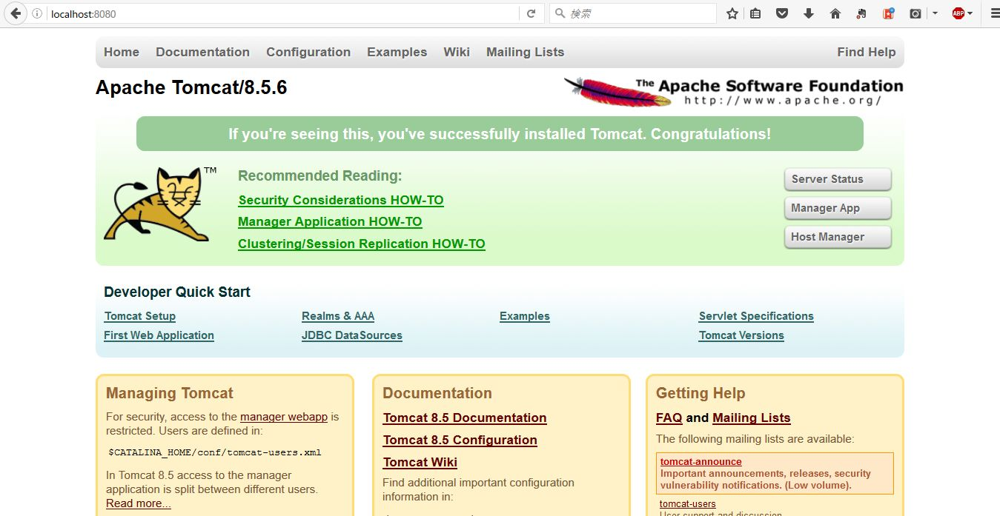
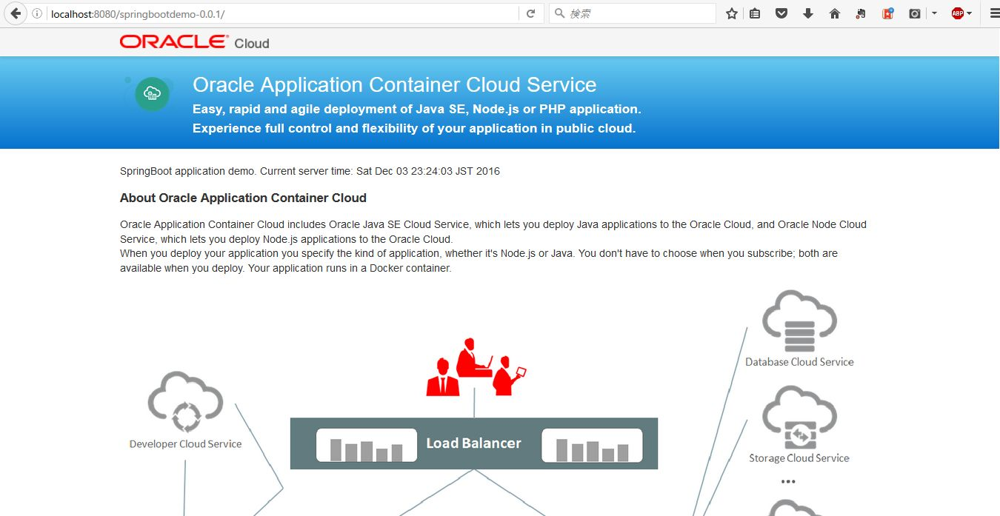
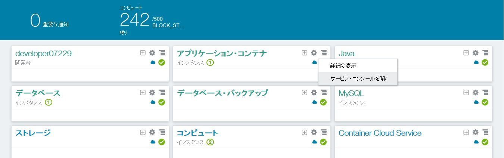
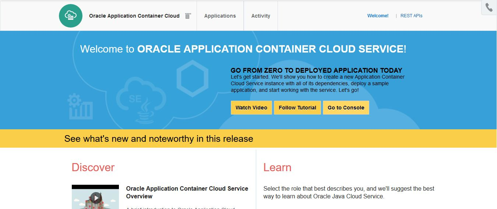
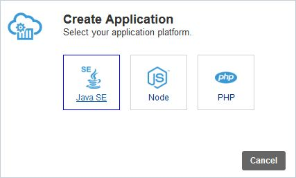
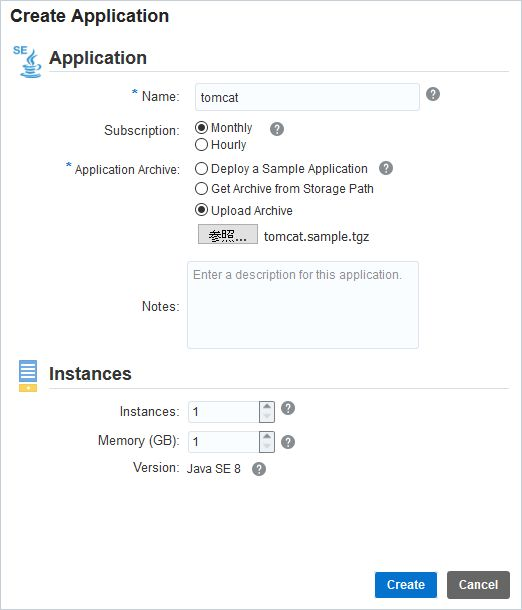
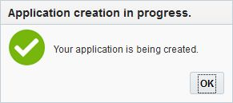
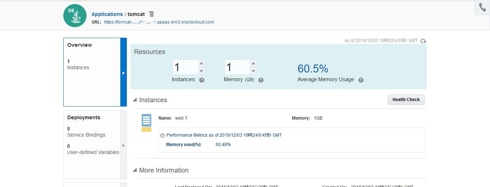
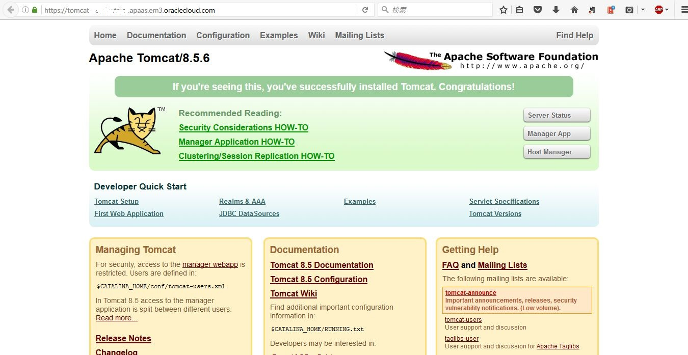
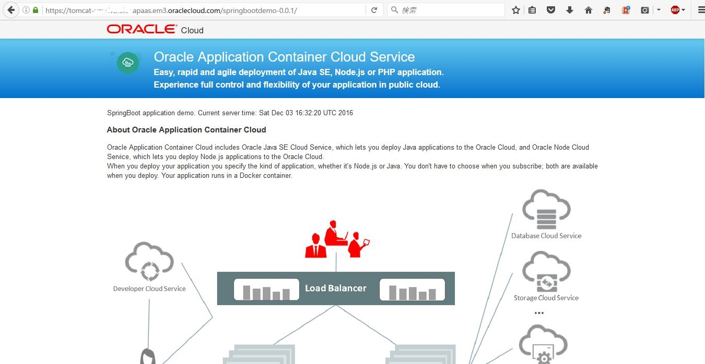

---
# ORACLE Public Cloud Service tutorial
-----
## Tomcat ベースのアプリケーションを Application Container Cloud Service へデプロイ

### 説明

Application Container Cloud Service は Java SE Cloud Service, Node CLoud Service 及び PHP Cloud Service を含んでいる。Application Container Cloud Service は 軽量なアプリケーション実行環境の基盤を提供しており、Oracle Cloud 上で Java SE 7, Java SE 8, Node.js そして PHP のアプリケーションを稼働させる事ができる。

### チュートリアルについて
このチュートリアルは、以下を実施する:

- 既存の Tomcat 環境を Application Container Cloud Service 用にパッケージする
- Application Container Cloud Service へデプロイする

### 前提

- Application Container Cloud Service が利用できるアカウントを保有している事

### 手順

#### オンプレミスでサンプル・アプリケーションを Tomcat にデプロイ

`/u01` フォルダに Apache Tomcat 8.5.6 を 次の場所からダウンロードする。
-  [http://archive.apache.org/dist/tomcat/tomcat-8/v8.5.6/bin/apache-tomcat-8.5.6.tar.gz](http://archive.apache.org/dist/tomcat/tomcat-8/v8.5.6/bin/apache-tomcat-8.5.6.tar.gz)

上記リンクが切れている場合は、Tomcat サイト ( [https://tomcat.apache.org/](https://tomcat.apache.org/)) で最新のバージョン、または求めているバージョンの適切なダウンロード・リンクを見つける。

```bash
$ cd /u01
$ wget http://archive.apache.org/dist/tomcat/tomcat-8/v8.5.6/bin/apache-tomcat-8.5.6.tar.gz -P /u01/
--2016-12-03 22:36:23--  http://archive.apache.org/dist/tomcat/tomcat-8/v8.5.6/bin/apache-tomcat-8.5.6.tar.gz
archive.apache.org (archive.apache.org) をDNSに問いあわせています... 163.172.17.199
archive.apache.org (archive.apache.org)|163.172.17.199|:80 に接続しています... 接続しました。
HTTP による接続要求を送信しました、応答を待っています... 200 OK
長さ: 9304958 (8.9M) [application/x-gzip]
`/u01/apache-tomcat-8.5.6.tar.gz' に保存中

apache-tomcat-8.5.6.tar.gz                100%[==================================================================================>]   8.87M   111KB/s    in 53s

2016-12-03 22:37:17 (172 KB/s) - `/u01/apache-tomcat-8.5.6.tar.gz' へ保存完了 [9304958/9304958]
```

`/u01` にダウンロードしたアーカイブファイルを展開する。

```bash
$ tar zxvf apache-tomcat-8.5.6.tar.gz -C /u01
apache-tomcat-8.5.6/conf/
apache-tomcat-8.5.6/conf/catalina.policy
apache-tomcat-8.5.6/conf/catalina.properties
apache-tomcat-8.5.6/conf/context.xml
apache-tomcat-8.5.6/conf/jaspic-providers.xml
apache-tomcat-8.5.6/conf/jaspic-providers.xsd
apache-tomcat-8.5.6/conf/logging.properties
apache-tomcat-8.5.6/conf/server.xml
apache-tomcat-8.5.6/conf/tomcat-users.xml
apache-tomcat-8.5.6/conf/tomcat-users.xsd
apache-tomcat-8.5.6/conf/web.xml
apache-tomcat-8.5.6/bin/
apache-tomcat-8.5.6/lib/
apache-tomcat-8.5.6/logs/
apache-tomcat-8.5.6/temp/
apache-tomcat-8.5.6/webapps/
apache-tomcat-8.5.6/webapps/ROOT/
...
...
...
...
apache-tomcat-8.5.6/bin/catalina.sh
apache-tomcat-8.5.6/bin/configtest.sh
apache-tomcat-8.5.6/bin/daemon.sh
apache-tomcat-8.5.6/bin/digest.sh
apache-tomcat-8.5.6/bin/setclasspath.sh
apache-tomcat-8.5.6/bin/shutdown.sh
apache-tomcat-8.5.6/bin/startup.sh
apache-tomcat-8.5.6/bin/tool-wrapper.sh
apache-tomcat-8.5.6/bin/version.sh
```

`catalina.sh` スクリプトを使用して Tomcat サーバを起動する。

```bash
$ ./apache-tomcat-8.5.6/bin/catalina.sh start
Using CATALINA_BASE:   /u01/apache-tomcat-8.5.6
Using CATALINA_HOME:   /u01/apache-tomcat-8.5.6
Using CATALINA_TMPDIR: /u01/apache-tomcat-8.5.6/temp
Using JRE_HOME:        /d/JAva/jdk1.8.0_102
Using CLASSPATH:       /u01/apache-tomcat-8.5.6/bin/bootstrap.jar:/u01/apache-tomcat-8.5.6/bin/tomcat-juli.jar
Tomcat started.
```

ブラウザで次の URL を開き Tomca の稼働を確認する: `http://localhost:8080/`

Apache Tomcat サーバのホーム画面が確認できる。




次に Spring Boot サンプル・アプリケーションをビルドする。`<クローンしたGitリポジトリ>/springboot-sample` に移動し、`mvn-install` を実行する。

```bash
$ cd springboot-sample
$ mvn install$ mvn install
[INFO] Scanning for projects...
[INFO]
[INFO] ------------------------------------------------------------------------
[INFO] Building demo 0.0.1
[INFO] ------------------------------------------------------------------------
[INFO]
[INFO] --- maven-resources-plugin:2.6:resources (default-resources) @ springbootdemo ---
[INFO] Using 'UTF-8' encoding to copy filtered resources.
[INFO] Copying 1 resource
[INFO] Copying 8 resources
[INFO]
[INFO] --- maven-compiler-plugin:3.1:compile (default-compile) @ springbootdemo ---
[INFO] Changes detected - recompiling the module!
...
...
...
[INFO] ------------------------------------------------------------------------
[INFO] BUILD SUCCESS
[INFO] ------------------------------------------------------------------------
[INFO] Total time: 25.460 s
[INFO] Finished at: 2016-12-03T22:58:14+09:00
[INFO] Final Memory: 29M/261M
[INFO] ------------------------------------------------------------------------

```

アプリケーションのデプロイは、アプリケーション・アーカイブファイル(`springbootdemo-0.0.1.war`) を `<Tomcatインストール・ディレクトリ>/webapps` フォルダにコピーで実施する。

```bash
$ cp -p target/springbootdemo-0.0.1.war /u01/apache-tomcat-8.5.6/webapps/

```

サンプル・アプリケーションのデプロイを `tail` コマンドでログファイルを確認する

```log
2016-12-03 23:07:28.561  INFO 4892 --- [ost-startStop-2] s.w.s.m.m.a.RequestMappingHandlerMapping : Mapped "{[/error],produces=[text/html]}" onto public org.springframework.web.servlet.ModelAndView org.springframework.boot.autoconfigure.web.BasicErrorController.errorHtml(javax.servlet.http.HttpServletRequest,javax.servlet.http.HttpServletResponse)
2016-12-03 23:07:28.616  INFO 4892 --- [ost-startStop-2] o.s.w.s.handler.SimpleUrlHandlerMapping  : Root mapping to handler of type [class org.springframework.web.servlet.mvc.ParameterizableViewController]
2016-12-03 23:07:28.617  INFO 4892 --- [ost-startStop-2] o.s.w.s.handler.SimpleUrlHandlerMapping  : Mapped URL path [/env] onto handler of type [class org.springframework.web.servlet.mvc.ParameterizableViewController]
2016-12-03 23:07:28.617  INFO 4892 --- [ost-startStop-2] o.s.w.s.handler.SimpleUrlHandlerMapping  : Mapped URL path [/heap] onto handler of type [class org.springframework.web.servlet.mvc.ParameterizableViewController]
2016-12-03 23:07:28.617  INFO 4892 --- [ost-startStop-2] o.s.w.s.handler.SimpleUrlHandlerMapping  : Mapped URL path [/cpu] onto handler of type [class org.springframework.web.servlet.mvc.ParameterizableViewController]
2016-12-03 23:07:28.669  INFO 4892 --- [ost-startStop-2] o.s.w.s.handler.SimpleUrlHandlerMapping  : Mapped URL path [/**] onto handler of type [class org.springframework.web.servlet.resource.ResourceHttpRequestHandler]
2016-12-03 23:07:28.669  INFO 4892 --- [ost-startStop-2] o.s.w.s.handler.SimpleUrlHandlerMapping  : Mapped URL path [/webjars/**] onto handler of type [class org.springframework.web.servlet.resource.ResourceHttpRequestHandler]
2016-12-03 23:07:28.675  INFO 4892 --- [ost-startStop-2] o.s.w.s.handler.SimpleUrlHandlerMapping  : Mapped URL path [/**] onto handler of type [class org.springframework.web.servlet.resource.DefaultServletHttpRequestHandler]
2016-12-03 23:07:28.935  INFO 4892 --- [ost-startStop-2] o.s.w.s.handler.SimpleUrlHandlerMapping  : Mapped URL path [/**/favicon.ico] onto handler of type [class org.springframework.web.servlet.resource.ResourceHttpRequestHandler]
2016-12-03 23:07:29.272  INFO 4892 --- [ost-startStop-2] o.s.j.e.a.AnnotationMBeanExporter        : Registering beans for JMX exposure on startup
2016-12-03 23:07:29.355  INFO 4892 --- [ost-startStop-2] com.example.springboot.DemoApplication   : Started DemoApplication in 8.187 seconds (JVM running for 1415.866)
2016-12-03 23:07:29.508  INFO 4892 --- [ost-startStop-2] org.apache.cxf.endpoint.ServerImpl       : Setting the server's publish address to be /
2016-12-03 23:07:29.622  INFO 4892 --- [ost-startStop-2] o.s.web.servlet.DispatcherServlet        : FrameworkServlet 'appServlet': initialization started
2016-12-03 23:07:29.627  INFO 4892 --- [ost-startStop-2] .s.AnnotationConfigWebApplicationContext : Refreshing WebApplicationContext for namespace 'appServlet-servlet': startup date [Sat Dec 03 23:07:29 JST 2016]; parent: org.springframework.boot.context.embedded.AnnotationConfigEmbeddedWebApplicationContext@dbc9f2f
2016-12-03 23:07:29.638  INFO 4892 --- [ost-startStop-2] .s.AnnotationConfigWebApplicationContext : Found 1 annotated classes in package [com.example.springboot.config]
2016-12-03 23:07:29.843  INFO 4892 --- [ost-startStop-2] o.s.web.servlet.DispatcherServlet        : FrameworkServlet 'appServlet': initialization completed in 221 ms
2016-12-03 23:07:29.856  INFO 4892 --- [ost-startStop-2] org.apache.cxf.endpoint.ServerImpl       : Setting the server's publish address to be /
03-Dec-2016 23:07:29.944 情報 [localhost-startStop-2] org.apache.catalina.startup.HostConfig.deployWAR Deployment of web application archive D:\msys64\u01\apache-tomcat-8.5.6\webapps\springbootdemo-0.0.1.war has finished in 13,352 ms
```

ログにエントリーされている情報から ***springbootdemo-0.0.1.war*** がデプロイされている事が確認できる。

ブラウザに戻り、次のサンプル・アプリケーション URL を開く: [http://localhost:8080/springbootdemo-0.0.1](http://localhost:8080/springbootdemo-0.0.1)



最後に、Application Container Cloud Service にデプロイする準備の前に、 `catalina.sh` を使用して Tomcat を停止する。

```bash
$ ./apache-tomcat-8.5.6/bin/catalina.sh stop
Using CATALINA_BASE:   /u01/apache-tomcat-8.5.6
Using CATALINA_HOME:   /u01/apache-tomcat-8.5.6
Using CATALINA_TMPDIR: /u01/apache-tomcat-8.5.6/temp
Using JRE_HOME:        /d/JAva/jdk1.8.0_102
Using CLASSPATH:       /u01/apache-tomcat-8.5.6/bin/bootstrap.jar:/u01/apache-tomcat-8.5.6/bin/tomcat-juli.jar
```

#### Tomcat とサンプル・アプリケーションを Application Conytainer Cloud Service のデプロイ用にパッケージ

ローカルでアプリケーションのテストを行ったら、アプリケーション、依存するライブラリ、そして `manifest.json` を含むアーカイブファイル(.zip, .tgz, .tar.gz)を作成する。Application Container Cloud Service に UI を用いてアプリケーションをアップロードする際には、アプリケーション・アーカイブファイルの中に `manifest.json` を必ず含めておかなければならない。REST API でアプリケーションをアップロードする場合は、`manifest.json` が必要だがアプリケーション・アーカイブファイルの中に含めておかなくてもよい。もう一つのファイルである `deployment.json` はオプションであり、アーカイブには含まれない。このファイルは、UI から指定するか、または REST APIによりファイルをアップロードする事とができる。このチュートリアルでは、UI によるデプロイを行う。

アプリケーションを開発する時に、依存するライブラリの含めるか参照するかを決める必要がある。Java アプリケーションでは、Uber JAR を作るか、またはクラスパスを使用するかという方法がある。そして、アプリケーションを起動するコマンドを忘れてなならない。

アプリケーションを起動する際には、直接 `java` コマンドで起動するか、シェル・スクリプトを使用するかがある。アプリケーションは、Linux コンテナの中で実行される。そのため、Linux のコマンドを使用する。この Tomcat サンプル・アプリケーションでは、シェル・スクリプトを使用している。実行するコマンドラインは次のようになる:

```sh
sh bin/catalina.sh
```

`manifest.json` を作成するには、好みのテキスト・エディタを使用する (vi や gedit など)。このチュートリアルでは、vi を使用する。

```bash
$ vi /u01/apache-tomcat-8.5.6/manifest.json
```

`i` を押し、入力モードにして、次の内容を入力する:

```json
{
  "runtime": {
    "majorVersion": "8"
  },
  "command": "sh bin/catalina.sh run"
}
```

**Esc** を押してノーマルモードに戻り、、そして**:** を押し、コマンドラインモードにして、 `wq` を入力してこのファイルを保存する。このファイルが最低限必要なメタデータ・ファイルである。その他の属性値、例えば ***startUpTime***, ***release***, ***notes*** などは、[documentation](http://docs.oracle.com/cloud/latest/apaas_gs/DVCJV/GUID-D98FB882-5E58-4318-9DCB-4B404FD86E14.htm#DVCJV-GUID-D98FB882-5E58-4318-9DCB-4B404FD86E14) を参照。

なぜ `catalina.sh` を使用するか？ Tomcat は フォアグラウンド・プロセスとして起動する必要があるので、`startup.sh` は使用できない。startup.sh は Tomcat をバックグラウンド・プロセスとし、コンテナがexitするためである。代わりに、Tomcat をフォアグラウンドで起動する `catalina.sh run` を使用する必要がある。

Tomcat はサンプル・アプリケーションの WAR ファイルを含んでいる。そこで、**tomcat.sample.tgz** という名前でパッケージを行う。

```bash
$ cd /u01/apache-tomcat-8.5.6/ && tar -zcvf ../tomcat.sample.tgz * && cd ..
bin/
bin/version.sh
bin/bootstrap.jar
...
...
...
work/Catalina/localhost/host-manager/
work/Catalina/localhost/examples/
work/Catalina/localhost/docs/
```

`ls` コマンドで結果を確認すると、`/u01` フォルダに **tomcat.sample.tgz** が生成されている。

```bash
$ ls /u01
apache-tomcat-8.5.6  apache-tomcat-8.5.6.tar.gz  tomcat.sample.tgz
```

#### Application Container Cloud Service へのデプロイ

デプロイするアプリケーションの準備はできている。Oracle Cloud へ[サインイン](../common/sign.in.to.oracle.cloud.md) する [(https://cloud.oracle.com/sign-in)](https://cloud.oracle.com/sign-in)。
ログイン後、ダッシュボード画面の Application Container Cloud Service のドロップダウンメニューから **サービス・コンソールを開く** を選択する。




Application Container Cloud Service コンソール画面が表示される。初めてコンソール画面を開く場合、ウェルカム・ページが表示される。この場合は、**コンソールに移動** をクリックする。




Application Container Cloud サービス・コンソールで **Create Application** をクリックする。


Java SE をクリックする。



次の当たりを入力する:

- Name: アプリケーション名を指定する。これが、ACCSのインスタンス名になる。
- Subscription: 月単位/時間単位課金 (デフォルトのまま)
- Application Archive: `tomcat.sample.tgz` をアップロードする
- Instance: インスタンスとメモリのサイズを設定 (デフォルトのまま)

**Create** をクリックする。



確認のため **OK** をクリックする。




詳細ページに新しいインスタンスが表示される。アプリケーションが作成されるまで待つ。右上角のリフレッシュ・ボタンで最新状態に更新できる。プロビジョニングができると、アプリケーションの URL が表示され、クリックするとアプリケーションが開かれる。




URL を遷移すると、既にサーバが起動している Tomcat のホーム画面が表示される。




URL の末尾に `/springbootdemo-0.0.1` を加えると、アプリケーション画面が表示される。



