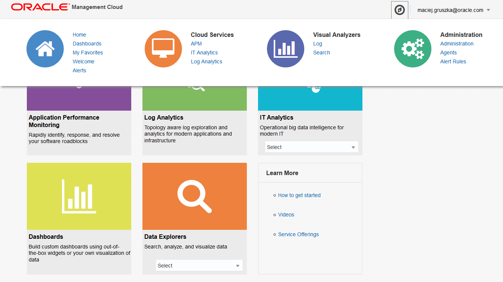

---
# ORACLE Cloud-Native DevOps workshop
-----
## APM エージェントのデプロイと Application Performance Monitoring のセットアップ

### 説明
Oracle Application Performance Monitoring Cloud Service は、エンドユーザー体験 (UX) からアプリケーション・リクエストやアプリケーションログまでを通してアプリケーションの性能に対する可視性を提供する Software as a Service である。Oracle Application Performance Monitoring Cloud Service により、業務影響が発生する事前に問題を取り除いたり、開発チームと運用チームの間の壁を取り除き、より優れたアプリケーションを提供できるようになる。


このチュートリアルでは、APMを継続的デリバリのフローに統合し、ビルドプロセスの中で APM エージェントのセットアップとインストールが自動で組みこまれ、継続的な計測内容を確認する。Application Performance Monitoring Web ユーザインターフェースを使用して、デモアプリケーションに関する必要な詳細情報を監視する事が可能になる。

このセットアップを行うと、APM がビルド中にアプリケーションに導入される。そのため、エージェントのデプロイ作業について考慮することなく計測を行う事が可能になる。
ploying agents.

### チュートリアルについて
このチュートリアルは、以下を実施する:

- Application Perfomance Monitoring Cloud Service にアクセスする
- エージェント・マスター・インストーラをダウンロードする
- APM エージェントを DevCS による継続的デリバリフローに組み込む
- Application Performance Monitoring をセットアップする
- Application Performance Monitoring の使い方を学ぶ
- Apache Tomcat に APM エージェントを手動デプロイする

### 前提

- 以下の Oracle Public Cloud Service が利用できるアカウントを保有している事:
  - Application Performance Monitoring Cloud Service
	- Application Container Cloud Service

- チュートリアル: [Developer Cloud Service を利用したSpring Boot サンプル・アプリケーションのApplication Container Cloud Service へのデプロイ](../springboot-sample/) を実施済みである事


### 手順

#### Spring Boot チュートリアルの完了
チュートリアル: [Developer Cloud Service を利用したSpring Boot サンプル・アプリケーションのApplication Container Cloud Service へのデプロイ](../springboot-sample/) を完了させる。この作業後、ソース管理から ACCS へのデプロイを行う継続的デリバリー・パイプラインをセットアップする。

#### 備忘ノード
セットアップ作業を通して必要となるいくつかの情報がある。忘れないように次のテンプレートを使用して控えておく。

```
Maven Base URL:
Agent Install Zip Path:

AGENTINSTALL_ZIP_URL:

AGENT_REGISTRATION_KEY:

URI Prefix:
WAR_FILE:
```


#### Oracle Management Cloud マスター・インストーラとレジストレーション・キーのダウンロード

マスター・インストーラは、全ての クライアントサイドのOracle Management Cloud Service コンポーネントのスタート・ポイントである。例えば、ゲートウェイ、クラウド・エージェント、APM エージェントである。APM をビルドに統合するために、ビルドプロセスにマスター・インストーラを与える必要がある。実施するために、テナント固有のマスター・インストーラをダウンロードする事から着手する。

使用しているテナントのマスター・インストーラをダウンロードし、レジストレーション・キーの確認を行う。エージェントの自動デプロイのためにこれらをビルド・プロセスに組み込む。

Oracle Cloud へサインインする[(https://cloud.oracle.com/sign-in)](https://cloud.oracle.com/sign-in)。そして、ダッシューボード画面を表示し、右上部の  **Launch APM** をクリックする。

別のアイデンティティドメインにある Management Cloud Service を使用する場合、例えばトライアル利用の場合、適切なアイデンティティドメインと認証情報を使用してログインを行う。

Management Cloud Service のウェルカム・ページが表示されたら、画面上部にあるコンパス型アイコンで表示されている **Application Navigator** をクリックし、ドロップダウンリストから **Administration** -> **Agents** を選択する。




左部メニューから、**Download** を選択肢、緑色のダウンロード・アイコンをクリックする。


**AgentInstall.zip** を保存する。

エージェント・デプロイメントに使用するレジストレーション・キーの一覧から、**Status: valid** かつ利用できる数が最大のものを選択する。**Key Value** に記載されているレジストレーション・キーを先のノートの AGENT_REGISTRATION_KEY に控えておく。


#### ビルド成果物の Maven へのアップロード

自動ビルドプロセスに必要となるマスター・インストーラをダウンロードを行った。これを DevCS の Maven リポジトリで使用する。Maven リポジトリにマスター・インストーラをアップロードする事で、ビルド・スクリプトがインストーラをダウンロードし、アプリケーションにエージェント・コンポーネントを統合するために使用する。

Developer Cloud Service にログインし、Maven リポジトリの **Upload** タブを開く。


先にダウンロードしていた AgentInstall.zip を Management Cloud の UI からアップロードする。アップロードする際には以下のオプションの設定を行う:

- Specify Maven Coordinates: **Manually**
- GroupId: 識別ID (例. com.oracle)
- ArtifactId: 成果物名 (デフォルトのまま AgentInstall)
- Version: 適当なバージョン
- Packaging: パッケージ種別 (デフォルトのまま zip)
- Generate POM: チェックする

**Start Upload** をクリックする。


アップロードが正常終了するまで待機し、次の手順に進む。


#### Maven 成果物の URL の決定

ビルスクリプトにはダウンロード URL が必要である。ここの手順では、ユーザ・インターフェースから取得する。

**Browse** タブに戻り、Distribution Management XML に含まれるリポジトリURL を先のノートの Maven Base URL として控えておく。そして成果物ディレクトリのリストのバージョン番号をクリックし、成果物を表示する。


成果物が表示されたら、zip ファイルをクリックして **Repository Path** を先のノートの Agent Install Zip Path に控えておく。


*Agent Install Zip Path* を *Maven Base URL* の末尾に連結し、冗長になるスラッシュ (/) をURL から修正したものを、先のノートの AGENTINSTALL_ZIP_URL に控える。

#### ビルドの更新

前のビルドに戻り APM を有効にするビルドプロセスを実行するためにビルド構成の修正を行う。ここで使用するスクリプトは、アプリケーションベースの Tomcat サーバとしてアプリケーションをパッケージし、APM エージェントを自動でセットアップするものである。このスクリプトが springboot-sample のコードを実行するために Maven を呼び出し、さらに Tomcat サーバをセットアップしして APM と統合させる。この場合のデプロイメント・モデルは WAR ファイルである。よって、WAR ファイル名からの URI プレフィックス配下で Tomcat によりアプリケーションが稼働する。

まず、短くユニークになる文字列 (名前やアイデンティティドメイン名など) をアプリケーションの URI プレフィックスとして使用する事を考える。選択した文字列を先のノートの URI Prefix に控える。末尾に ".war" を結合して WAR ファイルの名前としてプレフィックスに使用する。例えば、"traial021.war" のようになる。この名前を先のノートの WAR_FILE に控える。


ビルドジョブに戻り、**Configure** 画面に移動する。新しく **Execute shell** ビルド・ステップを追加する。ノートとして控えた インストーラへの URL やレジストレーション・キー、WAR ファイルの名前を確認する。以下のコマンドの <> を控えたノートの内容で置き換える。

Return to the `springboot_build` build job and navigate to its **Configure** section. Add a new **Execute shell** build step. Refer back to the full URL to our installer within Maven, the registration key that we collected in the previous steps, and your chose war file name. Substitute them into the appropriate <> within the Command as follows:
```
export AGENTINSTALL_ZIP_URL=<AGENTINSTALL_ZIP_URL from your notes>
export AGENT_REGISTRATION_KEY=<AGENT_REGISTRATION_KEY from your notes>
export WAR_FILE=<WAR_FILE from your notes>
cd apm
./build.sh
```


このビルドスクリプトは `apm/application.zip` を生成する。そして **Post Build** 構成を適切に更新する必要がある。そして **Save** をクリックすつ。
This build script will generate `apm/application.zip`, so we will need to update the **Post Build** configuration appropriately, and then **Save**


ビルド画面に戻り **Build Now** をクリックする。


コンソールでビルドの進捗を監視し、ビルドの正常終了を待つ。

#### Update the Deploy ####

アーカイブファイルが変わっているので、デプロイ構成の更新が必要である。


`apm/application.zip` が成果物とて指定さえれる事を確認する。**Type** を"On Demand" に一時的に変更し、最新の成果物を表示する必要がある。表示できたら Type を "Automatic" に戻し、構成内容を **Save** する。


再デプロイメントを開始する。進捗を監視しながら正常終了を待つ。

#### アプリケーションの妥当性確認

アプリケーションのデプロイが成功しているかを確認する。

ブラウザで次の URL を入力する。

- `https://<ACCSインスタンスのURL>/<URI prefix>`
  - ACCS インスタンスの URL は、ACCS コンソール画面に表示される対象インスタンスの URL

springboot-sample が以前同様に表示される事を確認する。

次に、ブラウザ (Chrome 又は Firefox) で `Ctrl + Shift + I` を押すと、ブラウザ組み込みの開発ツールが開く。開かれた後、次の　URL を入力する:

- `https://<ACCSインスタンスのUR>/<URI prefix>/angular.html`

するとシングルページ・アプリケーションが開かれるので、開発ツールで **ネットワーク** タブを開き `collector` を呼び出しが一覧にある事を確認する。この呼び出しは ブラウザの測定内容を APM に集めている事を表している。


このページ上をクリックし挙動を見てみる。

#### Application Performance Monitoring のセットアップ

Oracle Cloud へサインインする[(https://cloud.oracle.com/sign-in)](https://cloud.oracle.com/sign-in)。そして、ダッシューボード画面を表示し、右上部の  **Launch APM** をクリックする。

Management Cloud Service の ウェルカム・ページが表示されたら、**Application Performance Monitoring** をクリックする。


APM のホーム画面を開くと、メトリクス情報が表示されているダッシュボードが表示されている。**Home** の左横のハンバーガメニューをクリックする。


メニューアイテムから **Administration** メニューをクリックする。


次にメニューアイテムから **Application definitions** をクリックする。


ここで新しいアプリケーションの定義を行う事ができる。**Create Application Definition** をクリックする。


**Application Specification** ダイアログでアプリケーションや環境に固有の評価基準を定義する事ができる。ここではアプリケーションの定義に使用した **URI Prefix** を使用する。アプリケーション名は何してもよいが、コンテキスパス名にしておくと便利である。アプリケーション名はハイフン (-) を含むことができない事を注意する。評価基準には **Pages** 選択して **URL** を選択し、**URI Prefix** を含むように設定し **OK** をクリックする。**Save** をクリックしアプリケーション定義を保存する。


左部メニューから **Applications** メニューを選択する。


アプリケーションの定義ができた事が確認できる。リロードすると、計測情報が更新される。


#### 計測データ生成

適度な量のデータを生成するために 5から10分以上の間隔で 4-5 回以下の操作を実施する:

- ページ上のいろいろなボタンをクリックする
- **Compute** ボタンを数回クリックする
- **Return Array Index** に `1048576` を入力し、**Compute** ボタンをクリックする
- ページをリロードし数回上記操作を実施する

#### アプリケーションの振る舞いの理解のための APM の使用

APM 上でのアプリケーション画面に戻り、時間範囲を **last 15 minutes** に設定する:


APM を使用して次の問題を考えてみよう:

乱数の合計の実行に割り当てられているメモリはどの程度か？


Quote 機能が静的データの使用か外部の Web サービスの呼び出しを行うか判別可能か？

Can you tell whether the quote functionality uses static data or makes a real external web service call?


どのボタンをクリックすると AJAX 呼び出しが発生するか、どのボタンが発生しないか判別できるか？*Return Array Index* に `1048576` を入力して **Compute** をクリックした際の振る舞いの原因が分かるか？


このチュートリアルは以上となる。

#### (Optional) Installing and Provisioning APM Java Agent on Apache Tomcat (or other Java EE application servers) Manually ####

	[oracle@localhost u01]$ unzip AgentInstall.zip -d /u01/apm_temp
	Archive:  AgentInstall.zip
	  inflating: /u01/apm_temp/AgentInstall.sh  
	  inflating: /u01/apm_temp/AgentInstall.bat  
	  inflating: /u01/apm_temp/README         
	[oracle@localhost u01]$

From the local directory where you have extracted the contents of the master installer ZIP file, change the permissions of `AgentInstall.sh`:

	[oracle@localhost u01]$ cd /u01/apm_temp/
	[oracle@localhost apm_temp]$ chmod 755 AgentInstall.sh

Now run the following command to download the software:

	[oracle@localhost apm_temp]$ ./AgentInstall.sh AGENT_TYPE=apm_java_as_agent STAGE_LOCATION=${STAGE_DIR} AGENT_REGISTRATION_KEY=${REG_KEY}
	Downloading apm agent software ...
	[oracle@localhost apm_temp]$


After you have downloaded and extracted the installer, install and provision the APM Java Agent in your application server domain running the `./ProvisionApmJavaAsAgent.sh -d ${DESTINATION}` command in the staging directory. Just for sure change the permissions for `ProvisionApmJavaAsAgent.sh`.

	[oracle@localhost apm_temp]$ cd ${STAGE_DIR}
	[oracle@localhost apm_staging]$ chmod +x ProvisionApmJavaAsAgent.sh
	[oracle@localhost apm_staging]$ ./ProvisionApmJavaAsAgent.sh -d ${DESTINATION}
	 The current destination for provisioning the APM Java AS Agent is TOMCAT. This needs to be done with no-wallet option. Hence the installation will be done with no wallet.
	*************************************************************************
	Your settings are as follows:

	              Tenant_ID = usxxxxxxtrial
	            Destination = /u01/apache-tomcat-8.5.6
	        RegistrationKey = EQAAAA9idWlsdEluQUxDS2V5LjG5fm5XfcX985Q06kU2dZKhzVW8WocMgJIb63bDKqdZ072pnsoScmcpIjRxxxxxxxxxxxxxxxxxxx==

	Do you wish to proceed with these values? y
	Archive:  /u01/apm_staging/ApmAgent-1.10.zip
	   creating: apmagent/
	   creating: apmagent/config/
	  inflating: apmagent/config/AgentHttpBasic.properties  
	  inflating: apmagent/config/MetricCollector.json  
	  inflating: apmagent/config/BrowserAgent.json  
	  inflating: apmagent/config/AgentStartup.properties  
	  inflating: apmagent/config/Servlet.json  
	   creating: apmagent/lib/
	   creating: apmagent/lib/system/
	  inflating: apmagent/lib/system/instrumentor-2.2.0.1.jar  
	  inflating: apmagent/lib/system/ApmAgentInstrumentation.jar  
	  inflating: apmagent/lib/system/ApmProbeSystem.jar  
	   creating: apmagent/lib/action/
	  inflating: apmagent/lib/action/ApmProbeAction.jar  
	   creating: apmagent/lib/agent/
	  inflating: apmagent/lib/agent/jackson-core-asl-1.9.13.jar  
	  inflating: apmagent/lib/agent/jackson-jaxrs-1.9.13.jar  
	  inflating: apmagent/lib/agent/commons-logging-1.1.1.jar  
	  inflating: apmagent/lib/agent/httpcore-4.2.4.jar  
	  inflating: apmagent/lib/agent/ApmAgentUtility.jar  
	  inflating: apmagent/lib/agent/ApmAgentRuntime.jar  
	  inflating: apmagent/lib/agent/commons-codec-1.8.jar  
	  inflating: apmagent/lib/agent/jackson-mapper-asl-1.9.13.jar  
	  inflating: apmagent/lib/agent/jettison-1.3.4.jar  
	  inflating: apmagent/lib/agent/ApmEumFilter.jar  
	  inflating: apmagent/lib/agent/cmnutil.jar  
	  inflating: apmagent/lib/agent/httpclient-4.2.5.jar  
	  inflating: apmagent/lib/agent/agentToEngine.jar  
	  inflating: apmagent/lib/agent/jackson-xc-1.9.13.jar  
	  inflating: apmagent/lib/agent/ApmProbeRuntime.jar  
	*******************************************************************************
	So far, so good! Now, one more thing to do, which you will perform manually.
	You will need to modify your destination's start up script so that
	the APM instrumentation you have just laid down and configured will be invoked.

	Here's what you do:


	Weblogic :
	---------

	1. Make a backup copy of your startWebLogic.sh file:
	        % cd $DOMAIN_HOME/bin
	        % cp startWebLogic.sh startWebLogic.sh.orig

	2. Now edit the script with your favorite text editor (e.g. "vi"), and add the
	   -javaagent option to the set of JAVA_OPTIONS found therein, by adding the
	   following line right after the "setDomainEnv.sh" call:

	        JAVA_OPTIONS="${JAVA_OPTIONS} -javaagent:${DOMAIN_HOME}/apmagent/lib/system/ApmAgentInstrumentation.jar"

	3. Stop and restart your WebLogic Application Server. Note that you will use
	   the $DOMAIN_HOME/bin version of stopWebLogic.sh, but the $DOMAIN_HOME
	   version of startWebLogic.sh, even though you edited the $DOMAIN_HOME/bin
	   version. The "upper" level one will, in fact, invoke the "lower" level one:

	        % cd $DOMAIN_HOME/bin
	        % ./stopWebLogic.sh                        
	        % cd ..                                    
	        % nohup ./startWebLogic.sh >& startup.log &

	4. Finally, if you have any Managed WebLogic Application Servers, stop and
	   restart them also:

	        % cd $DOMAIN_HOME/bin
	        % ./stopManagedWebLogic.sh {SERVER_NAME} {ADMIN_URL} {USER_NAME} {PASSWORD}                                                  
	        % nohup ./startManagedWebLogic.sh {SERVER_NAME} {ADMIN_URL} >& {SERVER_NAME}.log &

	Tomcat :
	-------

	1. Make a backup copy of your Catalina.sh file:
	            % cd "$CATALINA_HOME/bin"
	            % cp catalina.sh catalina.sh.orig

	2. Now edit the script with your favorite text editor (e.g. "vi") , and add the
	   -javaagent option to the set of CATALINA_OPTS, by adding the
	   following line:

	    	 CATALINA_OPTS="${CATALINA_OPTS} -javaagent:\"${CATALINA_HOME}/apmagent/lib/system/ApmAgentInstrumentation.jar\""

	3. Stop and restart your Tomcat Server.

	        % cd "$CATALINA_HOME/bin"
	        % ./shutdown.sh
	        % ./startup.sh

	JBoss 7.x/Wildfly(Standlone Mode):
	----------

	1. Make a backup copy of your standalone.conf file:
	        % cd $JBOSS_HOME/bin
		% cp standalone.conf standalone.conf.orig

	2. Now edit standalone.conf with your favorite text editor (e.g. "vi"), and search text 'JBOSS_MODULES_SYSTEM_PKGS'
		Add  oracle.apmaas,org.jboss.logmanager to it.

	 	If it was JBOSS_MODULES_SYSTEM_PKGS="org.jboss.byteman" then the new value will be JBOSS_MODULES_SYSTEM_PKGS="org.jboss.byteman,oracle.apmaas,org.jboss.logmanager"

	3. Go to the end of the file and add following statements

		JAVA_OPTS="$JAVA_OPTS -Djava.util.logging.manager=org.jboss.logmanager.LogManager"

		# Location and version of below jar files would be different for jboss versions. You can modify java opts with correct version of jar file. If files are not present then you can download the jars and modify paths of jar in below statements.

		JAVA_OPTS="$JAVA_OPTS -Xbootclasspath/p:<JBOSS_HOME>/modules/org/jboss/logmanager/main/jboss-logmanager-1.2.2.GA.jar:<JBOSS_HOME>/modules/org/jboss/logmanager/log4j/main/jboss-logmanager-log4j-1.0.0.GA.jar:<JBOSS_HOME>/modules/org/apache/log4j/main/log4j-1.2.16.jar"

		JAVA_OPTS="$JAVA_OPTS -javaagent:<JBOSS_HOME>/apmagent/lib/system/ApmAgentInstrumentation.jar"

	4. Stop and restart your JBoss/Wildfly Server


	JBoss 7.x/Wildfly(Domain Mode):
	-----------------------

	1. Make a backup copy of your domain.conf file:
	        % cd $JBOSS_HOME/bin
		% cp domain.conf domain.conf.orig

	2. Now edit domain.conf with your favorite text editor (e.g. "vi"), and search text 'JBOSS_MODULES_SYSTEM_PKGS'

		Add  oracle.apmaas,org.jboss.logmanager to it.

		If it was JBOSS_MODULES_SYSTEM_PKGS="org.jboss.byteman" then the new value will be JBOSS_MODULES_SYSTEM_PKGS="org.jboss.byteman,oracle.apmaas,org.jboss.logmanager"

	3. Go to the end of the file and add following statements

		JAVA_OPTS="$JAVA_OPTS -Djava.util.logging.manager=org.jboss.logmanager.LogManager"

		# Location and version of below jar files would be different for jboss versions. You can modify java opts with correct version of jar file. If files are not present then you can download the jars and modify paths of jar in below statements.

		JAVA_OPTS="$JAVA_OPTS -Xbootclasspath/p:<JBOSS_HOME>/modules/org/jboss/logmanager/main/jboss-logmanager-1.2.2.GA.jar:<JBOSS_HOME>/modules/org/jboss/logmanager/log4j/main/jboss-logmanager-log4j-1.0.0.GA.jar:<JBOSS_HOME>/modules/org/apache/log4j/main/log4j-1.2.16.jar"

		JAVA_OPTS="$JAVA_OPTS -javaagent:<JBOSS_HOME>/apmagent/lib/system/ApmAgentInstrumentation.jar"

	4. Stop and restart your JBoss/Wildfly Server


	Websphere :
	-----------------------

	1. From websphere admin console, click on Servers tab and  select the server on which you want to provision the APM Agent. Expand Java and Process Management tab and select Process Definition. Select Java Virtual Machine under Additional Properties tab.

	2. In Generic JVM arguments field, add the following line:
		-javaagent:$WAS_HOME/apmagent/lib/system/ApmAgentInstrumentation.jar -Dws.ext.dirs=$WAS_HOME/apmagent/lib/agent/ApmEumFilter.jar

	3. Create a backup of $WAS_HOME/properties/server.policy file
	    	% cd $WAS_HOME/properties
		% cp server.policy server.policy.orig

	4. Add the following snippet in $WAS_HOME/properties/server.policy to grant permission to apmagent directory.

	        grant codeBase "file:$WAS_HOME/apmagent/-"
	        {
	        permission java.security.AllPermission;
	        };

	5. Restart the websphere server

	*******************************************************************************
	[oracle@localhost apm_staging]$

Now the local installation of Apache Tomcat is almost ready to run and includes APM agent. As you can see from the output you have to add `-javaagent:"${CATALINA_HOME}/apmagent/lib/system/ApmAgentInstrumentation.jar` to `CATALINA_OPTS` and restart the server.
