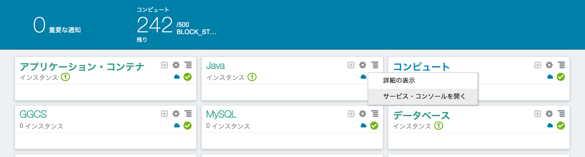
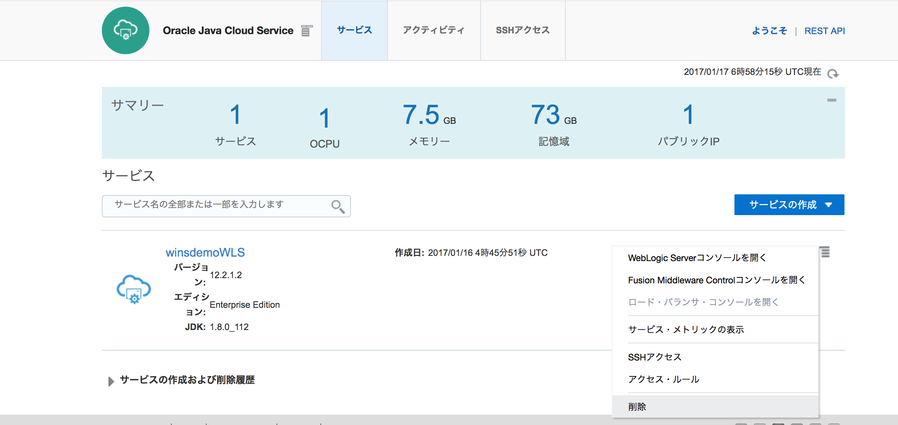
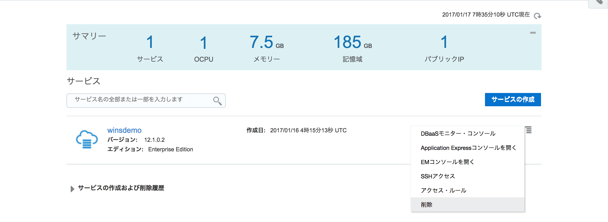
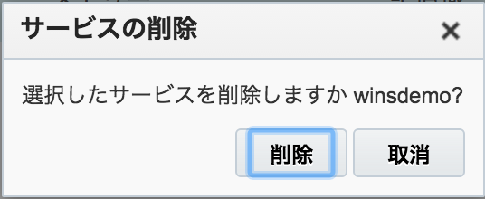

---
# ORACLE Cloud-Native DevOps workshop
----
## UI を用いた Java Cloud Service, Database Cloud Service 及び Application Container Cloud Service インスタンスの削除

### チュートリアルについて

このチュートリアルでは、以下の内容を実施する:

- UI を用いた Java Cloud Service インスタンスの削除
- UI を用いた Database Cloud Service インスタンスの削除

### 前提

以下のチュートリアルを実施済み、または削除するインスタンスが存在する事:

- [UI を用いた Database Cloud Service インスタンスの作成](../dbcs-create/README.md)
- [UI を用いた Java Cloud Service インスタンスの作成](../jcs-create/README.md)

### 手順

#### UI を用いた Java Cloud Service インスタンスの削除

Oracle Cloud へ[サインイン](../common/sign.in.to.oracle.cloud.md) する [(https://cloud.oracle.com/sign-in)](https://cloud.oracle.com/sign-in)。ダッシュボード画面から Java Cloud Service コンソールを開く。

インスタンス表示欄の右側のハンバーガーメニューをクリックし、**削除** を選択する。

Java Cloud Service は、Database にリポジトリを格納している。そのため、Database Cloud Service インスタンスからリポジトリを削除するためにデータベース管理者の認証情報を入力する必要がある。そして削除をクリックする。**強制削除** を選択すると、削除中にエラーが発生しもスキーマの削除を継続して行う。このチュートリアルでは、選択しない。

データセンターのリソースにも依存するが Java Cloud Service インスタンスの削除には大体 15 から 20 分程度かかる。

#### UI を用いた Database Cloud Service インスタンスの削除

Database Cloud Service コンソールを開く。様々なクラウドサービスのコンソール画面からダッシュボード画面に戻るには、画面右上部の **ダッシュボード** をクリックする。そして、ダッシュボード画面から Database Cloud Service を選択する。

インスタンス表示欄の右側のハンバーガーメニューをクリックし、**削除** を選択する。

確認のダイアログ画面で削除をクリックする。

データセンターのリソースにも依存するが Database Cloud Service インスタンスの削除には大体 15 から 20 分程度かかる。
