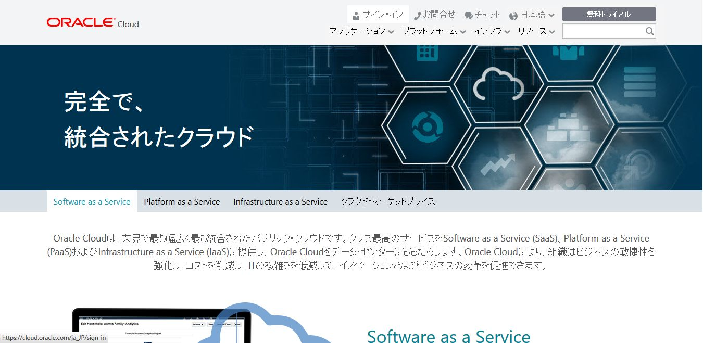
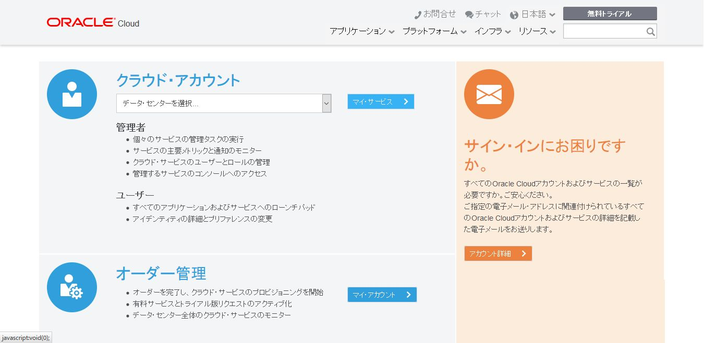
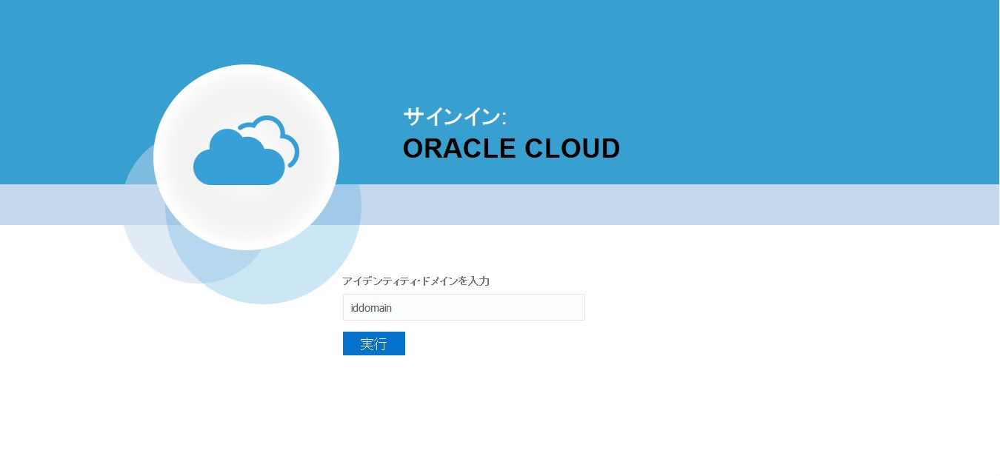
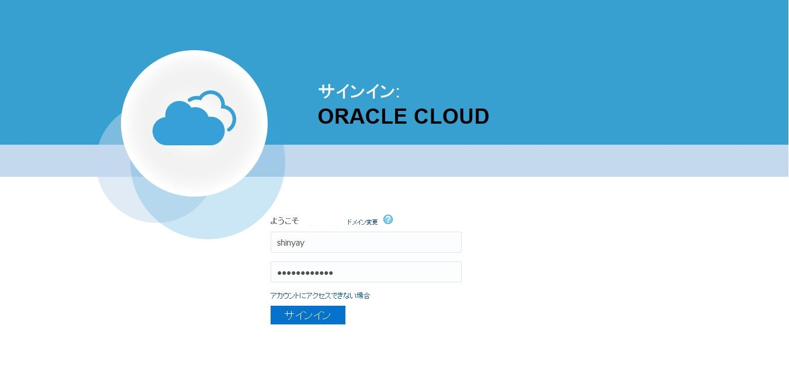
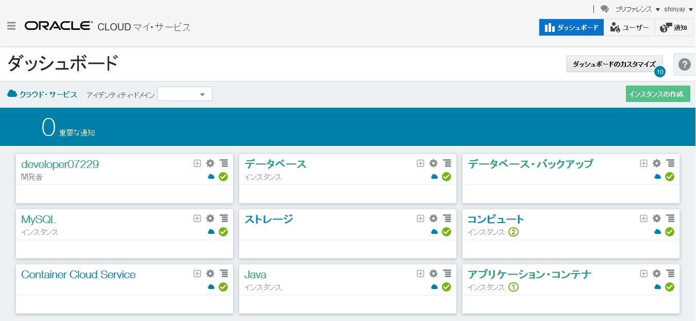

# ORACLE Cloud-Native DevOps workshop
-----
## Oracle Cloud へのサイン・イン

1.　ブラウザから[cloud.oracle.com](https://cloud.oracle.com/ja_JP/home)を開き、**サイン・イン** をクリックする

2.　データ・センターを選択肢、**マイ・サービス** をクリックする

3.　アイデンティティ・ドメイン名を入力し、**実行** をクリックする

4.　サービス管理者ロールをもつユーザ名とパスワードを入力するし、**サインイン** をクリックする

5.　ダッシュボード画面画面には、事前構成された複数のクラウド・サービスのタイルが表示される。このタイルの表示を変更する場合は、**ダッシュボードのカスタマイズ** をクリックし、表示するサービスにチェックする。

