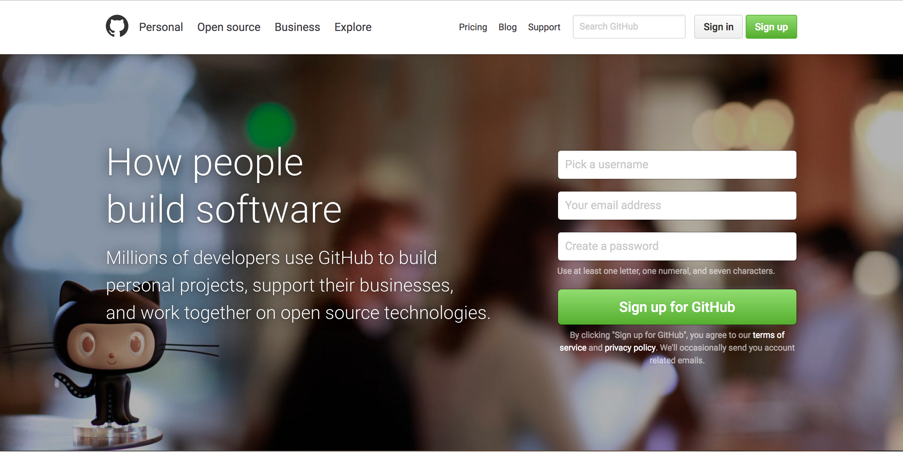
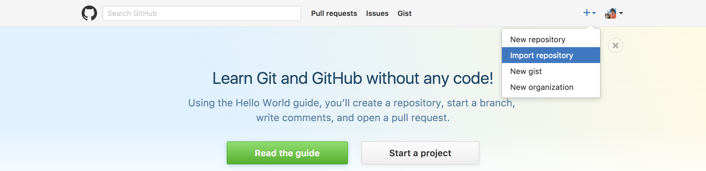
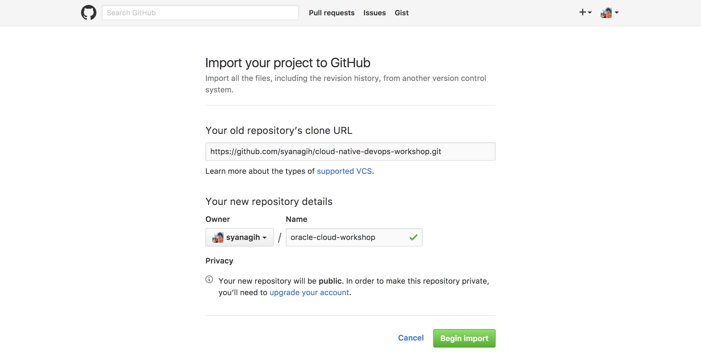
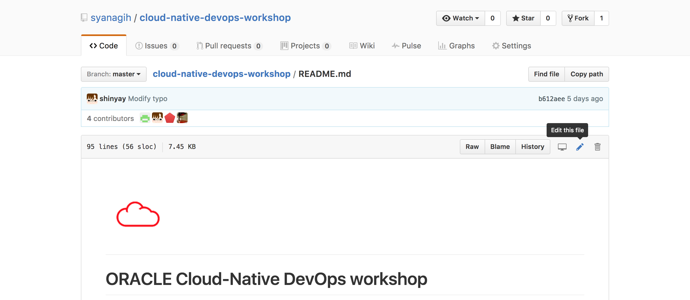
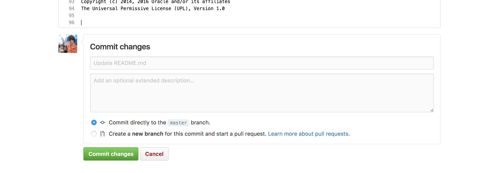

---
# ORACLE Cloud-Native DevOps workshop

## ワークショップのカスタマイズ

ここでは、ワークショップ・コンテンツのカスタマイズ方法について説明する。

### 手順

#### ワークショップ・コンテンツ・リポジトリの複製

ブラウザを開き、**GitHub** ([https://github.com](https://github.com)) にログインする。GitHub のアカウントを持っていない場合は、新規アカウントをサインアップする必要がある。

ログインしたら、右上部角にある **+** マークをクリックし、**Import repository** をコンテキスト・メニューから選択する。

**Your old repository’s clone URL** に以下の URL を入力する

- 英語版: `https://github.com/oracle/cloud-native-devops-workshop.git`
- 翻訳版: `https://github.com/syanagih/cloud-native-devops-workshop.git`

Name フィールドには、適当なリポジトリ名を入力する。例えば `cloud-native-devops-workshop` とし、**Begin Import** をクリックする。

インポートが終了すると、複製されたリポジトリが使用できるようになる。

#### ワークショップ・コンテンツの修正

簡単なカスタマイズ方法は、不要なコンテンツを削除する事である。ワークショップ・コンテンツの一部を実施する場合は、コンテンツ一覧を修正するとよい。ブラウザから複製したリポジトリを開き、**README.md** を選択する。鉛筆アイコンで表示される **Edit this file** をクリックする。

メタデータ・エディタが開く。これを使用し、必要な内容にカスタマイズを行う。最後に **Commit changes** をクリックする。

また、各チュートリアルのトップに表示しているロゴ・アイコンの変更も行ってよい。

- `cloud-native-devops-workshop/images/customer.logo.png`

