---
# ORACLE Cloud-Native DevOps workshop
-----
## UI を用いた Database Cloud Service インスタンスの作成

### 説明

Database Cloud Service はクラウド上に Oracle Database をデプロイする事が可能である。単一の Oracle Database をそれぞれのデプロイメントにて提供している。Database Cloud Service では、Oracle Database に対する完全な機能と操作を提供しているだけでなく、処理能力や物理ストレージ、またメンテナンスや管理操作をシンプルにするツールも提供している。

データベースを作成すると、Database Cloud Service では、データベースをホストするコンピュート・ノードが作成されます。これは、Compute Cloud Service により提供されており、演算処理やストレージ・リソースを備えている。さらに、Compute Cloud　Service によりネットワーク・リソースが扱え、コンピュート・ノードやデータベースにアクセスする事ができる。

### チュートリアルについて
このチュートリアルは、以下を実施する:

- UI を用いて Database Cloud Service インスタンスを作成する

### 前提

- Database Cloud Service と Storage Cloud Service が利用できるアカウントを保有している事

### 手順

Oracle Cloud へ[サインイン](../common/sign.in.to.oracle.cloud.md) する [(https://cloud.oracle.com/sign-in)](https://cloud.oracle.com/sign-in)。
データセンターを選択し、アイデンティティドメインとアカウント情報を入力してログインする。
ログイン後、ダッシュボード画面の Database Cloud Service のドロップダウンメニューから **サービス・コンソールを開く** を選択する。

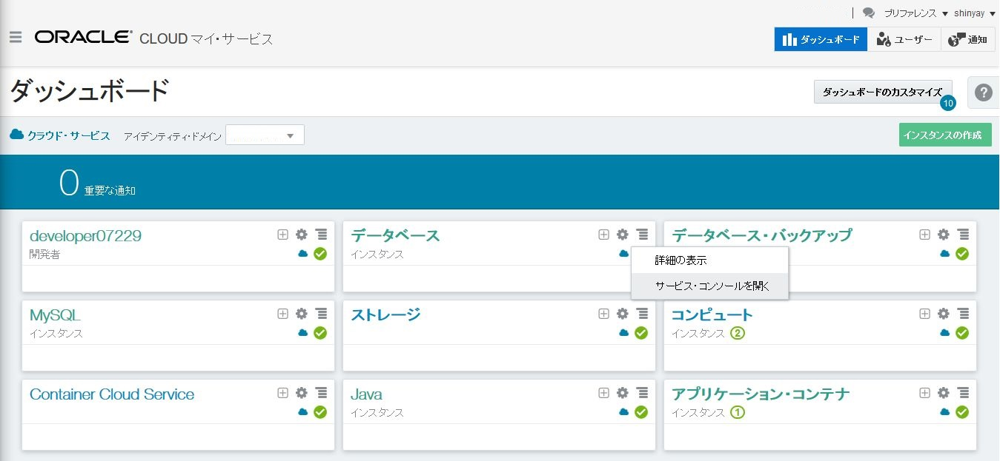


Database Cloud Service コンソール画面が表示される。ここでインスタンスの作成のために **サービスの作成** をクリックする。

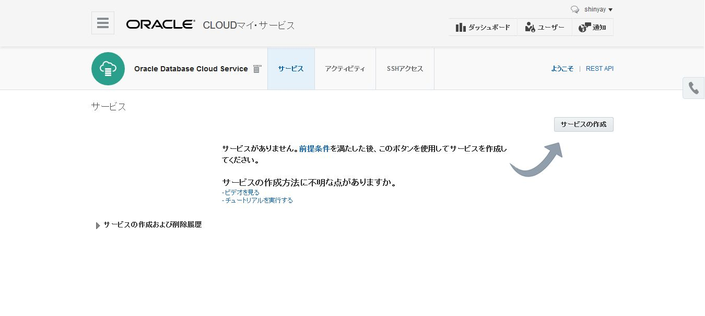


サブスクリプション・タイプを選択する。
- サービス・レベル: **Oracle Database Cloud Service**
- 請求頻度: **月** (デフォルト)

詳細なサブスクリプション・タイプは[documentation](https://docs.oracle.com/cloud/latest/dbcs_dbaas/CSDBI/GUID-F1E6807A-D283-4170-AB2B-9D43CD8DCD92.htm#CSDBI3395)を参照。

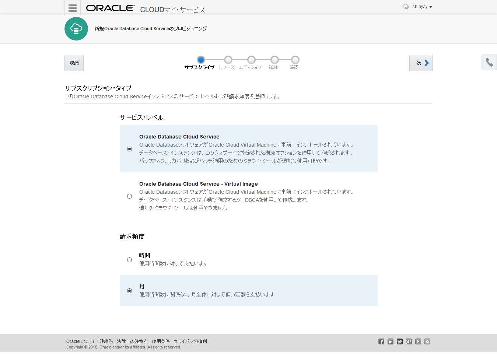


ソフトウェア・リリースを選択する。
- **Oracle Database 12cリリース1**

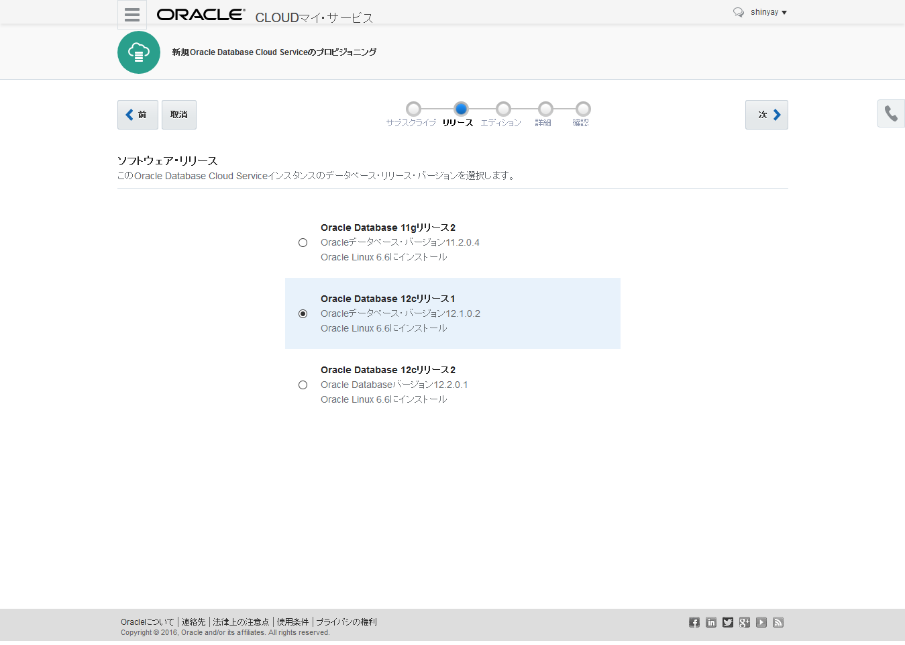


ソフトウェア・エディションを選択する。
Database Cloud Service では、インスタンス作成時に以下のエディションが選択可能
- Standard Edition
- Enterprise Edition
- Enterprise Edition - High Performance
- Enterprise Edition - Extreme Performance

この中から **Enterprise Edition** を選択する。

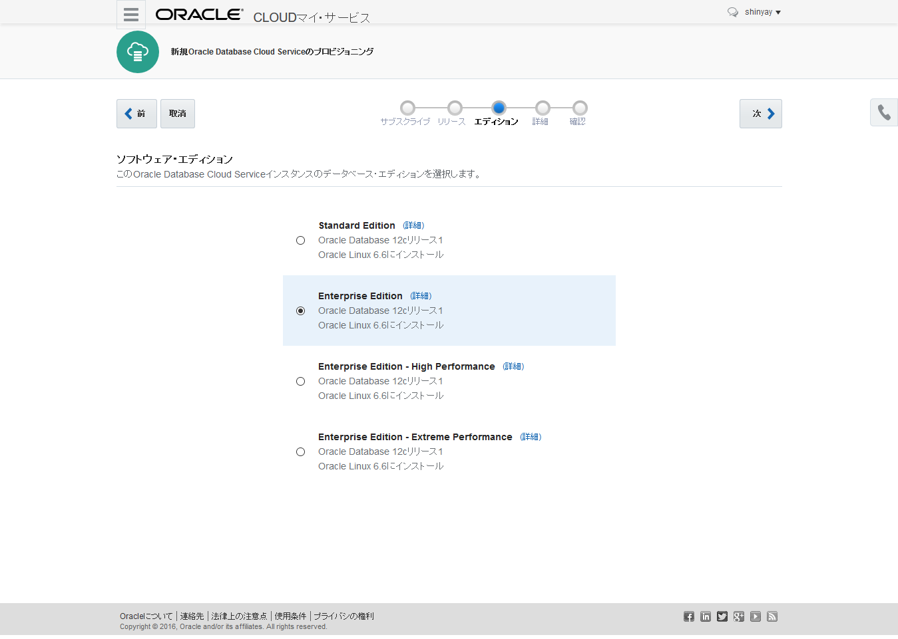


最後にサービス詳細では、以下のパラメータを入力する

- **サービス名**: サービス・インスタンスの名前 (例. techcoDB)
- **説明**: サービスに関する説明
- **コンピュート・シェイプ**: OCPU の数とメモリの容量 (デフォルトを選択)
- **タイムゾーン**: タイムゾーンを選択 (日本標準時を選択)
- **SSH 公開鍵**: 仮想マシンにアップロードする公開鍵を指定する。秘密鍵を利用して SSH接続 によりアクセスできる。 **新規鍵の作成** を選択するとキー・ペアが作成されてダウンロードできる。ダウンロードしたキー・ペアは `<クローンしたGitリポジトリ>/cloud-utils` フォルダに展開する。(後の工程で使用)

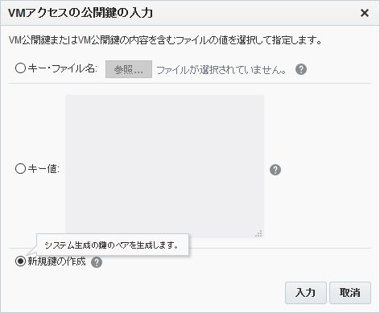

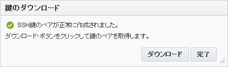

ターミナルを開き、Open a terminal and change to folder `<クローンしたGitリポジトリ>/cloud-utils` フォルダへ移動する。キー・ペアを含むアーカイブファイル(*sshkeybundle.zip*)を展開し、秘密鍵のアクセス権限の変更を行う。

```bash
$ [oracle@localhost Desktop]$ cd /<クローンしたGitリポジトリ>/cloud-utils
$ [oracle@localhost cloud-utils]$ unzip sshkeybundle.zip
      Archive:  sshkeybundle.zip
      inflating: privateKey              
      inflating: publicKey
$ [oracle@localhost cloud-utils]$ chmod 600 privateKey
```

- **管理パスワード**: データベース・インスタンスのシステム・パスワード
- **データベース名 (SID)**: コンテナ・データベース名
- **PDB 名**: プラガブル・データベース名 (デフォルト:PDB1）
- **バックアップの保存先**: デフォルトのまま (クラウド・storageとローカル・ストレージ両方)
- **クラウド・ストレージ・コンテナ**: データベース・インスタンス用のストレージ・コンテナ名。次のフォーマットで入力する: `Storage-IDENTITYDOMAIN/CONTAINERNAME`
- **クラウド・ストレージ・ユーザー名/パスワード**: Storage Cloud Service のアクセス・ユーザ及びパスワード
- **クラウド・ストレージ・コンテナの作成**: チェックする (コンテナが存在しない場合に作成する)
- **文字セット**: データベースの文字セット (デフォルト: AL32UTF8)
- **各国語文字セット**: SQL NCHAR データ・タイプ使用する文字セット (デフォルト: AL16UTF16)

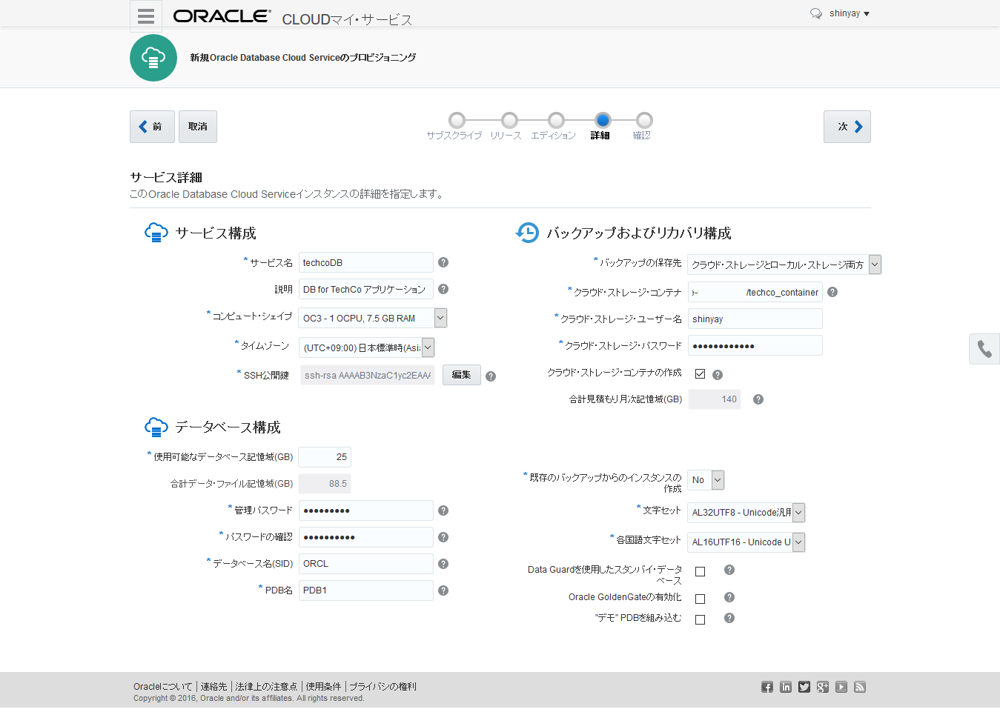

各パラメータの詳細は[documentation](https://docs.oracle.com/cloud/latest/dbcs_dbaas/CSDBI/GUID-D4A35763-53ED-4FBB-97BF-0366F21B05E0.htm#CSDBI3401)を参照。**次** をクリックする。


最後のページは構成に関するサマリーが表示される。ここでインスタンスの作成リクエストのサブミット前に確認を行う。**作成** をクリックするとサービス・インスタンスの作成が開始する。

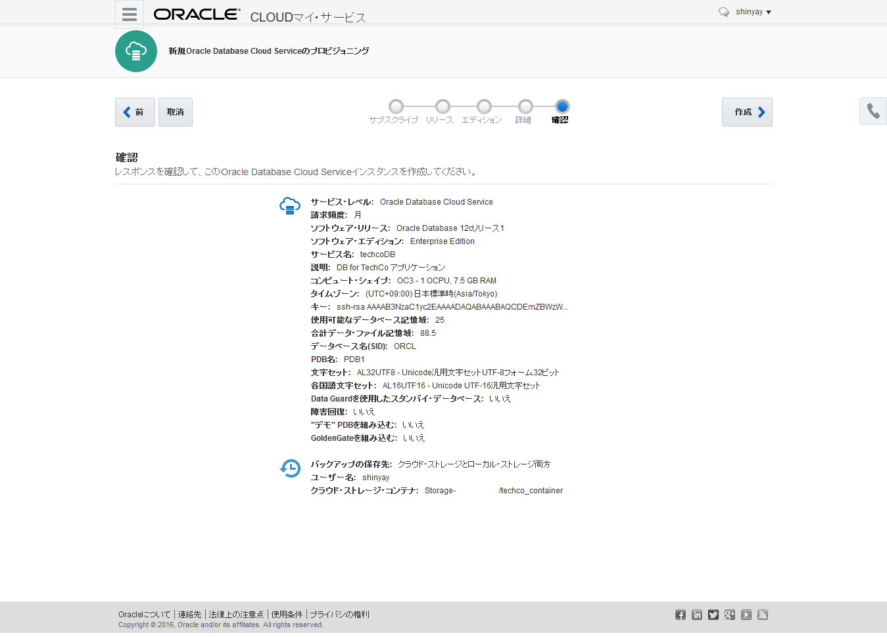


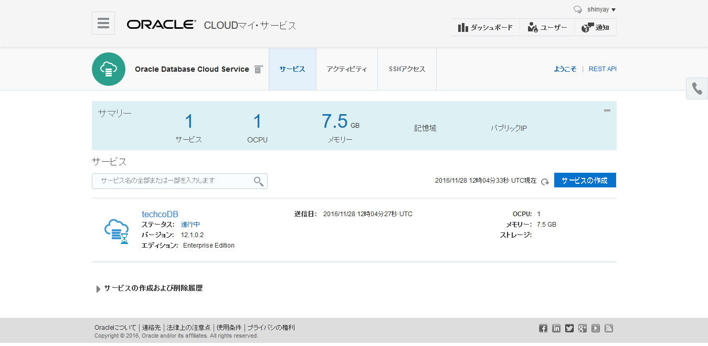

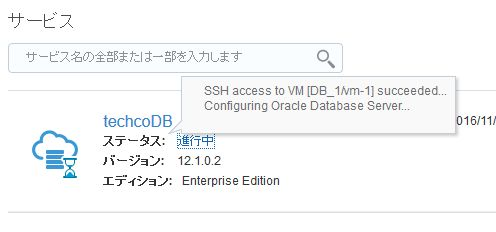
