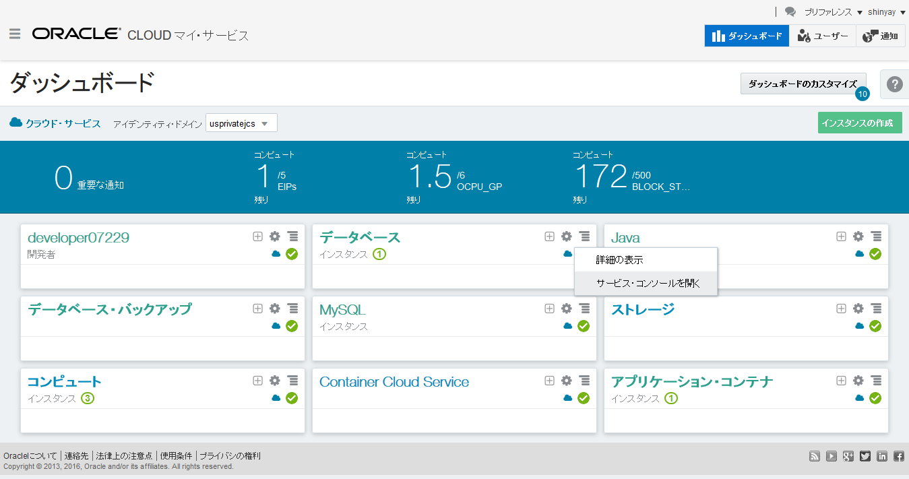
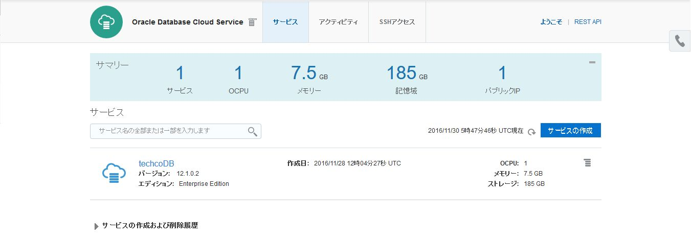
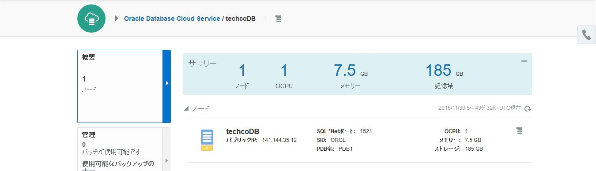

---
# ORACLE Cloud-Native DevOps workshop
----
## TechCo (Java EE) サンプル・アプリケーション用 Database Cloud Service の準備

### 説明

Database Cloud Service はクラウド上に Oracle Database をデプロイする事が可能である。単一の Oracle Database をそれぞれのデプロイメントにて提供している。Database Cloud Service では、Oracle Database に対する完全な機能と操作を提供しているだけでなく、処理能力や物理ストレージ、またメンテナンスや管理操作をシンプルにするツールも提供している。

データベースを作成すると、Database Cloud Service では、データベースをホストするコンピュート・ノードが作成されます。これは、Compute Cloud Service により提供されており、演算処理やストレージ・リソースを備えている。さらに、Compute Cloud　Service によりネットワーク・リソースが扱え、コンピュート・ノードやデータベースにアクセスする事ができる。

Database Cloud Service インスタンスが作成されると、22番ポートでのSSH接続に限定したインスタンスに対するネットワーク接続ができる。このアクセス制御はデフォルトでインスタンスをセキュアに保証している。


### このチュートリアルについて
このチュートリアルは、以下を実施する:

- Database Cloud Service の仮想マシンに対する SSH による接続を行う
- アプリケーション用のデータベース・サービスをSQLを実行して用意する

### 前提

- チュートリアル: [UI を用いた Database Cloud Service インスタンスの作成](../dbcs-create/README.md) を実施し、Database Cloud Service インスタンスが稼働している事
- Database Cloud Service インスタンスに関連づいているコンピュート・ノードの IP アドレスを確認している事。パブリック IP アドレスは、Database Cloud Service のサービス・インスタンス詳細ページに表示される。
- Database Cloud Service インスタンスを作成する際に指定した公開鍵と対になる秘密鍵がある事

### 手順
Oracle Cloud へ[サインイン](../common/sign.in.to.oracle.cloud.md) する [(https://cloud.oracle.com/sign-in)](https://cloud.oracle.com/sign-in)。
データセンターを選択し、アイデンティティドメインとアカウント情報を入力してログインする。
ログイン後、ダッシュボード画面の Database Cloud Service のドロップダウンメニューから **サービス・コンソールを開く** を選択する。




サンプル・アプリケーション用のサービス・インスタンスをクリックする。




データベース・インスタンスをホストしているコンピュート・ノードのパブリック IP アドレスを確認する




サービス・インスタンスを作成する際に生成された公開鍵と秘密鍵のアーカイブファイルを展開していない場合、ターミナルを開き***unzip*** 及び ***chmod*** を行う。
チュートリアル: [UI を用いた Database Cloud Service インスタンスの作成](../dbcs-create/README.md) でキー・ペアを保存した `<クローンしたGitリポジトリ>/cloud-utils` フォルダに移動する。そして、公開鍵と秘密鍵が含まれているアーカイブファイル(デフォルト: `sshkeybundle.zip`)を展開する。

```bash
$ [oracle@localhost Desktop]$ cd /u01/content/cloud-native-devops-workshop/cloud-utils
$ [oracle@localhost cloud-utils]$ unzip sshkeybundle.zip
      Archive:  sshkeybundle.zip
      inflating: privateKey              
      inflating: publicKey
```

秘密鍵の使用前にファイル・オーナーのみにREAD/WRITE権限(rw)があるように変更を行う。

```bash
$ [oracle@localhost cloud-utils]$  chmod 600 privateKey
```


`<クローンしたGitリポジトリ>/techco-app` フォルダに移動する。

```bash
$ [oracle@localhost cloud-utils]$  cd ../techco-app
```

Database Cloud Service インスタンスの PDB に OE ユーザを作成する必要がある。このユーザはスキーマを作成したり、ドロップしたりする権限が必要である。作成したユーザは、テーブルを作成したり、テーブルにデータを投入する事ができる。


`init-dbcs-pdb.sh` スクリプトを使用する事で、ユーザ、テーブル、そしてデータの投入を自動で行う事ができる。以下のように使用する。

```
usage: ./init-dbcs-pdb.sh <DBユーザ名> <DBパスワード> <ssh 鍵ファイル> <DBサーバ・IPアドレス> [<PDB名>]
```

- <DBユーザ名>: `system`
- <ssh鍵ファイル>: `<クローンしたGitリポジトリ>/cloud-utils` に展開した秘密鍵ファイル
- <DBサーバ・IPアドレス>: 確認しておいたパブリック IP アドレス
- <PDB名>: PDB1 がデフォルトで設定されている。異なる場合は指定する事で上書きできる。

<実行例>
```bash
[oracle@localhost techco-app]$ ./init-dbcs-pdb.sh system syspassword ../cloud-utils/privateKey 140.86.6.100 PDB1

The authenticity of host '140.86.6.165 (140.86.6.100)' can't be established.
RSA key fingerprint is 75:e0:29:8a:9f:8a:98:5d:5d:2e:5a:70:01:5a:08:55.
Are you sure you want to continue connecting (yes/no)? yes
Warning: Permanently added '140.86.6.100' (RSA) to the list of known hosts.
create_user.sh                                                                                100%  242     0.2KB/s   00:00    
create_user.sql                                                                               100%   73     0.1KB/s   00:00    
oe-min-drop-create.sh                                                                         100%  249     0.2KB/s   00:00    
oe-min-drop-create.sql                                                                        100%  246KB 245.6KB/s   00:00    

SQL*Plus: Release 12.1.0.2.0 Production on Fri Aug 19 14:02:30 2016

Copyright (c) 1982, 2014, Oracle.  All rights reserved.

Last Successful login time: Fri Aug 19 2016 13:28:58 +02:00

Connected to:
Oracle Database 12c Enterprise Edition Release 12.1.0.2.0 - 64bit Production

SQL> DROP USER oe
*
ERROR at line 1:
ORA-01922: CASCADE must be specified to drop 'OE'
...
...
...
SQL>
1 row created.

SQL> SQL>
Commit complete.

SQL> Disconnected from Oracle Database 12c Enterprise Edition Release 12.1.0.2.0 - 64bit Production
```

これで TechCo サンプル・アプリケーション用のデータベースの準備ができた。
