---
# ORACLE Cloud-Native DevOps workshop
-----
## Java Cloud Service 自動スケール・ポリシー

### 説明

Java Cloud Service では、スケーリング機能によりサービス・インスタンスの負荷による変化に応じてオンデマンドで Java Cloud Service のリソースを追加したり削減したりすることができる。サービス・インスタンス上のクラスタ、ノードまた Coherence データ層をスケールする事により、Java Cloud Service インスタンスをスケールする事ができる。
Java Cloud Service では、予めサービスにルールを定義しておく自動スケール機能がある。ルールの基準が定義しておいた閾値を満たした際に、自動スケールがサービスをスケール・イン / スケール・アウトを始める。

### このチュートリアルについて

このチュートリアルは、以下を実施する:

- 自動スケールのルールを作成

### 前提

- 以下の Oracle Cloud Service アカウントを保有している事:
  - Database Cloud Service
	- Java Cloud Service
- 以下のチュートリアルを実施済みである事
  - [UI を用いた Database Cloud Service インスタンスの作成](../dbcs-create/README.md)
  - [UI を用いた Java Cloud Service インスタンスの作成](../jcs-create/README.md)

### 手順

#### 負荷生成サンプル・アプリケーションのビルドとデプロイ

まず、サービス・インスタンスの CPU に負荷を与えるアプリケーションをビルドする。これはシンプルな Web アプリケーションで巨大なコレクション・オブジェクトを作成し、そのオブジェクト内の要素を繰り返しシャッフルし、整列する操作を行うものである。ターミナルを開き、`<クローンしたGitリポジトリ>/jcs.autoscale` フォルダに移動し、`mvn install` を実行する。

```bash
$ mvn install
[INFO] Scanning for projects...
[INFO]
[INFO] ------------------------------------------------------------------------
[INFO] Building Sample Load Generator Webapp 0.0.1
[INFO] ------------------------------------------------------------------------
Downloading: https://repo.maven.apache.org/maven2/org/apache/maven/plugins/maven-war-plugin/2.2/maven-war-plugin-2.2.pom
Downloaded: https://repo.maven.apache.org/maven2/org/apache/maven/plugins/maven-war-plugin/2.2/maven-war-plugin-2.2.pom (7 KB at 3.6 KB/sec)
...
...
...
[INFO] ------------------------------------------------------------------------
[INFO] BUILD SUCCESS
[INFO] ------------------------------------------------------------------------
[INFO] Total time: 12.318 s
[INFO] Finished at: 2016-12-06T14:01:08+09:00
[INFO] Final Memory: 15M/211M
[INFO] ------------------------------------------------------------------------
```


Oracle Cloud へ[サインイン](../common/sign.in.to.oracle.cloud.md) する [(https://cloud.oracle.com/sign-in)](https://cloud.oracle.com/sign-in)。
データセンターを選択し、アイデンティティドメインとアカウント情報を入力してログインする。
ログイン後、ダッシュボード画面の Java Cloud Service のドロップダウンメニューから **サービス・コンソールを開く** を選択する。

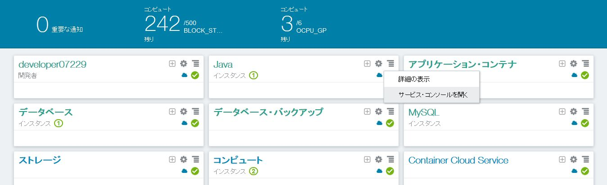


サービス・コンソールで、負荷生成サンプル・アプリケーションをデプロイするサービス・インスタンス名をクリックする。

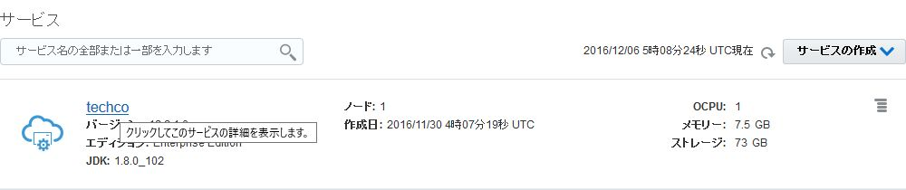


画面上部中央のハンバーガー・メニューをクリックし、**WebLogic Serverコンソールを開く** を選択する。

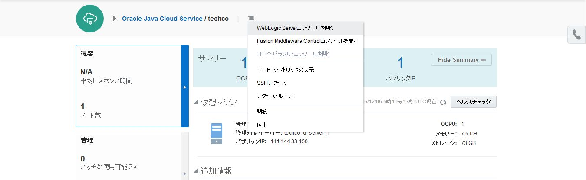


新しいブラウザが開かれ、選択したコンソールのログイン・ページにリダイレクトされる。自己証明書に保護されていると、証明書が信頼できないという警告される。これはデフォルトの構成であり、証明書を構成する事ができる。エラー内容を選択肢、例外の追加をクリックし、セキュリティ例外の承認を行う。


ダイアログが表示されたら、**セキュリティ例外の承認** をクリックする。When dialog appears select Confirm Security Exception.

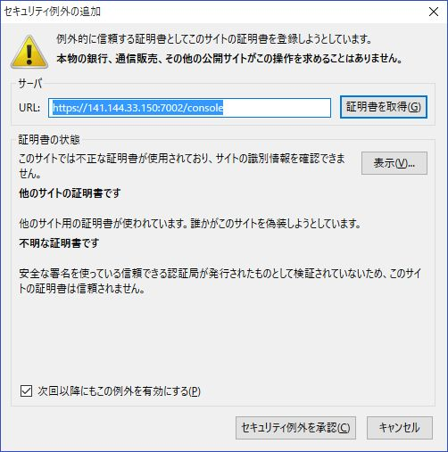

管理コンソールのログイン・ページが表示されたら、サービス・インスタンスの作成時に設定した WebLogic 管理者のユーザ名及びパスワードを入力する。

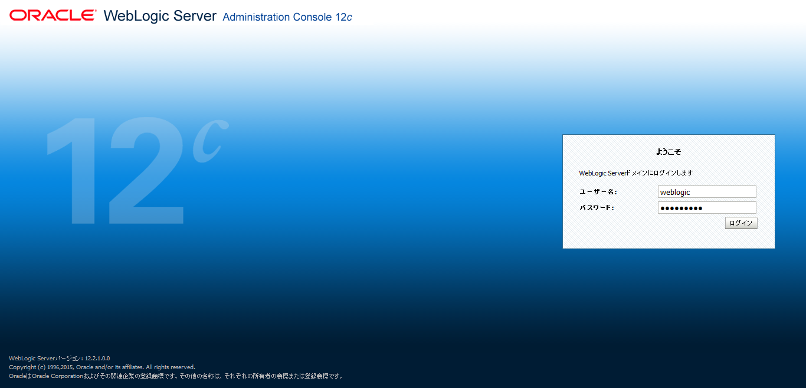


ログインできたら、WebLogic Serer 管理コンソールが表示される。**ロックして編集** をクリックし、**デプロイメント** をクリックする。そして、**インストール** をクリックする。

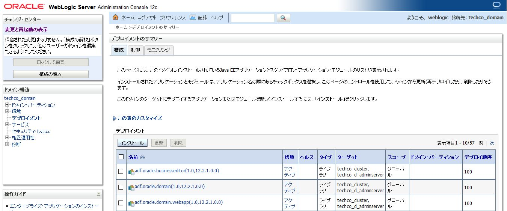


サーバ上には WAR ファイルを配置していないためアップロードする必要があるので、**ファイルをアップロード** をクリックする必要がある。

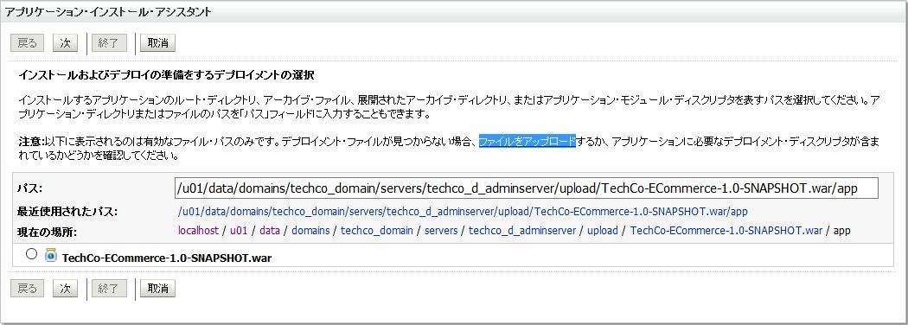


デプロイメント・アーカイブの **参照...** をクリックし、ファイルのアップロード・ダイアログを開く。

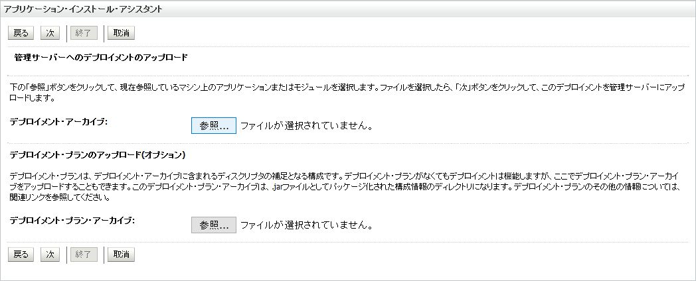


次のフォルダに配置されている先にビルドした `load.war` を選択する: `<クローンしたGitリポジトリ>/jcs.autoscale/target`.

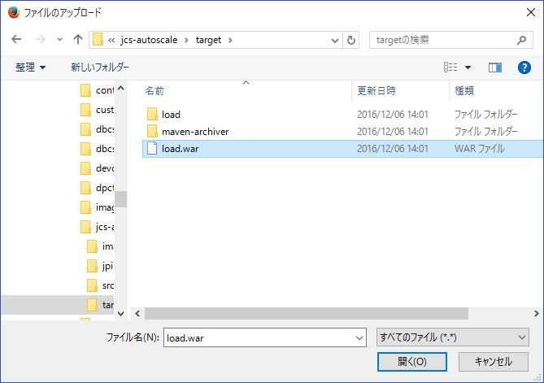


ファイルをアップロードすると **参照** の隣に WAR ファイルの名前が表示される。**次** をクリックする。

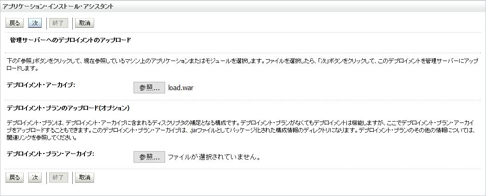


Confirm the selection of the `load.war` が選択されている事を確認し、**Next** をクリックする。

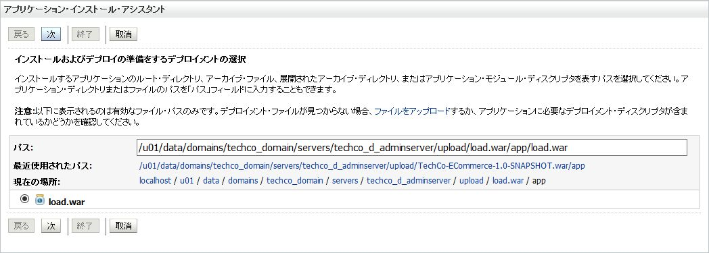


**このデプロイメントをアプリケーションとしてインストールする** が選択されている事を確認し、**次** をクリックする。


アプリケーションをデプロイする先のサーバは、**クラスタのすべてのサーバー** を選択し、**次** をクリックする。

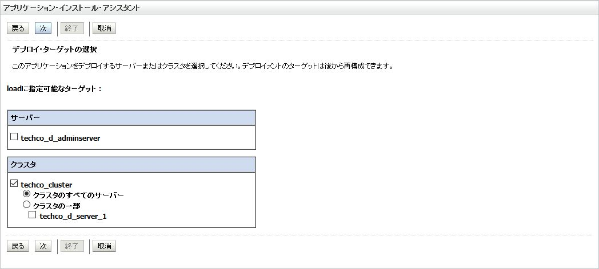


デフォルトの設定のまま、**終了** をクリックする。

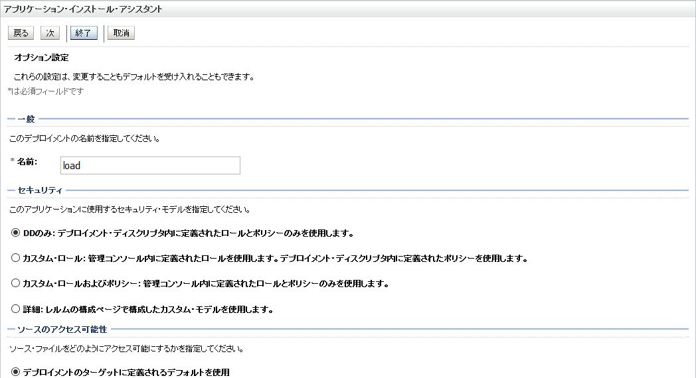


チェンジ・センターで、**変更のアクティブ化** をクリックする。

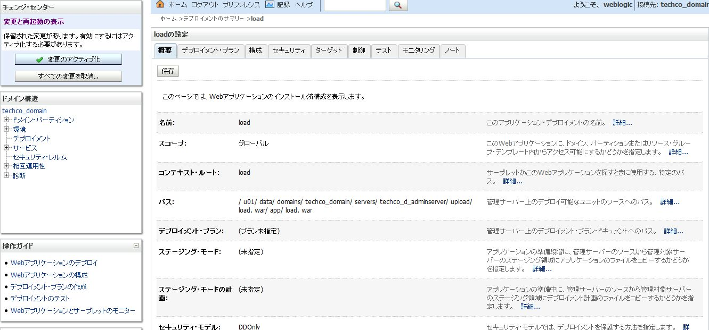


アプリケーションは ***準備完了*** 状態になっており、リクエストを受け付けられるようにする必要がある。デプロイしたアプリケーションを開始するには、ドメイン構造ペインの **デプロイメント** を選択し、**制御タブ** をクリックする。一覧からデプロイしたアプリケーションを見つける。アプリケーションを選択し、**起動** をクリックして **すべてのリクエストを処理** を選択する。

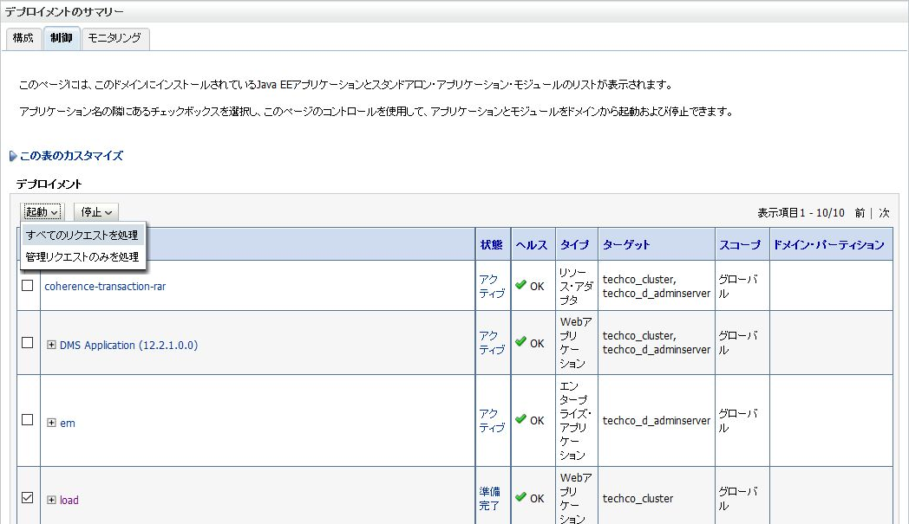

デプロイメントの確認に対して **はい** をクリックする。

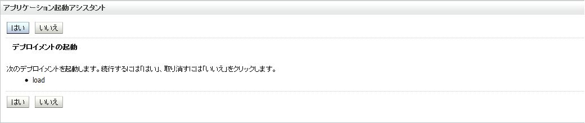


アプリケーションは ***アクティブ*** 状態になったのでリクエストの受付ができるようになっている。

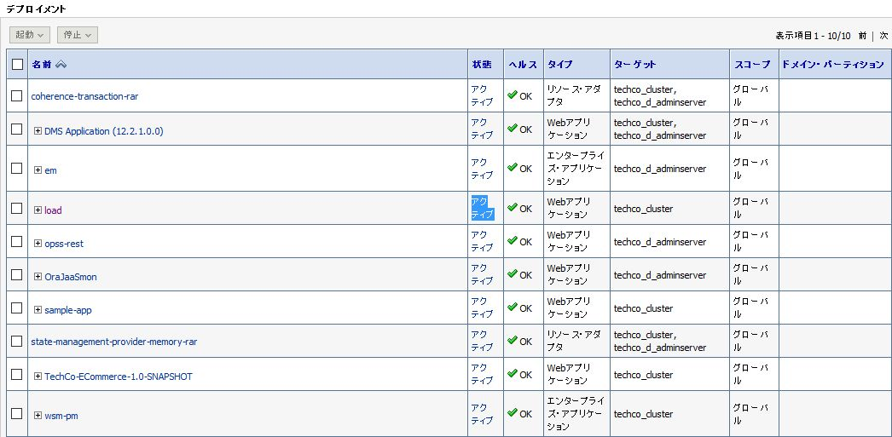

#### 負荷生成サンプル・アプリケーションの起動

アプリケーションの起動ために、Java Cloud Service に関する情報を確認しておく必要がある。ロードバランサを構成しているのであれば、ロードバランサが稼働しているパブリック IP アドレスを確認する。そうではない場合、管理対象サーバが稼働するいずれかの仮想マシンのパブリック IP アドレスを確認する必要がある。

ブラウザに戻り、Java Cloud Service の詳細ページでインスタンス・トポロジーとパブリック IP アドレスを確認する。左部メニューで **概要** が選択されている事を確認する。ロード・バランサが構成されていれば、そのパブリック IP アドレスをサンプル・アプリケーションの実行に使用する。ロード・バランサを構成していない場合は、管理対象サーバが稼働している仮想マシンの パブリック IP アドレスを使用する。ロード・バランサが構成されている場合でも、WebLogic をホストしている仮想マシンの IP アドレスは後続の手順のために控えておく必要がある。`ssh` を使用して仮想マシンにアクセスし、CPU の負荷をチェックするのである。

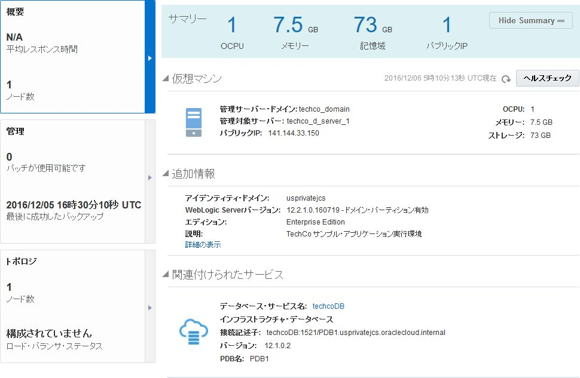


ブラウザを開き、次の URL を入力する: `https://<public-ip-address>/load/cpu.jsp` すると、負荷生成に使用するアプリケーションを確認できる。

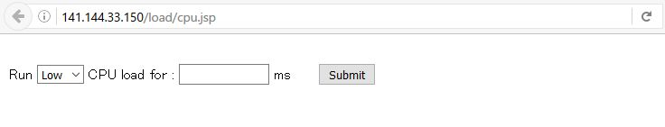


#### 自動スケール・ルールの作成

予め定義した基準をベースとした自動スケールを起動する Java Cloud Service のルールを作成する。Java Cloud Service インスタンスの詳細ページに戻り、左部メニューから **トポロジ** をクリックする。**ノードの追加** をクリックし、**自動スケール** を選択する。

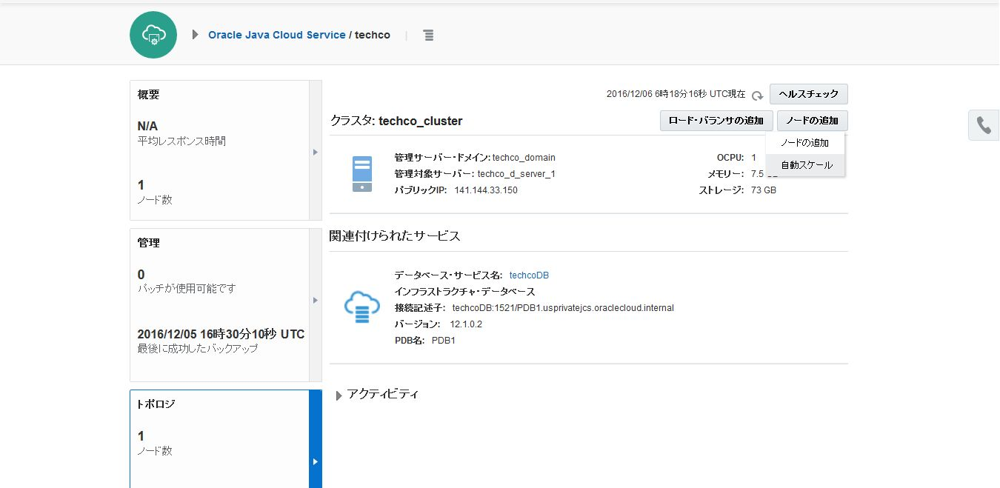

Rules ページで、**Create Rule** をクリックする。

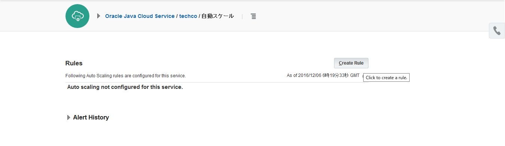

次のルール・パラメータを設定する:

- Perform: **Scale Out**
- Maximum Cluster Size: **2** (既存のクラスタサイズより 1 超のサイズ)
- CPU Utilization: **Average** - **50%**
- 計測期間数: **1**
- 計測期間: **5** minutes (5 が最小値)
- VM instances: **Any**
- Cool down period: 30 (30 が最小値)
  - スケール実施ご次回のスケールまでのスケール動作凍結期間

**Create** をクリックする。

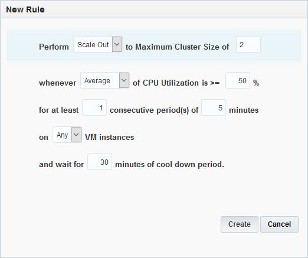


ルールの作成が完了するまで待機する。

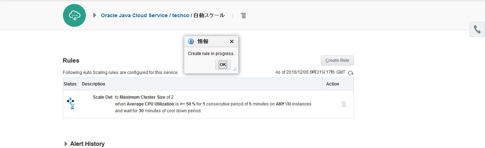


負荷生成の前に、CPU 負荷を確認するために管理対象サーバをホストしている仮想マシンへの `ssh` アクセスを行っておく。ターミナルを開き、`ssh -i privateKey opc@VM_PUBLIC_IP` コマンドを実行する。`privateKey` は、Java Cloud Service を作成する際に構成した公開鍵の対になる秘密鍵ファイルである。秘密鍵がパスフレーズを持っている場合、`ssh` する際にパスフレーズを入力する必要がある。

```bash
$ ssh -i privateKey opc@141.144.33.150
[opc@techco-wls-1 ~]$
```

これで仮想マシンへの `ssh` 接続が確立した。`top` コマンドを実行し、負荷生成中の管理対象サーバが稼働する仮想マシンの CPU 使用率を確認する

```bash
[opc@techco-wls-1 ~]$ top
```

`top` は稼働中のシステムをリアルタイムな情報表示画面を提供してくれる。システム状況のサマリ情報を表示ができ、またLinux カーネルによって現在管理されているプロセス一覧を表示する事ができる。
3行目で CPU の状態をリアルタイムに確認する事ができる。

- us: ユーザプロセスの使用時間
- sy: システムプロセスの使用時間
- ni: 実行優先度を変更したユーザプロセスの使用時間
- id: アイドル状態の時間
- wa: I/O の終了待ちをしている時間
- hi: ハードウェアの割り込み要求での使用時間
- si: ソフトウェアの割り込み要求での使用時間
- st: OS 仮想化利用時に他の仮想 CPU の計算で待たされた時間

```bash
top - 08:51:15 up 6 days,  4:39,  1 user,  load average: 0.00, 0.01, 0.05
Tasks: 120 total,   1 running, 119 sleeping,   0 stopped,   0 zombie
Cpu(s):  0.2%us,  0.0%sy,  0.0%ni, 99.2%id,  0.7%wa,  0.0%hi,  0.0%si,  0.0%st
Mem:   7660116k total,  5932292k used,  1727824k free,   374504k buffers
Swap:  4194300k total,     1372k used,  4192928k free,  2347876k cached

  PID USER      PR  NI  VIRT  RES  SHR S %CPU %MEM    TIME+  COMMAND
 7137 oracle    20   0 5769m 1.2g  41m S  0.7 16.3  10:56.20 java
 7546 oracle    20   0 2548m 128m  31m S  0.3  1.7   9:29.96 java
 7728 oracle    20   0 5022m 1.5g  58m S  0.3 20.3  34:51.87 java
    1 root      20   0 19408 1588 1272 S  0.0  0.0   0:02.34 init
    2 root      20   0     0    0    0 S  0.0  0.0   0:00.00 kthreadd
    3 root      20   0     0    0    0 S  0.0  0.0   0:00.58 ksoftirqd/0
    5 root       0 -20     0    0    0 S  0.0  0.0   0:00.00 kworker/0:0H
    6 root      20   0     0    0    0 S  0.0  0.0   0:00.00 kworker/u:0
    7 root       0 -20     0    0    0 S  0.0  0.0   0:00.00 kworker/u:0H
    8 root      RT   0     0    0    0 S  0.0  0.0   0:00.48 migration/0
```

top 上の CPU の負荷を後でチェックするためにターミナルは開いたままにする。

次に、Java Cloud Service に対して負荷をかける。負荷生成サンプル・アプリケーションが開かれているブラウザに切り替える。以下のパラメータを設定し、**Submit** をクリックする:
- CPU 負荷: **Mid**
- 期間: **400000** ms

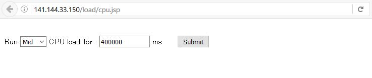

`top` 起動しているターミナルに切り替えて CPU 使用率を確認する。そして Java Cloud Service のスケール・アウト操作が自動スケール・ルールにより起動されるまで待機する。

```bash
top - 09:11:51 up 6 days,  4:59,  1 user,  load average: 1.25, 0.29, 0.14
Tasks: 121 total,   1 running, 120 sleeping,   0 stopped,   0 zombie
Cpu(s):100.0%us,  0.0%sy,  0.0%ni,  0.0%id,  0.0%wa,  0.0%hi,  0.0%si,  0.0%st
Mem:   7660116k total,  6119884k used,  1540232k free,   374628k buffers
Swap:  4194300k total,     1372k used,  4192928k free,  2347944k cached

  PID USER      PR  NI  VIRT  RES  SHR S %CPU %MEM    TIME+  COMMAND
 7137 oracle    20   0 5770m 1.4g  41m S 207.0 18.5  11:37.56 java
    1 root      20   0 19408 1588 1272 S  0.0  0.0   0:02.34 init
    2 root      20   0     0    0    0 S  0.0  0.0   0:00.00 kthreadd
    3 root      20   0     0    0    0 S  0.0  0.0   0:00.59 ksoftirqd/0
    5 root       0 -20     0    0    0 S  0.0  0.0   0:00.00 kworker/0:0H
    6 root      20   0     0    0    0 S  0.0  0.0   0:00.00 kworker/u:0
    7 root       0 -20     0    0    0 S  0.0  0.0   0:00.00 kworker/u:0H
    8 root      RT   0     0    0    0 S  0.0  0.0   0:00.48 migration/0
    9 root      20   0     0    0    0 S  0.0  0.0   0:00.00 rcu_bh
   10 root      20   0     0    0    0 S  0.0  0.0   0:35.33 rcu_sched
```
