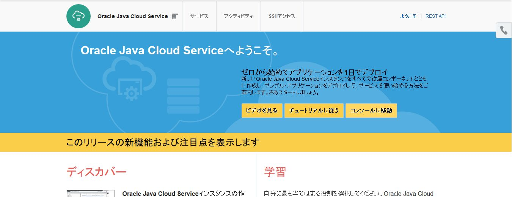
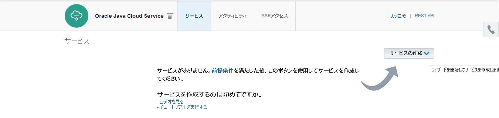
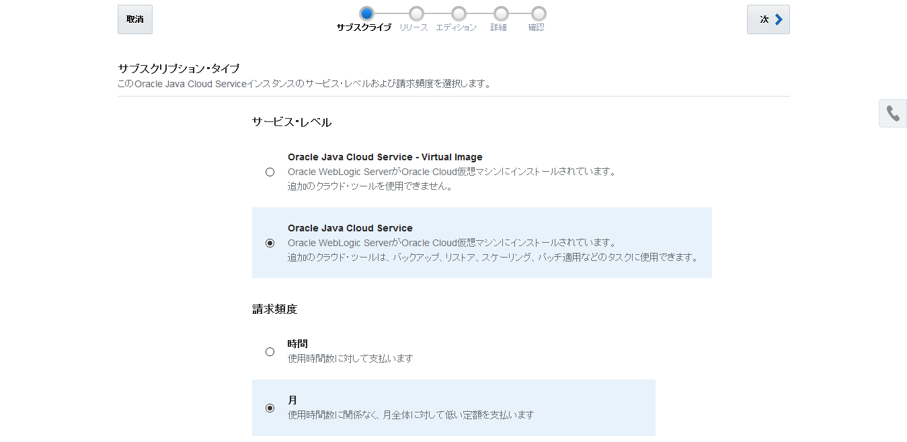
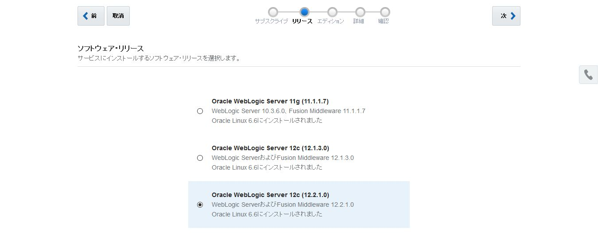
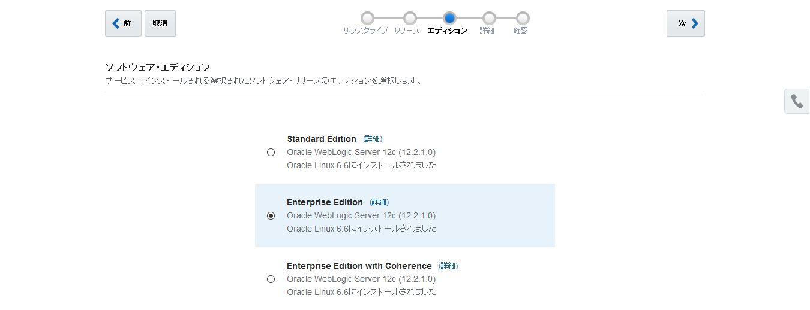
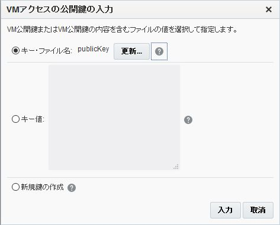
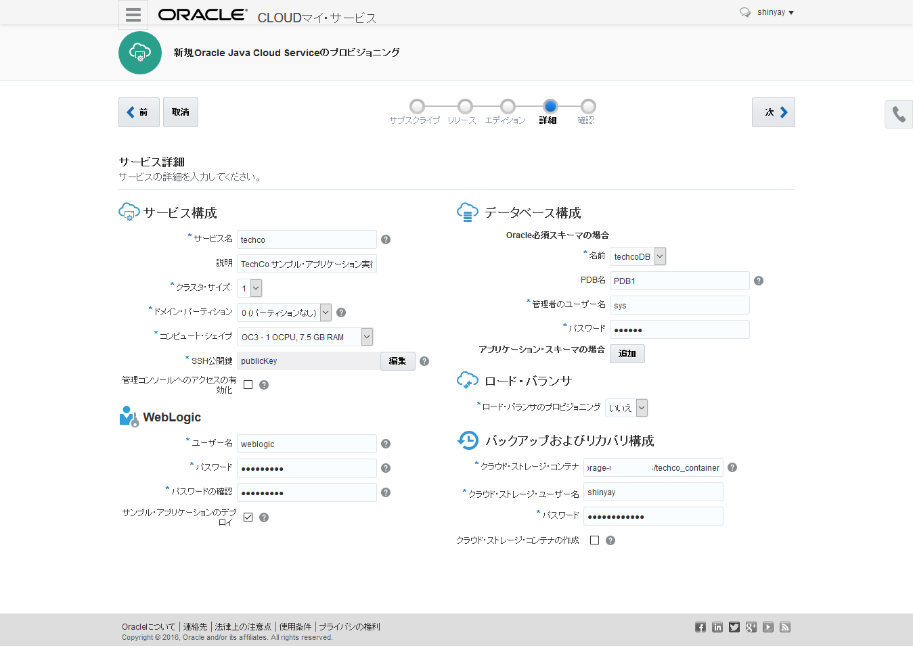
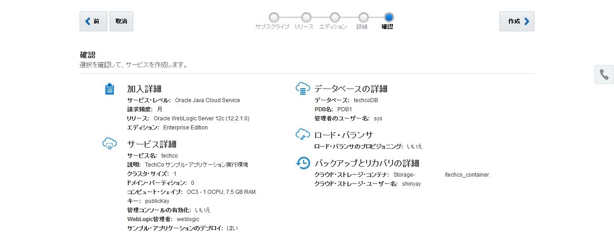
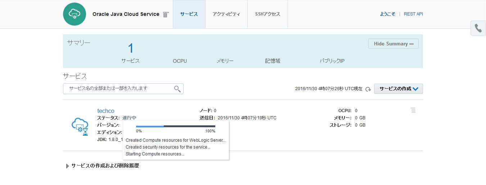

---
# ORACLE Cloud-Native DevOps workshop

## UI を用いた Java Cloud Service インスタンスの作成

### 説明

Java Cloud Service を用いることにより、WebLogic Server ドメイン環境と Java EE アプリケーション環境を基盤環境やプラットフォームの状態を意識することなく、迅速に構築・構成を行う事ができる。全てのJava Cloud Service のインスタンスは、事前構成されている Database Cloud Service 上のOracle Database を使用する事ができる。また、Storage Cloud Service 上に作成されているオブジェクト・ストレージ・コンテナも使用できる。

### このチュートリアルについて
このチュートリアルは、以下を実施する:

- UI を用いて Java Cloud Service インスタンスを作成する

### 前提

- Java Cloud Service、Database Cloud Service 及び Storage Cloud Service が利用できるアカウントを保有している事
- Java Required Files (JFR) に必要となる Fusion Middleware コンポーネント・スキーマをホストするために Database Cloud Service を使用する。そのため、Java Cloud Service のインスタンスを作成する事前に、チュートリアル: [UI を用いた Database Cloud Service インスタンスの作成](../dbcs-create/README.md) を実施しておく。Java Cloud Service のインスタンスの作成プロセスの中で、作成済みのデータベースに JRF スキーマをプロビジョンする。

### 手順

Oracle Cloud へ[サインイン](../common/sign.in.to.oracle.cloud.md) する [(https://cloud.oracle.com/sign-in)](https://cloud.oracle.com/sign-in)。
データセンターを選択し、アイデンティティドメインとアカウント情報を入力してログインする。
ログイン後、ダッシュボード画面の Java Cloud Service のドロップダウンメニューから **サービス・コンソールを開く** を選択する。

Java Cloud Service コンソール画面が表示される。初めてコンソール画面を開く場合、ウェルカム・ページが表示される。この場合は、**コンソールに移動** をクリックする。

インスタンスの作成のために **サービスの作成** をクリックする。

サブスクリプション・タイプを選択する。
- サービス・レベル: **Oracle Java Cloud Service**
- 請求頻度: **月** (デフォルト)

詳細なサブスクリプション・タイプは[documentation](https://docs.oracle.com/cloud/latest/jcs_gs/JSCUG/GUID-31F00F2C-221F-4069-8E8A-EE48BFEC53A2.htm#JSCUG-GUID-98DD6CE1-480F-4AA9-8131-A1D3D274440F)を参照。

ソフトウェア・リリースを選択する。
- **Oracle WebLogic Server 12c (12.2.1.0)**

ソフトウェア・エディションを選択する。
Java Cloud Service では、インスタンス作成時に以下のエディションが選択可能
- Standard Edition
- Enterprise Edition
- Enterprise Edition with Coherence

この中から **Enterprise Edition** を選択する。

最後にサービス詳細では、以下のパラメータを入力する

- **サービス名**: サービス・インスタンスの名前 (例. techco)
- **説明**: サービスに関する説明
- **クラスタ・サイズ**: デフォルト(1)を選択する。これは管理対象サーバが1インスタンスである事を意味する。
- **ドメイン・パーティション**: マルチテナント・インスタンスの作成を行う。デフォルト(1)を選択する。
- **コンピュート・シェイプ**: OCPU の数とメモリの容量 (デフォルトを選択)
- **タイムゾーン**: タイムゾーンを選択 (日本標準時を選択)
- **SSH 公開鍵**: 仮想マシンにアップロードする公開鍵を指定する。秘密鍵を利用して SSH接続 によりアクセスできる。Database Cloud Service インスタンスを作成した際に作成した公開鍵を使用する。**編集** ボタンをクリックしして、チュートリアル: [UI を用いた Database Cloud Service インスタンスの作成](../dbcs-create/README.md) で作成・保存した`<クローンしたGitリポジトリ>/cloud-utils/publicKey`を選択する。 または、*publickKey* の内容をキー値フィールドにコピーしてもよい。もし鍵を持っていない場合や、別の鍵を作成したい場合は **新規鍵の作成** を選択し、新しく鍵を生成し保存しておく。

- **管理コンソールへのアクセスの有効化**: 管理コンソールににアクセスするためにチェックをつけておく。このチェックをつけない場合、パブリックなインターネット上に公開されることから、デフォルトでは管理コンソールのアクセスポートは有効になっていない。

- **ユーザ名**: WebLogic 管理者のユーザ名を指定する。ここでは、***weblogic*** を入力
- **パスワード**: WebLogic 管理者のパスワードを指定する。
- **サンプル・アプリケーションのデプロイ**: サンプル・アプリケーションのデプロイを行う。Java Cloud Service インスタンスのアクセスの確認、ロードバランサの構成などに用いる。
- **データベース構成 / 名前**: WebLogic のリポジトリ・データを格納するための Database Cloud Service インスタンス名を指定する。同じアイデンティティ・ドメイン内の Database Cloud Service のインスタンス名が表示される。
- **データベース構成 / PDB 名**: リポジトリ・スキーマを格納するために使用するプラガブル・データベースの名称を指定する。これは先に指定した Database Cloud Service のインスタンスに含まれる PDB を指定する。デフォルトでは、Database Cloud Service インスタンス作成時にデフォルトで作成される　***PDB1*** が指定される。
- **データベース構成 / 管理者のユーザ名**: Java Cloud Service のリポジトリ・スキーマを作成するための DBA admin ユーザを指定する。(***sys*** を指定)
- **データベース構成 / パスワード**: DBA admin ユーザのパスワードを指定する。
- **データベース構成 / アプリケーション・スキーマの場合**: 異なるデータベース・インスタンスへのアクセスを追加するオプションである。たとえば、アプリケーションで使用するデータベースが、Java Cloud Service インスタンスで使用するリポジトリ・データベースと異なる場合に使用する。Java Cloud Service インスタンスの作成後でも別のデータベース・インスタンスの指定はできるが、こここで定義をする方が容易に定義できる。
- **ロード・バランサのプロビジョニング**: ロードバランサの構成有無を指定する。(***いいえ*** を選択する)
- **クラウド・ストレージ・コンテナ**: Java Cloud Service 用のストレージ・コンテナ名。次のフォーマットで入力する: `Storage-IDENTITYDOMAIN/CONTAINERNAME`
なお以降の指定項目で自動でコンテナを作成するオプションがあるため、コンテナは、事前に作成しておく必要はない。
ここでは、Database Service インスタンスの作成時に作成済みのコンテナ名を指定する。 (***techco_container***)
- **クラウド・ストレージ・ユーザー名/パスワード**: Storage Cloud Service のアクセス・ユーザ及びパスワード
- **クラウド・ストレージ・コンテナの作成**: チェックする (コンテナが存在しない場合に作成する)

各パラメータの詳細は[documentation](https://docs.oracle.com/cloud/latest/jcs_gs/JSCUG/GUID-31F00F2C-221F-4069-8E8A-EE48BFEC53A2.htm#JSCUG-GUID-88BD737C-8DA9-419A-8DBF-489BDFF9C512)を参照。**次** をクリックする。

最後のページは構成に関するサマリーが表示される。ここでインスタンスの作成リクエストのサブミット前に確認を行う。**作成** をクリックするとサービス・インスタンスの作成が開始する。

リクエストが受領されると、Java Cloud Service Cloud コンソール画面に戻り、新しいインスタンスが表示される。この時点では、インスタンスはメンテナンス状態となっている。**進行中** をクリックするとインスタンス作成状態の情報が確認できる。

