---
# ORACLE Cloud-Native DevOps workshop #
-----
## TechCo (Java EE) サンプル・アプリケーションの Java Cloud Service へのデプロイ

### 説明

WebLogic 管理コンソールを使用して Java Cloud Service に対するアプリケーションのデプロイとアンデプロイを行う。Java Cloud Service では、サービス・コンソールから直接アプリケーションのデプロイやアンデプロイは行えない。

Java Cloud Service では、オンプレミスのサービス・インスタンスにアプリケーションのデプロイやアンデプロイを行うとの同様に、WebLogic Server 管理コンソールの GUI を利用して Java Cloud Service にデプロイやアンデプロイを行う事ができる。

### このチュートリアルについて
このチュートリアルは、以下を実施する:

- WebLogic 管理コンソールを使用して Java Cloud Service へリソース (データソース) を定義する
- WebLogic 管理コンソールを使用して Java Cloud Service へ Java EE アプリケーションをデプロイする

### 前提

- チュートリアル: [TechCo (Java EE) サンプル・アプリケーション用 Database Cloud Service の準備](../dbcs-prepare/README.md) を実施し、TechCo サンプル・アプリケーションのデータの準備をデータベース・インスタンスに準備しておく事
- チュートリアル: [UI を用いた Database Cloud Service インスタンスの作成](../jcs-create/README.md) を実施し、Database Cloud Service にアクセスするJava Cloud Service インスタンスが稼働している事

### 手順

#### サンプル・アプリケーションのビルド
ターミナルを開き `<クローンしたGitリポジトリ>/techco-app` フォルダに移動し、サンプル・アプリケーションをビルドする。

```bash
$ [oracle@localhost Desktop]$ cd /u01/content/cloud-native-devops-workshop/techco-app
$ [oracle@localhost techo-app]$ mvn install
Running the build you should see output similar to:

[oracle@localhost techo-app]$ mvn install
[INFO] Scanning for projects...
[INFO]                                                                         
[INFO] ------------------------------------------------------------------------
[INFO] Building TechCo-ECommerce 1.0-SNAPSHOT
[INFO] ------------------------------------------------------------------------
Downloading: https://repo.maven.apache.org/maven2/org/apache/maven/plugins/maven-war-plugin/2.4/maven-war-plugin-2.4.pom
Downloaded: https://repo.maven.apache.org/maven2/org/apache/maven/plugins/maven-war-plugin/2.4/maven-war-plugin-2.4.pom (10 KB at 3.7 KB/sec)
...
...
...
[INFO] Installing /u01/content/cloud-native-devops-workshop/techo-app/pom.xml to /home/oracle/.m2/repository/com/oracle/samples/TechCo-ECommerce/1.0-SNAPSHOT/TechCo-ECommerce-1.0-SNAPSHOT.pom
[INFO] ------------------------------------------------------------------------
[INFO] BUILD SUCCESS
[INFO] ------------------------------------------------------------------------
[INFO] Total time: 01:06 min
[INFO] Finished at: 2016-08-20T05:41:55-07:00
[INFO] Final Memory: 24M/491M
[INFO] ------------------------------------------------------------------------
[oracle@localhost techco-app]$
```

Now the web archive (war) is ready to deploy in the `target`フォルダの中にデプロイする事ができる Web Archive ファイル (WAR) が生成されている。

#### サンプル・アプリケーション用のデータソースの作成
Oracle Cloud へ[サインイン](../common/sign.in.to.oracle.cloud.md) する [(https://cloud.oracle.com/sign-in)](https://cloud.oracle.com/sign-in)。
データセンターを選択し、アイデンティティドメインとアカウント情報を入力してログインする。
ログイン後、ダッシュボード画面の Java Cloud Service のドロップダウンメニューから **サービス・コンソールを開く** を選択する。


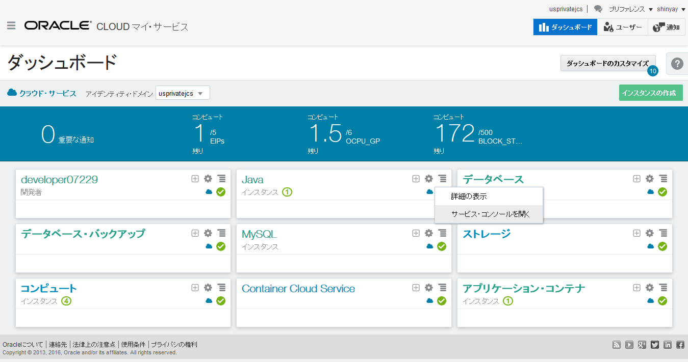

サービス・サマリーの右上部の角にあるハンバーガー・メニューをクリックし、メニューから **WebLogic Serverコンソールを開く** を選択する。

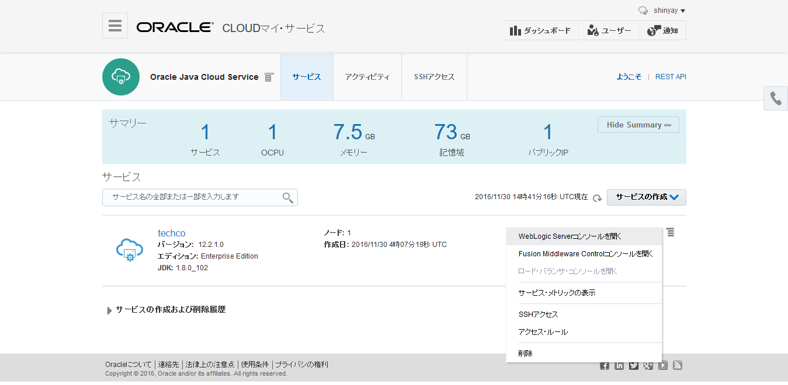


新しいブラウザが開かれ、選択したコンソールのログイン・ページにリダイレクトされる。自己証明書に保護されていると、証明書が信頼できないという警告される。これはデフォルトの構成であり、証明書を構成する事ができる。エラー内容を選択肢、例外の追加をクリックし、セキュリティ例外の承認を行う。


ダイアログが表示されたら、**セキュリティ例外の承認** をクリックする。When dialog appears select Confirm Security Exception.


管理コンソールのログイン・ページが表示されたら、サービス・インスタンスの作成時に設定した WebLogic 管理者のユーザ名及びパスワードを入力する。


ログインできたら、WebLogic Serer 管理コンソールが表示される。**ロックして編集** をクリックし、**サービス -> データ・ソース** とクリックする。そして、**汎用データ・ソース** を新規作成する。

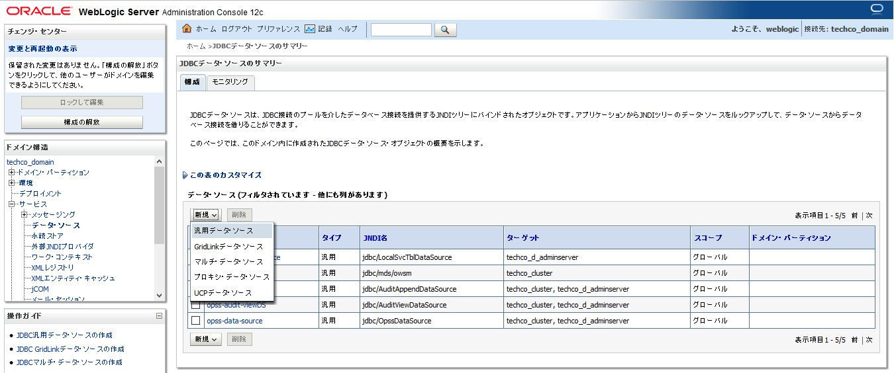


次のパラメータでデータ・ソースを構成する:

- **名前**: jdbc-OE
- **スコープ**: Global (default)
- **JNDI名**: jdbc/OE
- **データベースのタイプ**: Oracle (default)

**次** をクリックする。

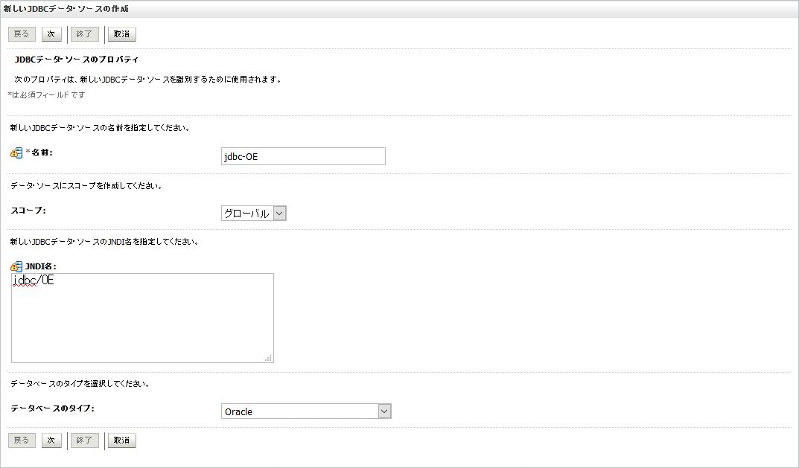


デフォルトのデータベース・ドライバのまま **次** をクリックする。

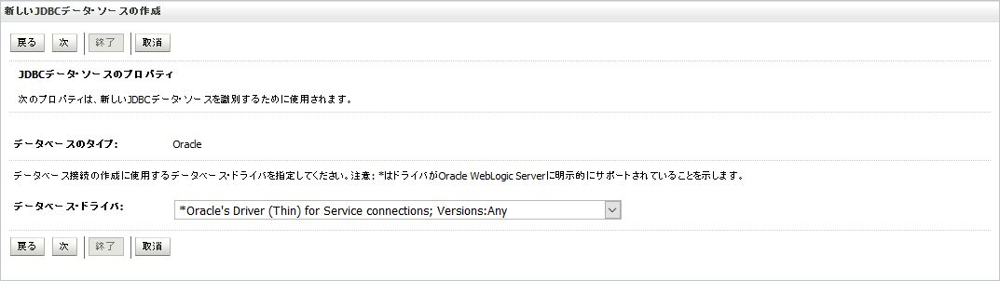


デフォルトのトランザクション・オプションのまま **次** をクリックする。

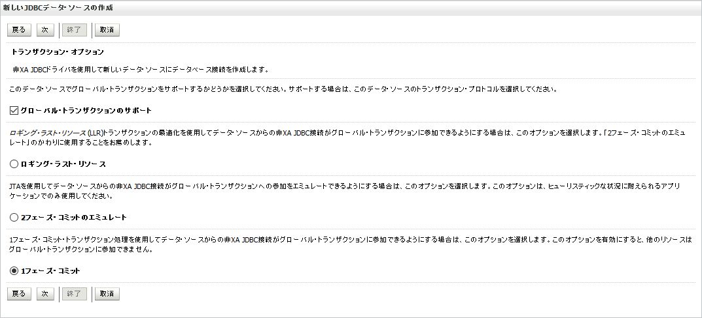


接続プロパティを設定する。

- **データベース名**: `PDB1.<identitydomain>.oraclecloud.internal`
+ **ホスト名**: 準備済みのサンプル・アプリケーションを稼働させる Database Cloud Service インスタンス名。チュートリアル: [TechCo (Java EE) サンプル・アプリケーション用 Database Cloud Service の準備](../dbcs-prepare/README.md) にて準備したサービス・インスタンス: `techcoDB`
- **ポート**: デフォルトのまま 1521
- **データベース・ユーザー名**: oe
- **パスワード**: DBA アカウントに入力したパスワード (Database Cloud Service 管理者 - sys)
- **oracle.jdbc.DRCPConnectionClass**: 空欄

**次** をクリックする。

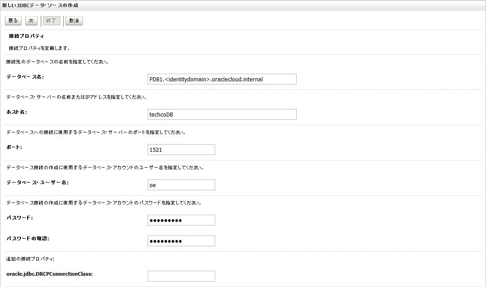


**構成のテスト** をクリックし、データ・ソースのテストを行う。

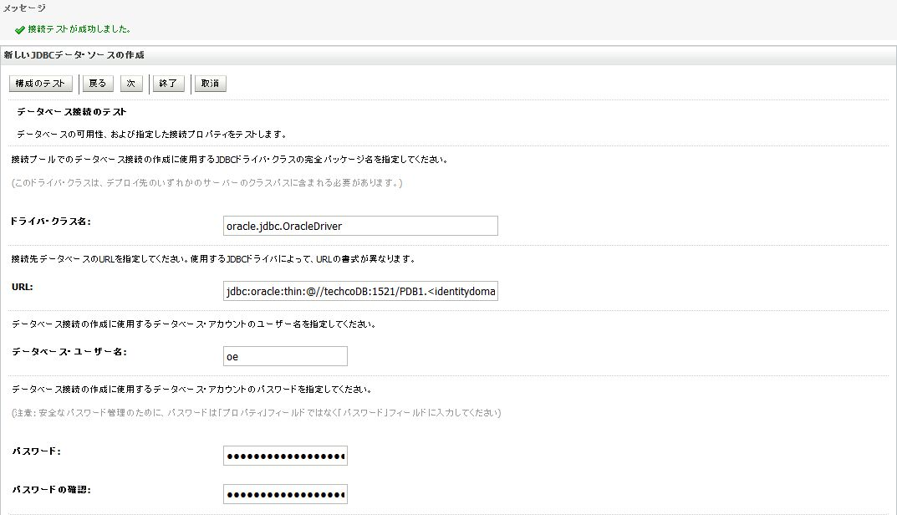


アプリケーションをデプロイする対象をサーバか、クラスタかを選択する。このチュートリアルでは、アプリケーションを **クラスタのすべてのサーバ** にデプロイするように選択し、**終了** をクリックする。

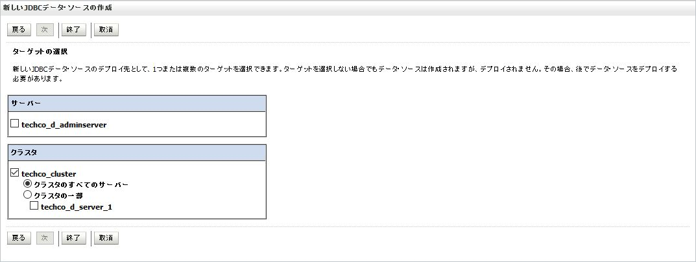


**変更のアクティブ化** をクリックし、承認メッセージを確認する。: `すべての変更がアクティブ化されました。再起動は不要です。`

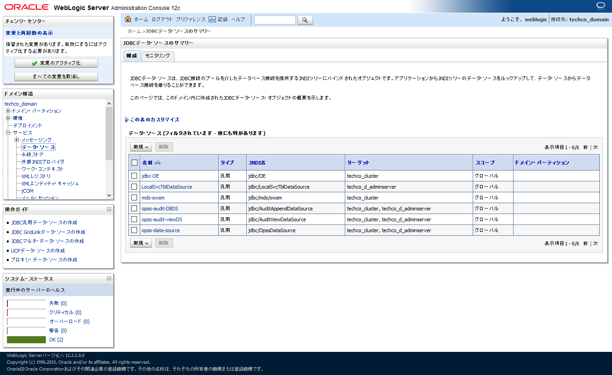


#### サンプル・アプリケーションのデプロイ
**ロックして編集** をクリックし、**デプロイメント** を選択する。そして **インストール** をクリックする。

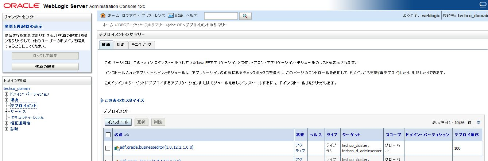


インストール・ページで、**ファイルをアップロード** をクリックする。

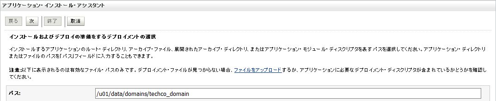


アプリケーション・インストール・アシスタント画面上で、参照をクリックし、`<クローンしたGitリポジトリ>/techco-app/target/TechCo-ECommerce-1.0-SNAPSHOT.war` を見つけ、デプロイするためにアップロードする。


ファイルをアップロードすると、参照ボタンの隣にファイル名が表示される。**次** をクリックする。

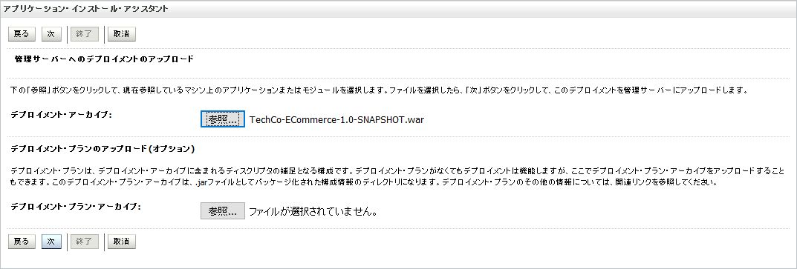


ファイルを選択し、**次** をクリックする。

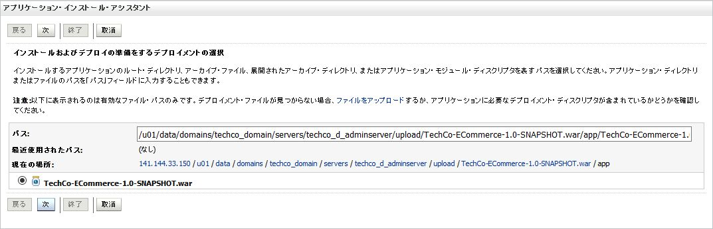


インストールタイプは **このデプロイメントをアプリケーションとしてインストールする** を選択し、**次** をクリックする。


デプロイ・ターゲットに **クラスタのすべてのサーバ** を選択し、**次** をクリックする。

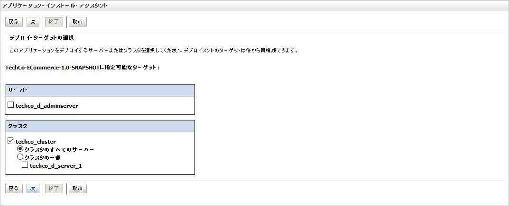


オプション設定はデフォルトのまま、**終了** をクリックする。

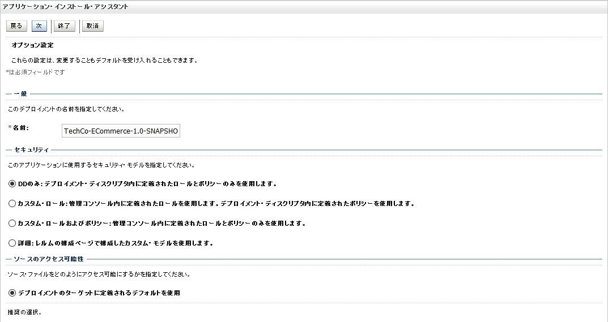

**変更のアクティブ化** をクリックする。


アプリケーションは ***準備完了*** 状態になっており、リクエストを受け付けられるようにする必要がある。デプロイしたアプリケーションを開始するには、ドメイン構造ペインの **デプロイメント** を選択し、**制御タブ** をクリックする。一覧からデプロイしたアプリケーションを見つける。

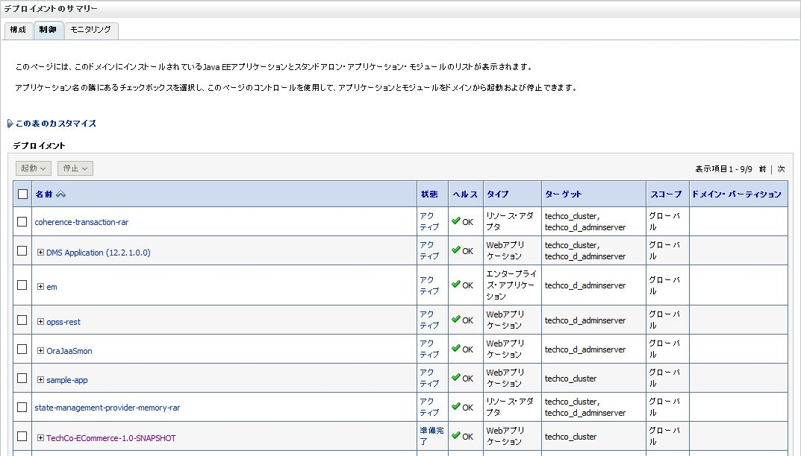


アプリケーションを選択し、**起動** をクリックして **すべてのリクエストを処理** を選択する。

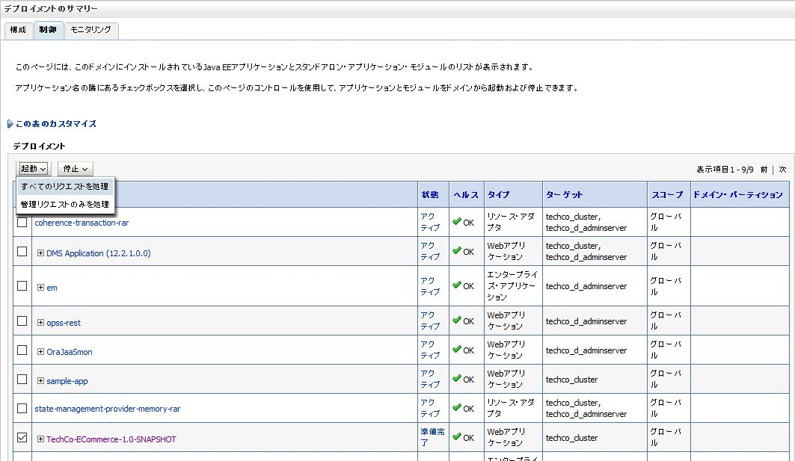


デプロイメントの確認に対して **はい** をクリックする。

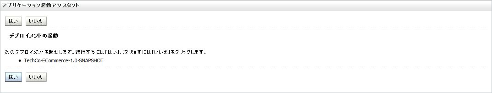


アプリケーションは ***アクティブ*** 状態になったのでリクエストの受付ができるようになっている。


#### サンプル・アプリケーションの起動

Java Cloud Service インスタンスにデプロイし起動したアプリケーションのテストを行うために、コンピュート・ノードのパブリックIPアドレスが必要となる。

Oracle Cloud マイ・サービスのダッシュボード画面に移動する。もし閉じている場合は、Oracle Cloud へ[サインイン](../common/sign.in.to.oracle.cloud.md)[(https://cloud.oracle.com/sign-in)](https://cloud.oracle.com/sign-in)し、ダッシュボード画面の Java Cloud Service のドロップダウンメニューから **サービス・コンソールを開く** を選択する。


アプリケーションをデプロイしたサービス・インスタンス名をクリックする。

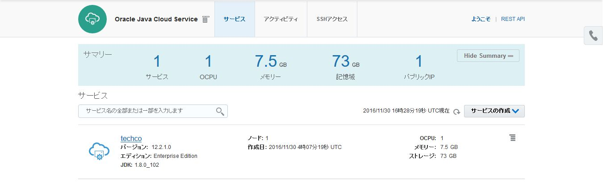


サービス・インスタンスの詳細ページで、ノード一覧を確認し管理サーバと管理対象サーバが含まれている仮想マシンのパブリックIPアドレスを控える。
ロードバランサの構成を行っている場合は、その仮想マシンのパブリックIPアドレスを控える。

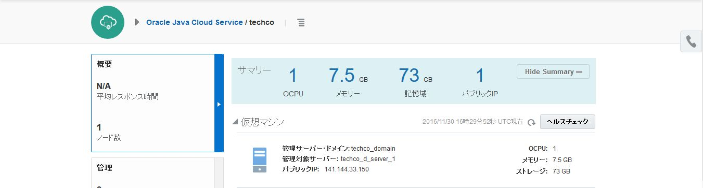


ブラウザで次のURLを開く: `https://<public-ip-address>/TechCo-ECommerce`

サンプル・アプリケーションのホーム・ページが確認できる。


