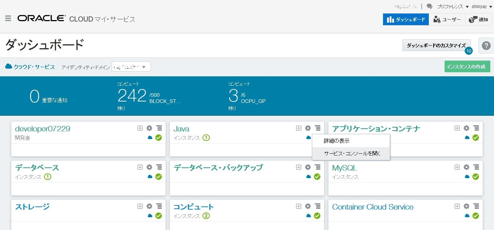
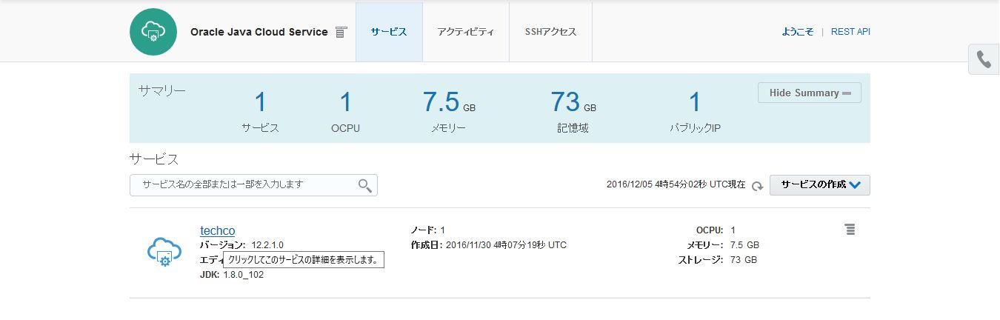
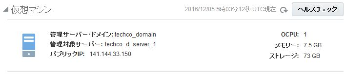
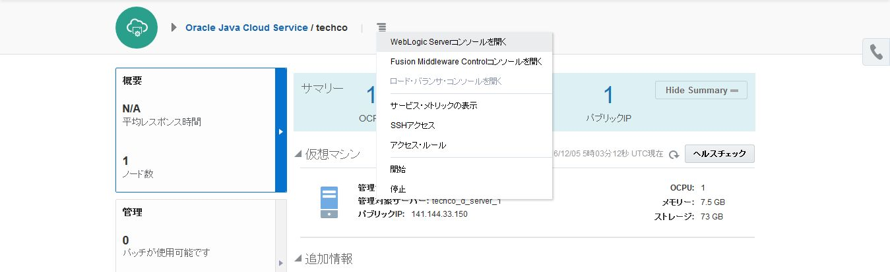
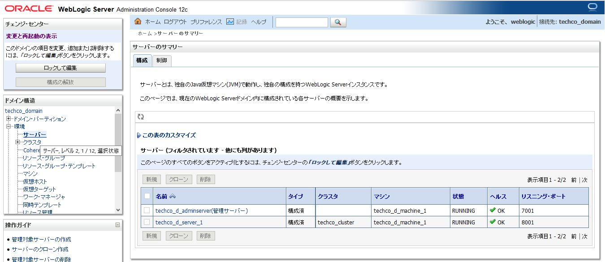
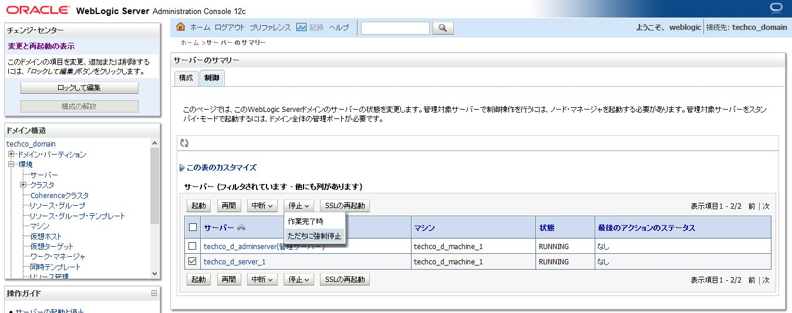
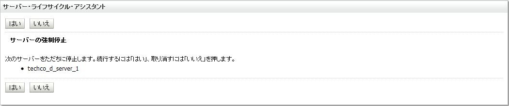
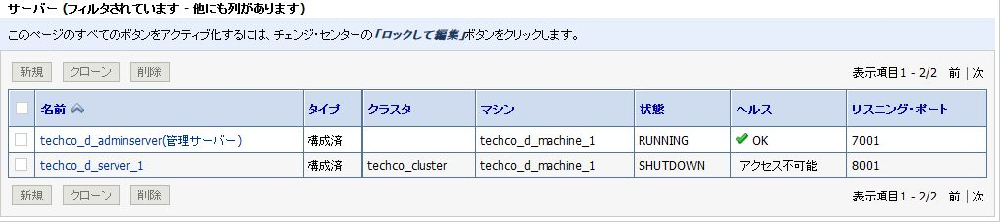
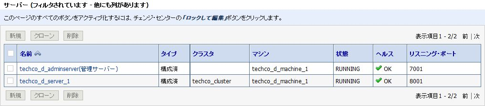

---
# ORACLE Cloud-Native DevOps workshop
----
## Java Cloud Service のダイレクト・アクセス及び管理

### 説明

SSH により VM にログインする事でサービス・インスタンスが提供しているサービスやリソースにアクセスする事ができる。

### このチュートリアルについて

このチュートリアルは、以下を実施する:

- SSH を使用して Java Cloud Service の VMにアクセスする
- UI (管理コンソール) を使用して管理対象サーバを停止する
- startup.properties を変更する
- WLST を使用して管理対象サーバを開始する
- WebLogic サーバ・ログのパターンマッチングによる検索

### 前提

- チュートリアル: [TechCo (Java EE) サンプル・アプリケーションの Java Cloud Service へのデプロイ](../jcs-deploy/README.md) を実施済みであること
- コンピュート・ノードに SSH で接続する前に、以下を確認・実施しておく必要がある
  - WebLogic Server がデプロイされているコンピュート・ノードの IP アドレスを確認しておく事。Java Cloud Service の概要ページに表示されている
  - Java Cloud Service インスタンスを作成した際に使用した公開鍵と遂になる SSH 秘密鍵を確認しておく事。

### 手順

Java Cloud Service コンソールに移動する。Oracle Cloud へ[サインイン](../common/sign.in.to.oracle.cloud.md) し [(https://cloud.oracle.com/sign-in)](https://cloud.oracle.com/sign-in)、ログイン後、ダッシュボード画面の Java Cloud Service のドロップダウンメニューから **サービス・コンソールを開く** を選択する。




サンプル・アプリケーションをホストするサービス・インスタンスをクリックする




Java Cloud Service インスタンスをホストしているコンピュート・ノードのパブリック IP アドレスを控える。




#### SSH を使用して　Java Cloud Service に接続する

ターミナルを開き、`privateKey` を配置している `<クローンしたGitリポジトリ>/cloud-utils` フォルダへ移動する

```bash
$ cd <クローンしたGitリポジトリ>/cloud-utils
```

SSH コマンドを使用して、リモートの VM に接続する。最初のコマンド・パラメータは、**秘密鍵ファイルの場所** で、次のパラメータが **リモート・ユーザ名と、リモート・アドレス** (サービス・インスタンスのパブリック IP アドレス) である。秘密鍵ファイルの名前が **privateKey** で、かつ `ssh` を実行するフォルダと同じ場所に配置してあれば、次のようなコマンドになる。ただし、IP アドレスは、各自の値に差し替える。:

```bash
$ ssh -i privateKey opc@141.144.33.150
[opc@techco-wls-1 ~]$
```

接続が確立したら、***oracle*** ユーザに変更する必要がある。*opc* ユーザはインスタンスに関するファイルにアクセスする権限がないためである。

```bash
$ sudo su - oracle
```

接続が確立され、インスタンスを管理するプロンプトの準備ができた。このターミナルは、後続の手順のために開いたままにしておく。

#### 管理コンソールを使用した管理対象サーバの停止

ブラウザで開いている Java Cloud Service コンソールに戻る。インスタンス名の横のハンバーガー・メニュー・アイコンをクリックし、**WebLogic Server コンソールを開く** を選択する。




ドメイン名の下のナビゲーション・ツリーの **環境** ノードをクリックし展開し、**サーバー** をクリックする。ドメインの一部であるサーバー一覧がワークスペースに表示される。




**制御** タブをクリックする。選択チェックボックスをクリックし、管理対象サーバを選択する。**停止->ただちに強制停止** をクリックすると、シャットダウン命令が送信される。




**はい** を選択し、命令を確認した後、完了するまで待機する。



状態が **SHUTDOWN** になるとシャットダウン操作が完了している。




#### 管理対象サーバ用の起動スクリプトの修正

SSH 接続が確立されているターミナル・ウインドウに変更する。管理対象サーバの起動スクリプトがないか nodemanager.properties を確認する。

```properties
-bash-4.1$ less $DOMAIN_HOME/nodemanager/nodemanager.properties
#Node manager properties
#Wed Nov 30 04:22:43 UTC 2016
DomainsFile=/u01/data/domains/techco_domain/nodemanager/nodemanager.domains
LogLimit=0
PropertiesVersion=12.2.1
AuthenticationEnabled=true
NodeManagerHome=/u01/data/domains/techco_domain/nodemanager
JavaHome=/u01/jdk
LogLevel=FINE
DomainsFileEnabled=true
StartScriptName=startJCSServer.sh
ListenAddress=techco-wls-1
NativeVersionEnabled=true
ListenPort=5556
LogToStderr=true
SecureListener=true
LogCount=1
StopScriptEnabled=false
QuitEnabled=true
LogAppend=true
StateCheckInterval=500
CrashRecoveryEnabled=true
StartScriptEnabled=true
LogFile=/u01/data/domains/techco_domain/nodemanager/nodemanager.log
LogFormatter=weblogic.nodemanager.server.LogFormatter
ListenBacklog=50
UseKSSForDemo=false
(END)
```

`StartScriptName` に示されている `startJCSServer.sh` が管理対象サーバの起動スクリプトである事を表示している。**q** を押して、`less`を抜ける。この `startJCSServer.sh` スクリプトをエディタ vi で開く。

```bash
-bash-4.1$ vi $DOMAIN_HOME/bin/startJCSServer.sh
```

**i** を押して編集モードに変更する。`/u01/data/domains/techco_domain/bin/startWebLogic.sh "$@"` の 前に、`echo="CUSTOM PROPERTY SETTING"` を挿入する。この目的は、アプリケーションに必要なカスタム属性をどのように設定するかを実践する事である。

```bash
#!/bin/bash
# Copyright (c) 2014 Oracle and/or its affiliates. All rights reserved.

# script to set the USER_MEM_ARGS before starting Server

managedServerName=techco__server_1
patternToBeMatched=`echo $managedServerName | cut -d _ -f 1,2`
if [ "${SERVER_NAME}" = "techco__adminserver" ]
then
   USER_MEM_ARGS="-Djava.security.egd=file:/dev/./urandom"
   JAVA_OPTIONS="$JAVA_OPTIONS -Dweblogic.rjvm.enableprotocolswitch=true -Djava.net.preferIPv4Stack=true"
   export JAVA_OPTIONS
   export USER_MEM_ARGS
elif [[ $SERVER_NAME =~ $patternToBeMatched ]]
then
   # in case of ManagedServer java args are coming from the startup.properties file so no need to set it explicitly. Setting USER_MEM_ARGS to " " so that default values of MEM_ARGS does not come into picture at all
    USER_MEM_ARGS=" "
    export USER_MEM_ARGS
fi

echo "CUSTOM PROPERTY SETTING"

/u01/data/domains/techco_domain/bin/startWebLogic.sh "$@"

```

管理対象サーバを起動する前に、管理対象サーバのログファイルに ***CUSTOME PROPERTY*** というエントリーがない事を確認する:

```bash
-bash-4.1$ grep -C 4 'CUSTOM PROPERTY' $DOMAIN_HOME/servers/techco_d_server_1/logs/techco_d_server_1.*
```

ログファイルにそのようなエントリー行がない事が確認できる。次に管理対象サーバを起動する。

#### WLST コマンドを使用して管理対象サーバを起動

`/u01/app/oracle/middleware/oracle_common/common/bin/` ディレクトリに移動し、WLST コマンド・ライン・インターフェース  を使用するために、`wlst.sh` を実行する。

```bash
-bash-4.1$ cd /u01/app/oracle/middleware/oracle_common/common/bin/
-bash-4.1$ ./wlst.sh

Initializing WebLogic Scripting Tool (WLST) ...

Welcome to WebLogic Server Administration Scripting Shell

Type help() for help on available commands

wls:/offline>
```

まず、ターゲット・サーバーを管理するノード・マネージャに接続する必要がある。ノード・マネージャに接続するために、次のコマンドを実行する。
- nmConnect(<ユーザ名>,<パスワード>,<ノード・マネージャ・ホスト名>,<ノード・マネージャ・ポート番号>,<ドメイン名>,<ドメイン・ディレクトリ>,<ノード・マネージャ・タイプ>)

```bash
wls:/offline> nmConnect('weblogic', '<password>', 'techco-wls-1', '5556', 'techco_domain', '/u01/data/domains/techco_domain', 'SSL')
Connecting to Node Manager ...
Successfully Connected to Node Manager.
wls:/nm/techco_domain>
```

接続を確立したノード・マネージャで管理対象サーバを起動するために `nmStart(<サーバ名>)` 使用する

```bash
wls:/nm/techco_domain> nmStart('techco_d_server_1')
Starting server techco_d_server_1 ...
Successfully started server techco_d_server_1 ...
wls:/nm/techco_domain> exit()
```

管理コンソール戻りサーバ一覧を見ると、管理対象サーバが起動済みであることが確認できる。



#### WebLogic Server のログでパターン・マッチングで検索

管理対象サーバが起動されたらログファイルを再度チェックする。`grep` コマンドで `-C 5` 引数をつけて実行すると、検索パターンで見つかる前後の5行が表示される。

```bash
-bash-4.1$ grep -C 5 'CUSTOM PROPERTY' /u01/data/domains/techco_domain/servers/techco_d_server_1/logs/techco_d_server_1.*
/u01/data/domains/techco_domain/servers/techco_d_server_1/logs/techco_d_server_1.out-<Dec 5, 2016 6:59:25 AM UTC> <FINEST> <NodeManager> <Environment: NLSPATH=/usr/dt/lib/nls/msg/%L/%N.cat>
/u01/data/domains/techco_domain/servers/techco_d_server_1/logs/techco_d_server_1.out-<Dec 5, 2016 6:59:25 AM UTC> <FINEST> <NodeManager> <Environment: CLASSPATHSEP=:>
/u01/data/domains/techco_domain/servers/techco_d_server_1/logs/techco_d_server_1.out-<Dec 5, 2016 6:59:25 AM UTC> <FINEST> <NodeManager> <Environment: UTILS_MEM_ARGS=-Xms32m -Xmx1024m>
/u01/data/domains/techco_domain/servers/techco_d_server_1/logs/techco_d_server_1.out-<Dec 5, 2016 6:59:25 AM UTC> <INFO> <NodeManager> <Working directory is '/u01/data/domains/techco_domain'>
/u01/data/domains/techco_domain/servers/techco_d_server_1/logs/techco_d_server_1.out-<Dec 5, 2016 6:59:25 AM UTC> <INFO> <NodeManager> <Server output log file is '/u01/data/domains/techco_domain/servers/techco_d_server_1/logs/techco_d_server_1.out'>
/u01/data/domains/techco_domain/servers/techco_d_server_1/logs/techco_d_server_1.out:CUSTOM PROPERTY SETTING
/u01/data/domains/techco_domain/servers/techco_d_server_1/logs/techco_d_server_1.out-.
/u01/data/domains/techco_domain/servers/techco_d_server_1/logs/techco_d_server_1.out-.
/u01/data/domains/techco_domain/servers/techco_d_server_1/logs/techco_d_server_1.out-JAVA Memory arguments:
/u01/data/domains/techco_domain/servers/techco_d_server_1/logs/techco_d_server_1.out-.
/u01/data/domains/techco_domain/servers/techco_d_server_1/logs/techco_d_server_1.out-CLASSPATH=/u01/app/oracle/middleware/oracle_common/modules/features/com.oracle.db.jdbc7-dms.jar:/u01/jdk/lib/tools.jar:/u01/app/oracle/middleware/wlserver/server/lib/weblogic.jar:/u01/app/oracle/middleware/wlserver/../oracle_common/modules/net.sf.antcontrib_1.1.0.0_1-0b3/lib/ant-contrib.jar:/u01/app/oracle/middleware/wlserver/modules/features/oracle.wls.common.nodemanager.jar:/u01/app/oracle/middleware/oracle_common/modules/oracle.jps/jps-manifest.jar:/u01/app/oracle/middleware/oracle_common/modules/internal/features/jrf_wlsFmw_oracle.jrf.wls.classpath.jar:/u01/app/oracle/middleware/wlserver/common/derby/lib/derbyclient.jar:/u01/app/oracle/middleware/wlserver/common/derby/lib/derby.jar:/u01/jdk/lib/tools.jar:/u01/app/oracle/middleware/oracle_common/modules/oracle.jps/jps-manifest.jar
```

`/u01/data/domains/techco_domain/servers/techco__server_1/logs/techco__server_1.out` に **CUSTOM PROPERTY SETTING** が見つかった。SSH 接続からログアウトするには、`exit` コマンドを使用する。

これは、Java Cloud Service に関するログファイルを確認する一つの方法である。その他にもログを扱う方法はある。次のドキュメントを参照・利用できる:

- [WebLogic 管理コンソール](http://docs.oracle.com/cloud/latest/jcs_gs/JSCUG/GUID-6EBA48D9-F5FB-4AE1-9573-937ABE9EBD0C.htm#JSCUG3386)
- Oracle Management Cloud - [Log Analytics](https://docs.oracle.com/cloud/latest/em_home/em_log_admin_tasks.htm)
- Java Cloud Service に関する監視やチューニングに関するさらなる情報は、[documentation](http://docs.oracle.com/cloud/latest/jcs_gs/jcs_monitortune_12.1.3.htm) を参照。
