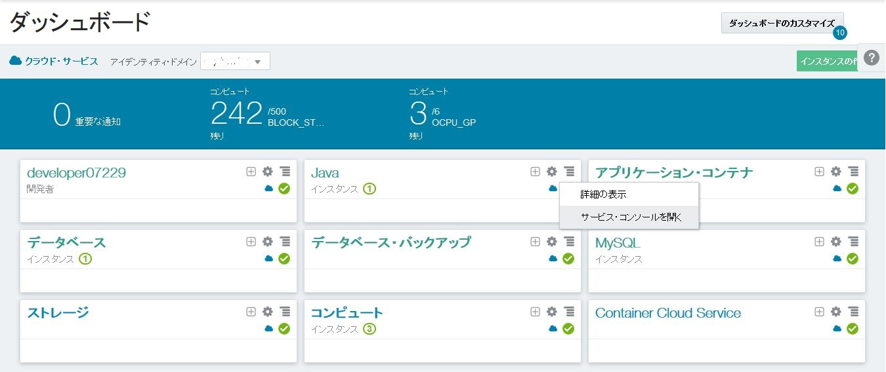
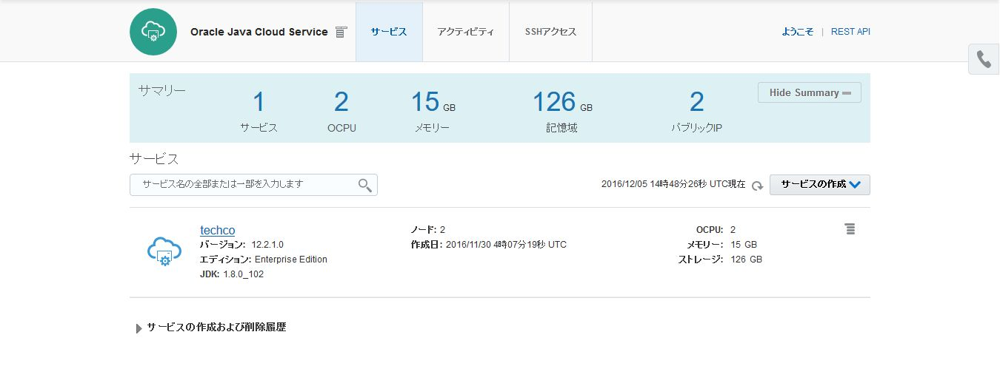
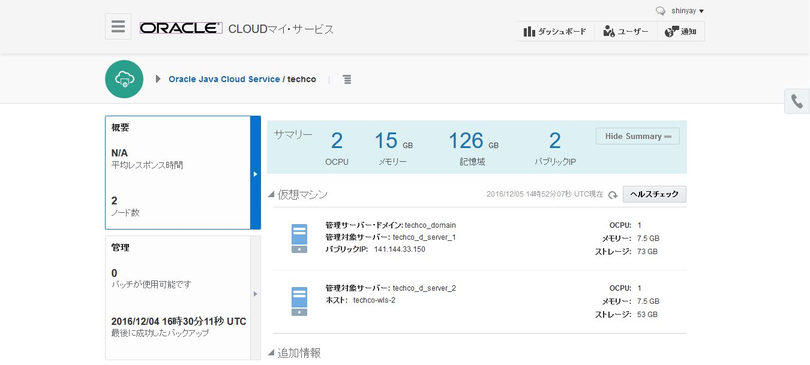
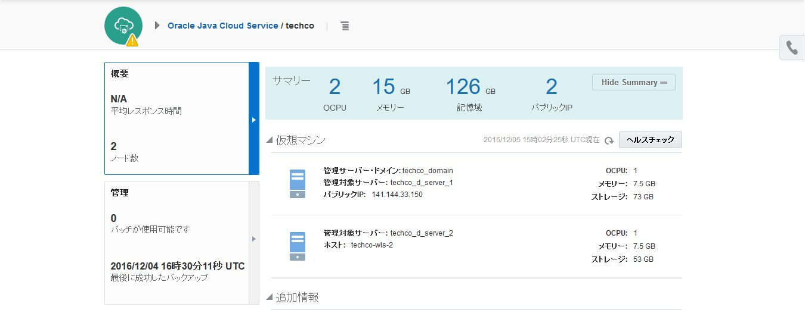

---
# ORACLE Cloud-Native DevOps workshop
----
## PSM コマンド・ライン・インターフェースを用いた Java Cloud Service のスケール・イン

### このチュートリアルについて

Oracle は、PaaS Service Manager (PSM) コマンド・ライン・インターフェースを提供しており、これを使って Application Container Cloud Service や、Database Cloud Service, Java Cloud Service をコマンドやシェルスクリプトから作成、監視、また管理を行う事ができる。

PSM に関するさらなる情報は、[documentation](https://docs.oracle.com/cloud/latest/jcs_gs/jcs_cli.htm) を参照。

### 前提

- チュートリアル: [TechCo (Java EE) サンプル・アプリケーションの Java Cloud Service へのデプロイ](../jcs-deploy/README.md) を実施済みである事。
- チュートリアル: [UI を用いた Java Cloud Service クラスタのスケール・アウト](../jcs-scale-ui/README.md) を実施済みである事、または 2ノード・クラスタである事。
- [cURL command-line tool](http://curl.haxx.se/download.html) を使用できる事。Linux では多くのディストリビューションでcURLはインストール済である。また、Windowsへのインストールも容易に行える。また、REST APIを実行するその他のツールをダウンロードして使用する事もできる。 (cURLのインストール方法はこのチュートリアルの対象外である。)
- Python 3.3 以降がインストールされている事。(Python のインストール方法はこのチュートリアルの対象外である。)

### 手順
#### Download the latest version of command line tool ####

まず、PSM CLI コマンド・ライン・ツールの最新版をダウンロードするために、REST API のサーバ名を確認する。
- **psm.us.oraclecloud.com**: US のデータセンターにログインするアカウントの場合
- **psm.europe.oraclecloud.com**: US 以外のアカウントの場合

cURL でリクエスト送信する。次のフォーマットで実施:

``` bash
curl -X GET -u username:password -H X-ID-TENANT-NAME:<identitydomain> https://<rest-server>/paas/core/api/v1.1/cli/<identitydomain>/client -o /u01/psmcli.zip
```

これにより、レスポンスデータを `psmcli.zip` に書き込む。

ターミナルを開き、上記 cURL コマンドに認証情報、REST API サーバ名、アイデンティティ・ドメイン名をつけて実行する。

```bash
$ curl -X GET -u shinyay:password -H X-ID-TENANT-NAME:iddomain https://psm.europe.oraclecloud.com/paas/core/api/v1.1/cli/iddomain/client -o /u01/psmcli.zip

% Total    % Received % Xferd  Average Speed   Time    Time     Time  Current
                               Dload  Upload   Total   Spent    Left  Speed
100 47570    0 47570    0     0  18415      0 --:--:--  0:00:02 --:--:-- 18982
```


`/u01` に移動し、ダウンロードした **psmcli.zip** ファイルを確認する。

```bash
$ cd /u01
$ ls -l
合計 56060
drwxr-xr-x 1 syanagih なし        0 12月  4 01:15 apache-tomcat-8.5.6
-rw-r--r-- 1 syanagih なし  9304958 10月  7 05:39 apache-tomcat-8.5.6.tar.gz
-rw-r--r-- 1 syanagih なし    47570 12月  5 04:32 psmcli.zip
-rw-r--r-- 1 syanagih なし 48044089 12月  4 00:50 tomcat.sample.tgz
```

#### PSM コマンド・ライン・インターフェースのインストール

Python のパッケージとして、PSM CLI をインストールする。

ターミナルを開き、`/u01` ディレクトリに移動し、***PIP*** を使って Python パッケージにインストールする。

```bash
$ cd /u01
$ pip install -U ./psmcli.zip
Processing ./psmcli.zip
Collecting requests<=2.8.1,>=2.7.0 (from psmcli==1.1.10)
  Downloading requests-2.8.1-py2.py3-none-any.whl (497kB)
    100% |████████████████████████████████| 501kB 1.5MB/s
Collecting keyring<=5.6,>=5.4 (from psmcli==1.1.10)
  Downloading keyring-5.6.tar.gz (69kB)
    100% |████████████████████████████████| 71kB 3.5MB/s
Collecting colorama==0.3.3 (from psmcli==1.1.10)
  Downloading colorama-0.3.3.tar.gz
Collecting PyYAML==3.11 (from psmcli==1.1.10)
  Downloading PyYAML-3.11.zip (371kB)
    100% |████████████████████████████████| 378kB 1.9MB/s
Building wheels for collected packages: keyring, colorama, PyYAML
  Running setup.py bdist_wheel for keyring ... done
  Stored in directory: /home/syanagih/.cache/pip/wheels/19/3c/d7/44703da2a323b0126bd306331a1930ef7491ef021d3998aa28
  Running setup.py bdist_wheel for colorama ... done
  Stored in directory: /home/syanagih/.cache/pip/wheels/21/c5/cf/63fb92293f3ad402644ccaf882903cacdb8fe87c80b62c84df
  Running setup.py bdist_wheel for PyYAML ... done
  Stored in directory: /home/syanagih/.cache/pip/wheels/4a/bf/14/d79994d19a59d4f73efdafb8682961f582d45ed6b459420346
Successfully built keyring colorama PyYAML
Installing collected packages: requests, keyring, colorama, PyYAML, psmcli
  Running setup.py install for psmcli ... done
Successfully installed PyYAML-3.11 colorama-0.3.3 keyring-5.6 psmcli-1.1.10 requests-2.8.1
```

#### コマンド・ライン・インターフェースの確認

PSM CLI コマンドを実施する前に、Oracle Cloud への接続を確認する

ターミナルを開き、`psm setup` コマンドを実行する。そして、クラウド・ユーザ名と、パスワード、アイデンティティ・ドメイン名を入力する。

```bash
$ psm setup
Username: shinyay
Password:
Retype Password:
Identity domain: iddomain
Region [us]: emea
Output format [json]:
----------------------------------------------------
'psm setup' was successful. Available services are:

  o CONTAINER : Oracle Container Cloud Service
  o CloudStack : Oracle Cloud Stack
  o IDCS : Oracle Identity Cloud Service
  o MySQLCS : Oracle MySQL Cloud Service
  o accs : Oracle Application Container Cloud Service
  o dbcs : Oracle Database Cloud Service
  o ggcs : Oracle GoldenGate Cloud Service
  o jcs : Oracle Java Cloud Service
  o stack : Oracle Cloud Stack Manager
----------------------------------------------------
```

CLI は使用できるコマンドをヘルプを提供している。使用するには、`psm help` を実行する。

```bash
$ psm help

DESCRIPTION
  A command line tool to interact with Oracle Cloud Platform Services (PaaS)

SYNOPSIS
  psm <service> <command> [parameters]

AVAILABLE SERVICES
  o CONTAINER
       Oracle Container Cloud Service
  o CloudStack
       Oracle Cloud Stack
  o IDCS
       Oracle Identity Cloud Service
  o MySQLCS
       Oracle MySQL Cloud Service
  o accs
       Oracle Application Container Cloud Service
  o dbcs
       Oracle Database Cloud Service
  o ggcs
       Oracle GoldenGate Cloud Service
  o jcs
       Oracle Java Cloud Service
  o stack
       Oracle Cloud Stack Manager
  o setup
       Configure psm client options
  o update
       Update psm client to latest version
  o log
       View or update psm client log level
  o help
       Show help

AVAILABLE PARAMETERS
  -v, --version
       Show current version of psm client
```

Java Cloud Service で使用できるコマンドを表示する:

```bash
$ psm jcs help

DESCRIPTION
  Oracle Java Cloud Service

SYNOPSIS
  psm jcs <command> [parameters]

AVAILABLE COMMANDS
  o services
       List all Oracle Java Cloud Service instances
  o service
       List an Oracle Java Cloud Service instance
  o create-service
       Create an Oracle Java Cloud Service instance
  o import
       Migrate an OnPremise WLS Domain to the Oracle Java Cloud Service instance
  o delete-service
       Delete an Oracle Java Cloud Service instance
  o stop
       Stop an Oracle Java Cloud Service instance, Managed Server or load balancer...
  o start
       Start an Oracle Java Cloud Service instance, Managed Server or load...
  o restart
       Restart an Oracle Java Cloud Service instance, Administration Server,...
  o scale-out
       Add a new Managed Server to the specified cluster to scale-out the Oracle...
  o scale-in
       Remove a Managed Server to scale-in the Oracle Java Cloud Service instance...
  o scale-up
       Scale the specified Administration Server or Managed Server node on an...
  o scale-down
       Scale the specified Administration Server or Managed Server node on an...
  o view-backup-config
       List backup configuration of an Oracle Java Cloud Service instance
  o update-backup-config
       Update backup configuration of an Oracle Java Cloud Service instance
  o view-backups
       List all backups of an Oracle Java Cloud Service instance
  o view-backup
       List a backup of an Oracle Java Cloud Service instance
  o backup
       Initiate an on-demand backup for an Oracle Java Cloud Service instance
  o delete-backup
       Delete a backup of an Oracle Java Cloud Service instance
  o view-restores
       List all restore operations for an Oracle Java Cloud Service instance
  o view-restore
       List a specified restore operation for an Oracle Java Cloud Service instance.
  o restore
       Restore an Oracle Java Cloud Service instance from the specified backup....
  o available-patches
       List all available patches for an Oracle Java Cloud Service instance
  o applied-patches
       List all applied patches for an Oracle Java Cloud Service instance
  o precheck-patch
       Precheck to identify potential issues that might prevent the specified...
  o patch
       Apply a patch to an Oracle Java Cloud Service instance
  o rollback
       Roll back a patch for an Oracle Java Cloud Service instance
  o operation-status
       View status of an Oracle Java Cloud Service instance operation
  o access-rules
       List access rules for Oracle Java Cloud Service instance
  o create-access-rule
       Create an access rule for Oracle Java Cloud Service instance
  o delete-access-rule
       Delete an access rule for Oracle Java Cloud Service instance
  o enable-access-rule
       Enable an access rule for Oracle Java Cloud Service instance
  o disable-access-rule
       Disable an access rule for Oracle Java Cloud Service instance
  o help
       Show help

```

特定のコマンドで使用できるパラメータについて表示する。例:

```bash
$ psm jcs create-service help

DESCRIPTION
  Create an Oracle Java Cloud Service instance

SYNOPSIS
  psm jcs create-service [parameters]
       -c, --config-payload <value>
       [-of, --output-format <value>]

AVAILABLE PARAMETERS
  -c, --config-payload    (file)
       Path to JSON file containing Oracle Java Cloud Service provisioning
       configuration parameters

  -of, --output-format    (string)
       Desired output format. Valid values are [json, html]

EXAMPLES
  psm jcs create-service -c /home/templates/create-jcs-service.json

```

#### コマンド・ライン・インターフェースの使用

まず、アイデンティティ・ドメイン上に構成されている Java Cloud Service インスタンスの一覧を表示する。
First list the Java Cloud Services in the configured identity domain:

```json
$ psm jcs services
{
    "uri":"https://psm.europe.oraclecloud.com/paas/service/jcs/api/v1.1/instances/iddomain",
    "service_type":"jaas",
    "implementation_version":"1.0",
    "services":[
        {
            "service_name":"techco",
            "version":"12cRelease2",
            "wlsVersion":"12.2.1.0.160719",
            "status":"Running",
            "error_status_desc":"",
            "compliance_status":"",
            "compliance_status_desc":"",
            "auto_update":"true",
            "description":"TechCo \u30b5\u30f3\u30d7\u30eb\u30fb\u30a2\u30d7\u30ea\u30b1\u30fc\u30b7\u30e7\u30f3\u5b9f\u884c\u74b0\u5883",
            "identity_domain":"iddomain",
            "creation_time":"2016-11-30T04:07:19.603+0000",
            "last_modified_time":"2016-11-30T04:07:17.350+0000",
            "created_by":"shinyay",
            "service_uri":"https://psm.europe.oraclecloud.com/paas/service/jcs/api/v1.1/instances/iddomain/techco"
        }
    ]
}
```

特定のサービスに関する詳細情報を取得するために、`psm jcs service -s <サービス名>` コマンドを使用する。
To get more details about specific service use psm service -s servicename command:

```json
$ psm jcs service -s techco
{
    "service_name":"techco",
    "version":"12cRelease2",
    "wlsVersion":"12.2.1.0.160719",
    "status":"Running",
    "error_status_desc":"",
    "compliance_status":"",
    "compliance_status_desc":"",
    "auto_update":"true",
    "description":"TechCo \u30b5\u30f3\u30d7\u30eb\u30fb\u30a2\u30d7\u30ea\u30b1\u30fc\u30b7\u30e7\u30f3\u5b9f\u884c\u74b0\u5883",
    "identity_domain":"iddomain",
    "creation_time":"2016-11-30T04:07:19.603+0000",
    "last_modified_time":"2016-11-30T04:07:17.350+0000",
    "created_by":"shinyay",
    "service_uri":"https://psm.europe.oraclecloud.com/paas/service/jcs/api/v1.1/instances/iddomain/techco",
    "domain_name":"techco_domain",
    "domain_mode":"PRODUCTION",
    "cluster_name":"techco_cluster",
    "num_nodes":2,
    "level":"PAAS",
    "subscription_type":"MONTHLY",
    "edition":"EE",
    "shape":"oc3",
    "otd_provisioned":"no",
    "ocpu_count":2,
    "memory_size":15,
    "storage_size":126,
    "service_components":[
        {
            "type":"JDK",
            "version":"1.8.0_102"
        },
        {
            "type":"OTD",
            "version":"12.2.1.0.160719"
        },
        {
            "type":"OTD_JDK",
            "version":"1.8.0_102"
        },
        {
            "type":"WLS",
            "version":"12.2.1.0.160719"
        }
    ],
    "creation_job_id":"3014363",
    "deletion_job_id":0,
    "db_info":"techcoDB:1521/PDB1.iddomain.oraclecloud.internal",
    "db_service_name":"techcoDB",
    "db_service_uri":"https://psm.europe.oraclecloud.com/paas/service/dbcs/api/v1.1/instances/iddomain/techcoDB",
    "useStackTag":"false",
    "num_ip_reservations":2,
    "wls_admin_url":"https://141.144.33.150:7002/console",
    "fmw_control_url":"https://141.144.33.150:7002/em",
    "sample_app_url":"https://141.144.33.150/sample-app/",
    "content_url":"http://141.144.33.150",
    "secure_content_url":"https://141.144.33.150",
    "wls_deployment_channel_port":9001,
    "psm_plugin_version":"16.4.3-541",
    "compute_site_name":"EM003_Z18",
    "db_associations":[
        {
            "db_service_name":"techcoDB",
            "db_infra":true,
            "db_connect_string":"techcoDB:1521/PDB1.iddomain.oraclecloud.internal",
            "pdb_service_name":"PDB1",
            "db_version":"12.1.0.2"
        }
    ]
}
```

このターミナルは開いたままにしておく。

#### PSM CLI を用いた Java Cloud Service クラスタのスケール・イン

まず、事前に実施したスケール・アウト要求が終了したか確認する必要がある。Oracle Cloud へ[サインイン](../common/sign.in.to.oracle.cloud.md) し [(https://cloud.oracle.com/sign-in)](https://cloud.oracle.com/sign-in)、ログイン後、ダッシュボード画面の Java Cloud Service のドロップダウンメニューから **サービス・コンソールを開く** を選択する。
Java Cloud Service コンソールに移動する。




サンプル・アプリケーションをホストしているサービス・インスタンスをクリックする。




2つ目の管理対象サーバ名をチェックする。



PSM CLI  が使用できるターミナルに戻り、スケール・インに関するヘルプを表示する。

```bash
$ psm jcs scale-in help

DESCRIPTION
  Remove a Managed Server to scale-in the Oracle Java Cloud Service instance by
  one node.

SYNOPSIS
  psm jcs scale-in [parameters]
       -s, --service-name <value>
       -n, --name <value>
       [-f, --force <value>]
       [-of, --output-format <value>]

AVAILABLE PARAMETERS
  -s, --service-name    (string)
       Name of the Oracle Java Cloud Service instance

  -n, --name    (string)
       Name of the Managed Server to remove

  -f, --force    (boolean)
       Flag that specifies whether you want to force the removal of the Managed
       Server, regardless of whether there are processes running. This value defaults
       to false.

  -of, --output-format    (string)
       Desired output format. Valid values are [json, html]

EXAMPLES
  psm jcs scale-in -s ExampleInstance -n ExampleI_server_4

```

ヘルプによると、**techco** サービスでスケール・インするために必要なパラメータを与える必要がある。

```json
$ psm jcs scale-in -s techco -n techco_d_server_2
{
    "status":"New",
    "details":{
        "message":"JAAS-SCALING-044: Scaling in Job (ID: 3086199) server name [techco_d_server_2] submitted for service [techco]",
        "jobId":"3086199"
    }
}
Job ID : 3086199
```

レスポンスデータにサブミットされたスケーリング・ジョブが表示されている。Job ID を使ってジョブに関するさらなる情報を取得する事ができる。

```json
$ psm jcs operation-status -j 3086199
{
    "activityLogId":1326507,
    "serviceName":"techco",
    "serviceType":"jaas",
    "identityDomain":"usprivatejcs",
    "serviceId":87156,
    "jobId":3086199,
    "startDate":"2016-12-05T14:59:32.938+0000",
    "endDate":"2016-12-05T15:05:26.674+0000",
    "status":"SUCCEED",
    "host":"techco-wls-2",
    "serverType":"WLS",
    "operationId":87156,
    "operationType":"SCALE_IN",
    "summaryMessage":"techco_d_server_2",
    "authDomain":"usprivatejcs",
    "authUser":"shinyay",
    "initiatedBy":"USER",
    "resourceName":"techco-wls-2",
    "resourceType":"VM",
    "resourceId":97931,
    "messages":[
        {
            "activityDate":"2016-12-05T14:59:32.938+0000",
            "message":"Activity Submitted"
        },
        {
            "activityDate":"2016-12-05T14:59:38.403+0000",
            "message":"Activity Started"
        },
        {
            "activityDate":"2016-12-05T14:59:38.528+0000",
            "message":"Scaling job for service [techco] in cluster [techco_cluster] with factor [1] is prepared."
        },
        {
            "activityDate":"2016-12-05T14:59:42.465+0000",
            "message":"Completed submitting config lock script on service [techco]"
        },
        {
            "activityDate":"2016-12-05T15:01:04.091+0000",
            "message":"Scale in host [techco-wls-2] is permitted, proceeding to next action"
        },
        {
            "activityDate":"2016-12-05T15:01:04.383+0000",
            "message":"Completed submitting OTD script for remote execution on service [techco]"
        },
        {
            "activityDate":"2016-12-05T15:01:05.776+0000",
            "message":"Completed submitting shutdown script for remote execution on service [techco]"
        },
        {
            "activityDate":"2016-12-05T15:02:07.112+0000",
            "message":"Successfully created IAAS resource removal child job for service [techco-wls-2]"
        },
        {
            "activityDate":"2016-12-05T15:04:16.408+0000",
            "message":"Stopped Virtual Machine wls/vm-2..."
        },
        {
            "activityDate":"2016-12-05T15:04:22.613+0000",
            "message":"Removed Virtual Machine wls/vm-2..."
        },
        {
            "activityDate":"2016-12-05T15:04:22.734+0000",
            "message":"Child job [3086205] completed removing all compute resources for host [techco-wls-2]."
        },
        {
            "activityDate":"2016-12-05T15:04:24.090+0000",
            "message":"Completed submitting domain config verify script for remote execution on service [techco]"
        },
        {
            "activityDate":"2016-12-05T15:05:26.638+0000",
            "message":"Successfully scaled in host [techco-wls-2]"
        },
        {
            "activityDate":"2016-12-05T15:05:26.674+0000",
            "message":"Activity Ended"
        }
    ]
}
```

サービス詳細画面を開いているブラウザに戻り、リフレッシュアイコンやトポロジタイルクリックする。トポロジのタイルには、***スケーリング中...*** と表示され、サービス・インスタンスはメンテナンス状態 ( アイコン表示) に変更となる。変更されなかった場合は、リフレッシュアイコンをクリックして、ページを更新する。




