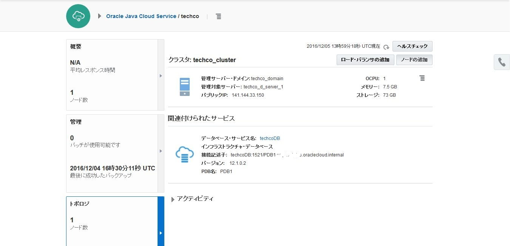
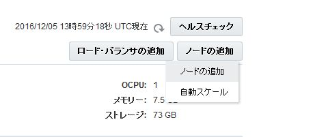
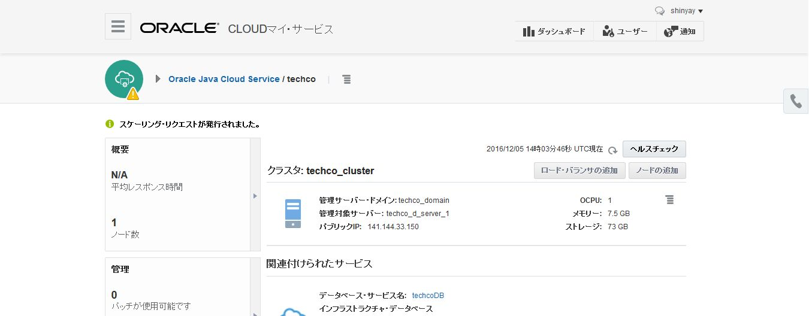
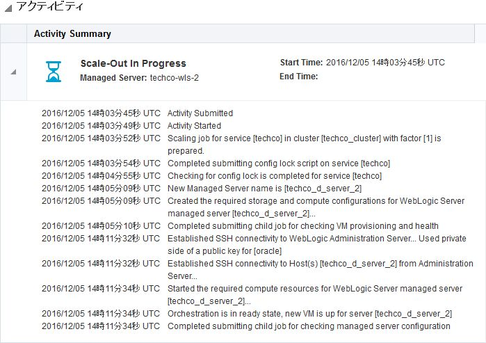

---
# ORACLE Cloud-Native DevOps workshop
----
## UI を用いた Java Cloud Service クラスタのスケール・アウト

### このチュートリアルについて

Java Cloud Service クラスタではスケール・アウトを行い、クラスタに1ノード追加する事ができる。スケール・アウトする際に、Java Cloud Service は WebLogic Server 管理対象サーバインスタンスが稼働する新しい VM を作成する。

また、ノードをスケール・アップする事もできる。Java Cloud Service インスタンスのスケールに関するさらなる情報は、[documentation](https://docs.oracle.com/cloud/latest/jcs_gs/JSCUG/GUID-02D79DE3-643B-44B9-A979-340BD472B529.htm#JSCUG3289) を参照。

### 前提

- チュートリアル: [TechCo (Java EE) サンプル・アプリケーションの Java Cloud Service へのデプロイ](../jcs-deploy/README.md) を実施済みである事。

### 手順

Java Cloud Service コンソールに移動する。Oracle Cloud へ[サインイン](../common/sign.in.to.oracle.cloud.md) し [(https://cloud.oracle.com/sign-in)](https://cloud.oracle.com/sign-in)、ログイン後、ダッシュボード画面の Java Cloud Service のドロップダウンメニューから **サービス・コンソールを開く** を選択する。
Java Cloud Service コンソールに移動する。

サンプル・アプリケーションをホストしているサービス・インスタンスをクリックする。

トポロジ画面に移動し、**ノードの追加** をクリックする。

ポップアップ・メニューから **ノードの追加** を選択する。

スケールアウトの実施を確認し、**ノードの追加** を選択する。

トポロジのタイルには、***スケーリング中...*** と表示され、サービス・インスタンスはメンテナンス状態 (
 アイコン表示) に変更となる。変更されなかった場合は、リフレッシュアイコンをクリックして、ページを更新する。

 

 

 また、スケールアウトの進行中の履歴が **アクティビティ** をクリックすると確認できる。

 

新しいノードの VM は、元々作成していたサービス・インスタンスとコンピュート・シェイプとストレージ容量を持つ。必要ならば、コンピュート・シェイプやストレージは[Scaling an Oracle Java Cloud Service Node](https://docs.oracle.com/cloud/latest/jcs_gs/JSCUG/GUID-8DD460BA-708C-4B90-822F-4E4D64C59F77.htm#GUID-8DD460BA-708C-4B90-822F-4E4D64C59F77) に説明があるように変更する事ができる。
