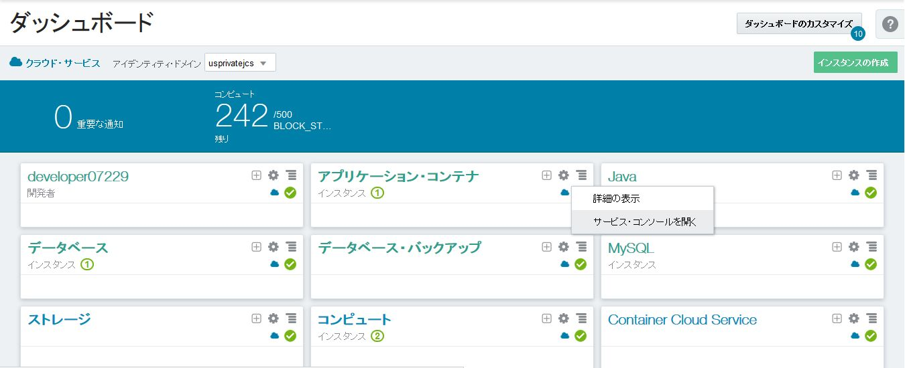
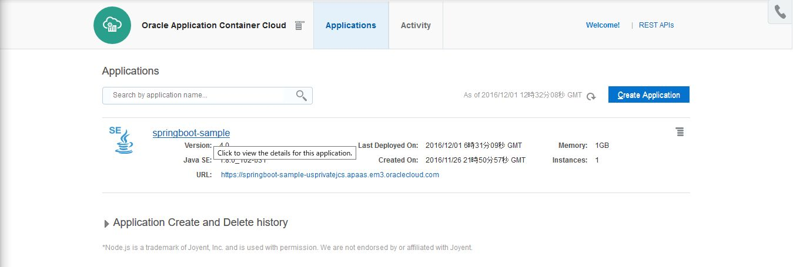
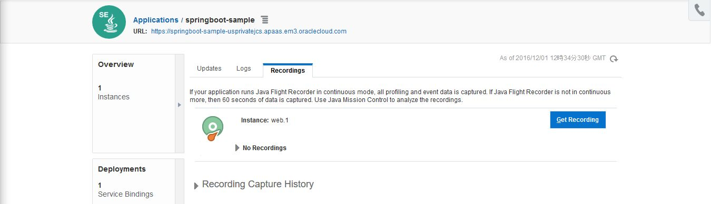
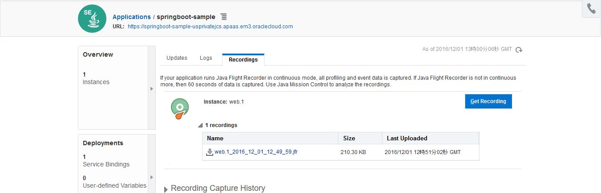
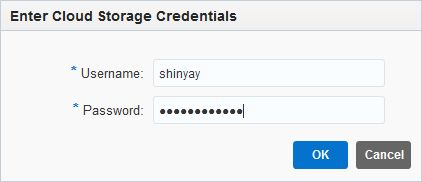
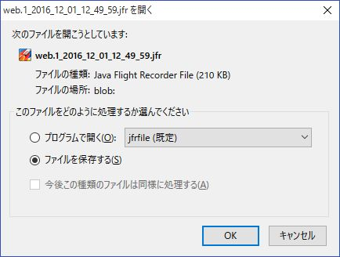
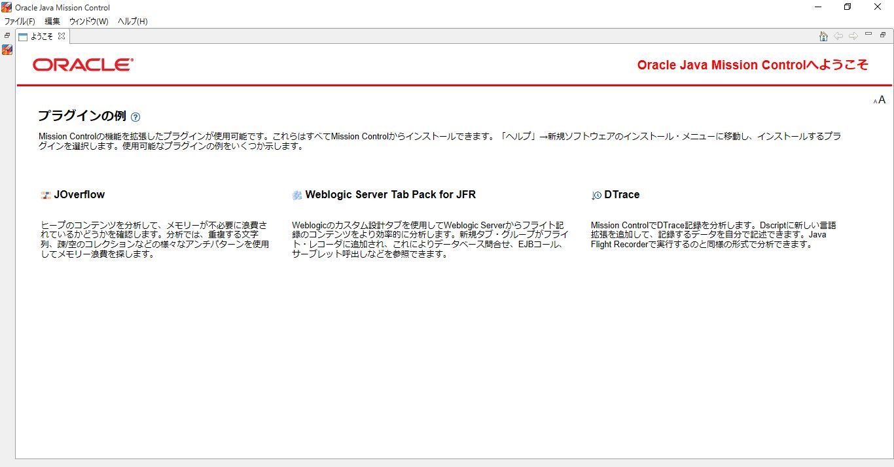
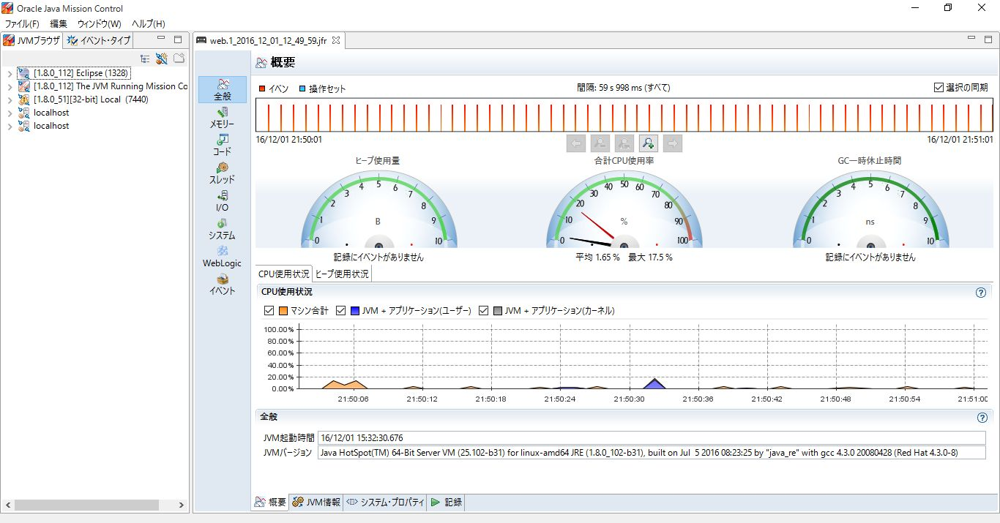

---
# ORACLE Cloud-Native DevOps workshop
-----
## Application Conytainer Cloud Service 上のSpring Boot アプリケーションの監視及びチューニング

### 説明

アプリケーションを監視したり問題対応するためにアプリケーション・ログの確認をしたい事がある。ログはStorage Cloud Service 上に保存される。また、Java Flight Recorder 及び Java Mission Control を使用して Java アプリケーションの監視をこなう事ができる。さらにアプリケーションは Storage Cloud Service 上に保存されているログ・ファイルに対しえt書き出すことができる。

Java Mission Control (JMC) は、通常この類のツールに発生するオーバーヘッドを発生させずに監視及び管理を行う事ができる。JMC はJVMの動的最適化で収集されるデータえをえ使用するためオーバーヘッドが低い。オーバーヘッドを最小化する事に加えて、監視ツールがシステムの実行特性を変更するという監視影響の問題を排除する事ができる。

Java Flight Recorder (JFR) はヒストリック分析やプロファイリングに用いる詳細な性能特性を収集し保存する。JMC クライアントのプラグインとして使用されると、論理的に分類されたテーブルやチャート、指針により診断情報を表示する。

各アプリケーションにおいて1回に60秒間の記録を行う事ができる。もし、複数インスタンスがある場合は、各インスタンスで記録を行う。Java Mission Control を使用してデータを取り出し検証する事ができる。またデータを元にチューニングを行う事ができる。

### チュートリアルについて
このチュートリアルは、以下を実施する:

- OEPE Cloud Tooling を使用してアプリケーション・ログを取得し確認する
- Java Flight Recorder ログを作成・取得し Java Mission Control で開く

### 前提

- 以下のチュートリアルを実施済みである事
  - [Spring Boot アプリケーション用のDeveloper Cloude Service プロジェクトの作成](../springboot-sample/create.devcs.project.md)
  - [Developer Cloud Service と Application Container Cloud Service を用いた継続的ビルド・インテグレーションの作成](../springboot-sample/devcs.accs.ci.md)
  - [Developer Cloud Service を用いた Eclipse 統合開発環境 (Oracle Enterprise Pack for Eclipse) の利用](../oepe/setup.oepe.md)

### 手順

#### OEPE Cloud Tooling を使用してアプリケーション・ログを取得する

OEPE を開き、Oracle Cloud の接続をアクティベートする。OEPE でログを開くために、次のように展開する。**[接続名]** -> **Applications** -> **[ACCS アプリケーション名]** -> **web.1** -> **Logs**

ログが存在しない場合は、**Logs** を右クリックしてメニューから **Generate Log** を選択する。Application Container Cloud Service はアプリケーションの最新のログを梱包するためにしばらく時間がかかる。


**Logs** を展開し配下の一覧からログを選択する。ログを開くためにログ・ファイルを **ダブルクリックをする** か、**右クリックしてOpenを選択する**。 OEPEでログを開き内容を確認する事ができる。


ログはアイデンティティ・ドメインに属しているStorage Cloud Service に保存される。このログ・ファイルは REST API を用いて取得する事もできる。さらなる情報は[documentation](http://docs.oracle.com/cloud/latest/apaas_gs/DVCJV/GUID-19455093-3D4E-46AD-B203-37BA1BB51874.htm#DVCJV-GUID-19455093-3D4E-46AD-B203-37BA1BB51874) を参照。

#### Application Container Cloud Service ユーザ・インターフェースを用いた Java Flight Recorder ログの作成と取得

Oracle Cloud へ[サインイン](../common/sign.in.to.oracle.cloud.md) する [(https://cloud.oracle.com/sign-in)](https://cloud.oracle.com/sign-in)。
ログイン後、ダッシュボード画面の Application Container Cloud Service のドロップダウンメニューから **サービス・コンソールを開く** を選択する。




Application Container Cloud Service インスタンスをクリックする




詳細画面で、**Administration** タイルをクリックし、**Recoredings** タブを選択する。Java Flight Recorder ログを作成するために **Get Recording** をクリックする。



これはアプリケーションがリクエスト処理に取り組んでいる際に詳細情報を記録する最適な手段である。Get Recording ボタンの裏では、REST を用いた管理インターフェースに対してシンプルな要求を行っている。例えば性能問題が見られるときに、この手段をトリガーに監視システムを使用できる。

記録は60秒間かかる。この時間内でブラウザを使用して繰り返しページのリフレッシュを行い、サーバサイドの生成処理を発生させる。ログの準備ができると、ログ名が表示される。ログ名をクリックする。




認証情報を入力する必要がある。入力するとログファイルをダウンロードできる。






Java Flight Recorder 自体はプロファイリングであり、Oracle JDK の中に組み込まれているイベント収集フレームワークである。ログ情報を分析するためには、Java Mission Control が必要となる。Java Mission Control はJava Flight Recorder に収集されたデータを効果的かつ詳細に分析するツールセットである。Java Mission Control も Oracle JDK の一部である。ログを開くために、次を実行する:

```bash
[oracle@localhost Desktop]$ $JAVA_HOME/bin/jmc
```

これで Java Mission Control の GUI が起動する。




ウェルカム・ページを閉じ、**ファイル -> ファイルを開く...** をクリックし、先にダウンロードした JAva Flight Recorder ファイルを選択する。次のように表示される:



全般画面でヒープ使用量のピークや、CPUの使用率、GC一時休止時間などの環境に関する概要情報を確認できる。アプリケーションに関する問題を識別するために多くのパースペクティブから様々な情報を見つける事ができる。
Java Mission Control に関するさらなる情報は、[Oracle Technology Network](http://www.oracle.com/technetwork/java/javaseproducts/mission-control/java-mission-control-1998576.html) を参照。
