---
# ORACLE Cloud-Native DevOps workshop
-----
## Developer Cloud Service を利用したSpring Boot サンプル・アプリケーションのApplication Container Cloud Service へのデプロイ

### 前提

- Developer Cloud Service が利用できるアカウントを保有している事

----

#### Developer Cloud Service プロジェクトの作成

Oracle Cloud へサインインする[(https://cloud.oracle.com/sign-in)](https://cloud.oracle.com/sign-in)。
データセンターを選択し、アイデンティティドメインとアカウント情報を入力してログインする。
ログイン後、ダッシュボード画面の Developer Cloud Service のドロップダウンメニューから **サービス・コンソールを開く** を選択する。


Developer Cloud Service にログインし、**New Project** を選択し新しいプロジェクトを作る。


プロジェクト名を入力し、**Next** をクリックする。


テンプレートに***Initial Repository*** を選択し**Next** をクリックする。


Initial Repository に**Import existing repository**を選択し、***https://github.com/oracle/cloud-native-devops-workshop.git*** を入力する。


そして、**Finish** をクリックして、指定したGitリポジトリのクローンを持つプロジェクトを作成する。


### Spring Boot サンプル・アプリケーション用のビルド・ジョブの構成

プロジェクトが作成されたら、Application Container Cloud Service 用のフォーマットのSpring Boot サンプル・アプリケーションのビルド・ジョブを作成する。


左部メニューから、**Build** を選択する。


表示されたビルド画面から、**New Job** をクリックする。

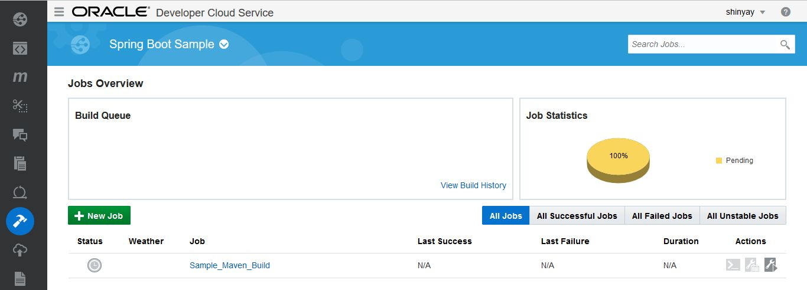


ジョブ名を入力し、***Create a free-style job*** を選択して**Save** をクリックする。

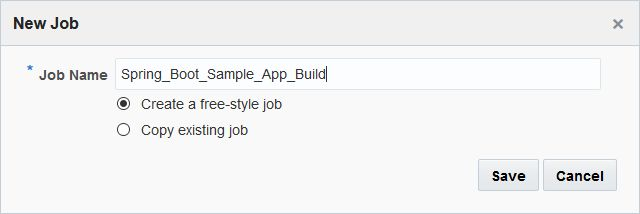


**Main** タブでJDKを **JDK 8** を選択する。

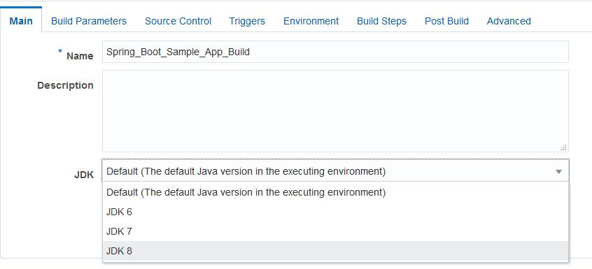


**Source Control** タブに移動し、**Git** を選択する。


**Repository** にクローンした、**spring-boot-sample** リポジトリを選択する。Advanced Repository Settings はデフォルト値のままとする。

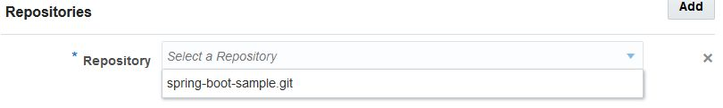


**Triggers** タブに移動し、**Based on SCM polling schedule** を選択する。この構成により、Git で管理するファイルに変更があるとビルド・ジョブが発動するようになる。

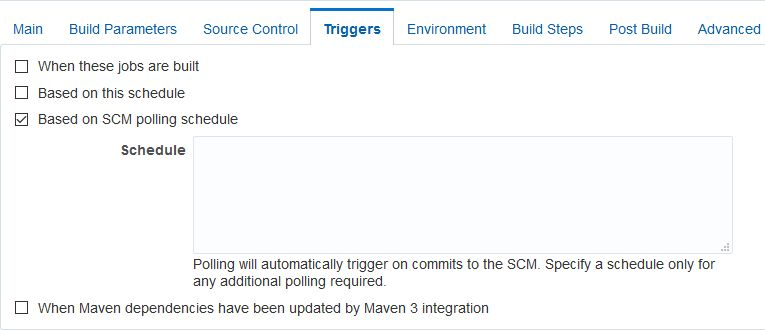


**Build Steps** タブに移動し、**Maven 3** を選択する。

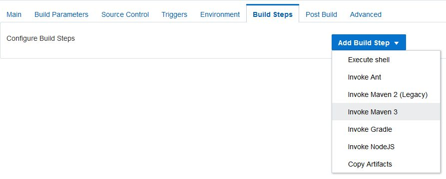


Goalsには **clean install** を設定し、POM Fileには**springboot-sample/pom.xml** を設定する。

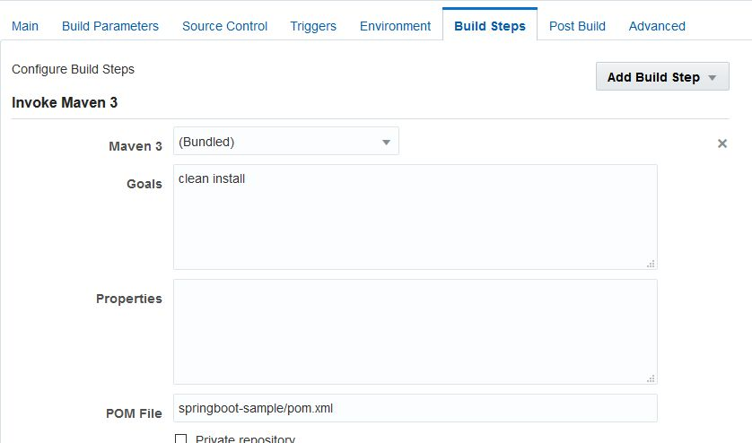


**Post Build** タブに移動し、**Archive the artifacts** を選択する。そして、**Files To Archive** に **springboot-sample/target/\*.zip** を入力する。最後に、**Save** をクリックする。

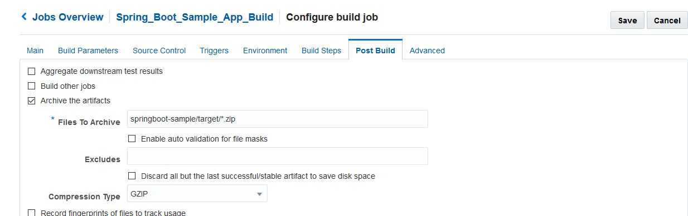


**Build Now** をクリックする。


ビルドが終了すると結果が表示され、アーカイブ・ファイルが作成される。

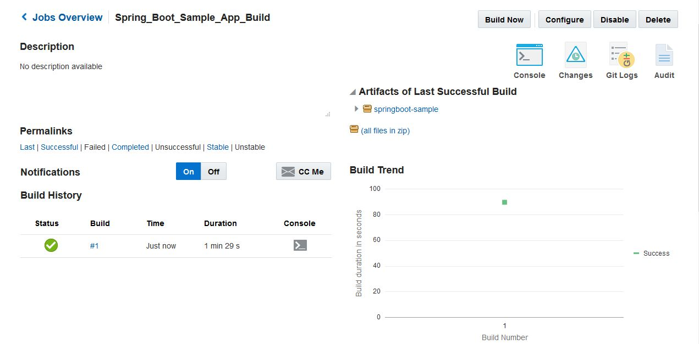


アーカイブ・ファイルを展開すると、`springbootdemo-0.0.1.zip` が表示される。

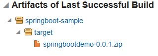


この`springbootdemo-0.0.1.zip` を展開すると `springbootdemo-0.0.1.war` と、 `manifest.json` が含まれている。

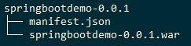


***manifest.json*** でエントリー・ポイントを指定しておくことが、Application Container Cloud Service 用のアプリケーション・フォーマットである。
```json
{
  "runtime": {
    "majorVersion": "8"
  },
  "command": "java -Dserver.port=$PORT -jar springbootdemo-0.0.1.war",
  "notes": "SpringBoot demo application"
}
```

### Application Container Cloud Service のデプロイメント構成 ###

次に、ビルド・ジョブが成功した場合にApplication Container Cloud Service に引き続きデプロイを実施する構成を行う。

左部メニューから、**Deploy** を選択する。


**New Configuration** をクリックする。

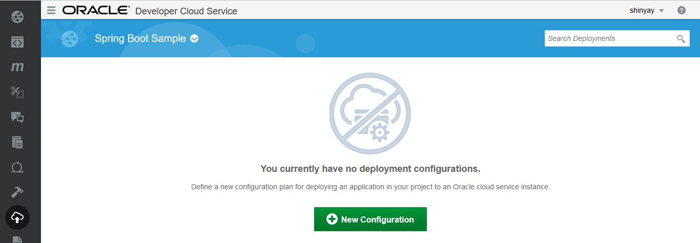


以下の項目を設定する。

- **Configuration Name**: デプロイメント構成を示す名称
- **Application Name**: Application Container Cloud Service のインスタンス名 (アプリケーションのアクセスURLに使用)
- **Deployment Target**: **New** をし、**Application Container Cloud Service** を選択する。

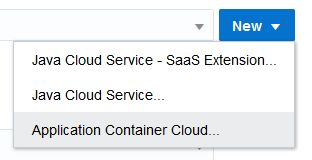


  - **Data center**: データセンタ名
  - **Identity Domain**: アイデンティティドメイン名
  - **Username**: Application Container CS ユーザ名
  - **Password**: Application Container CS パスワード

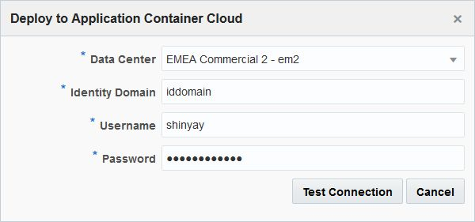

**Test Connection** をクリックし、接続設定の確認を行う。成功し、**Successful** と表示された後に **Use Connection** をクリックする。


- **ACCS Properties/Runtime**: **Java**を選択
- **Type**: **Automatic** を選択
- **Job**: 先に作成したビルド・ジョブを選択
- **Artifact**: ビルドし作成されたアーカイブファイルを選択

**Save** をクリックする。

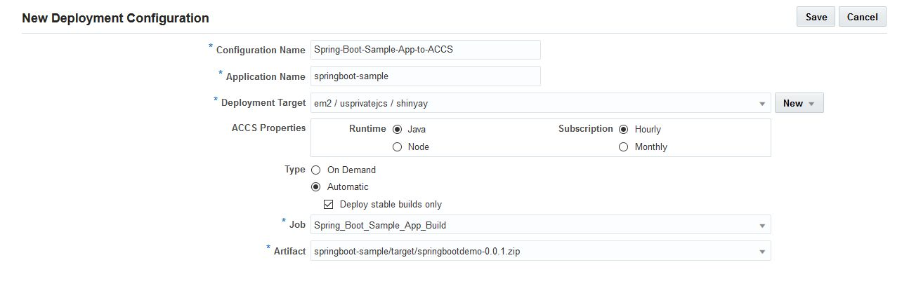


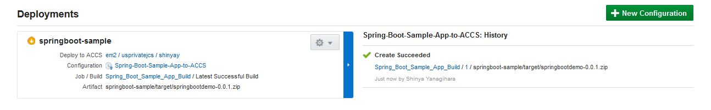

### サンプル・アプリケーションのビルド＆デプロイ ###

Application Container Cloud Service へデプロイするためにビルドを実行する方法は以下の方法がある。

1.**Deployments** からの起動
Deployments 画面のギアアイコンから**Start**を選択する。

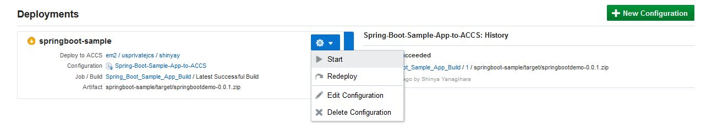


2.**Build** からの起動
Build 画面に登録済みのビルド・ジョブを実行し、成功するとデプロイが実施される。Spring Boot サンプル・アプリケーション用のビルド・ジョブの右端にある **Build Now** をクリックする。

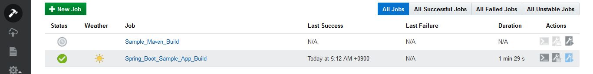


デプロイが終了すると、**Deploy** 画面に結果が表示される。左ペインの **Deploy to ACCS** をクリックすると、Application Container Cloud Service のダッシュボード画面に遷移する。

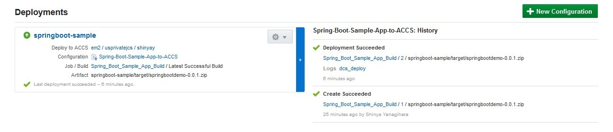


デプロイされたSpring Boot サンプル・アプリケーションが表示される。

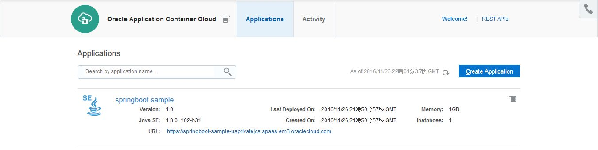


URLをクリックすると、サンプル・アプリケーション画面が表示される。

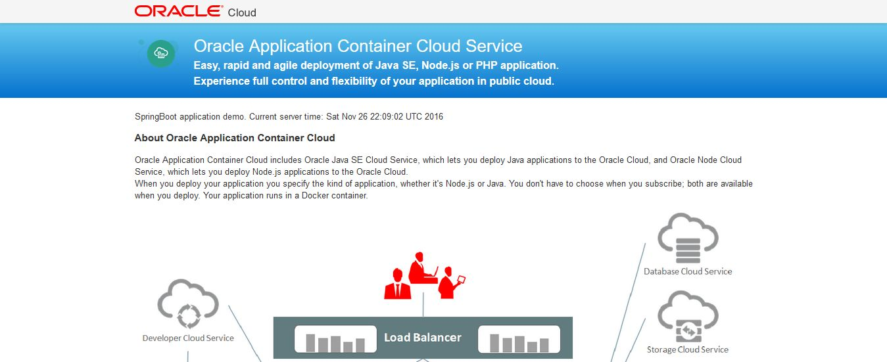
