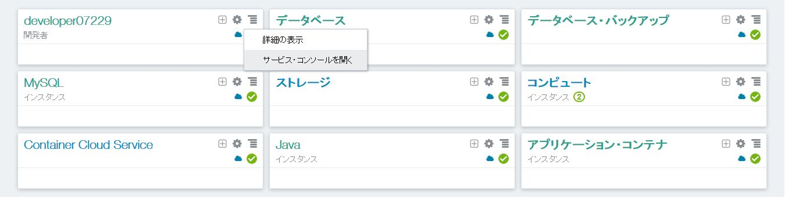
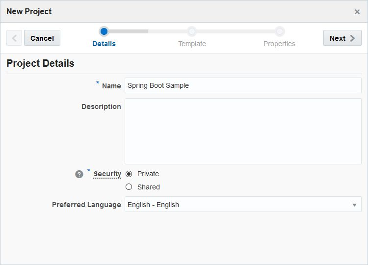
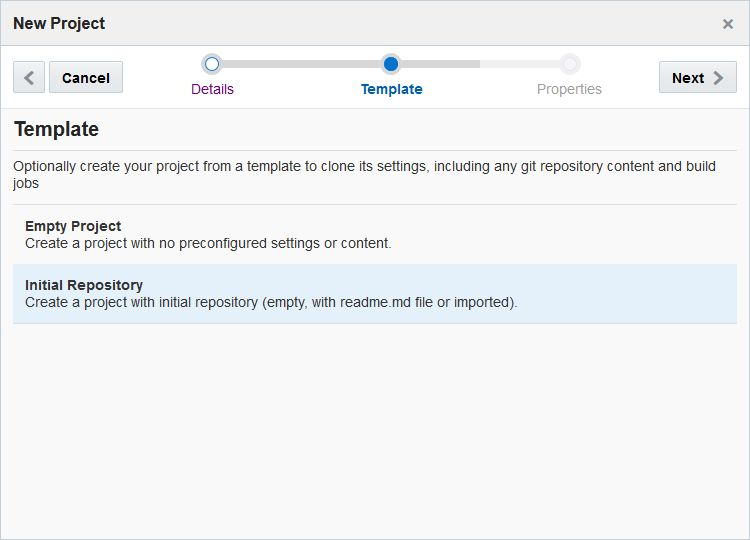
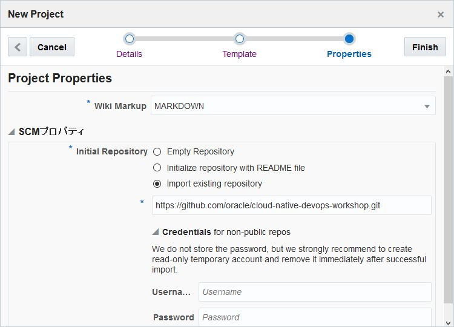
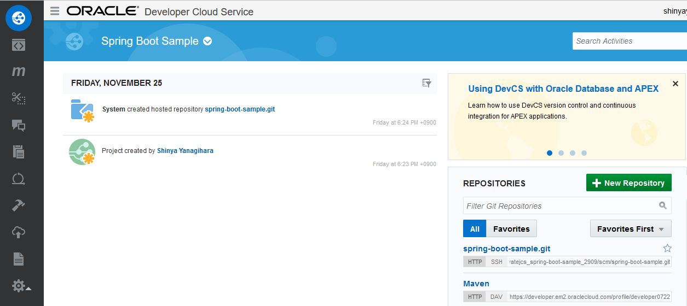

---
# ORACLE Cloud-Native DevOps workshop #

## 初期設定Git リポジトリ用いた Developer Cloud Service プロジェクトの作成

### About this tutorial ###
**Oracle Developer Cloud Service** is a cloud-based software development Platform as a Service (PaaS) and a hosted environment for your application development infrastructure. It provides an open-source standards-based solution to manage the application development life cycle effectively through integration with Hudson, Git, Maven, issues, and wikis. Using Oracle Developer Cloud Service, you can commit your application source code to the Git repository on the Oracle Cloud, track assigned issues and defects online, share information using wiki pages, peer review the source code, and monitor project builds. After successful testing, you can deploy the project to Oracle Java Cloud Service - SaaS Extension, publicly available Oracle Java Cloud Service instances, Oracle Application Container Cloud Service instances, or to an on-premise production environment.

The key features of Oracle Developer Cloud Service include:

Project creation, configuration, and user management

+ Version control and source code management with Git
+ Storage of application dependencies and libraries with Maven
+ Continuous build integration with Hudson
+ Wiki for document collaboration
+ Issue tracking system to track tasks, defects, and features
+ Repository branch merge after code review
+ Deployment to Oracle Java Cloud Service - SaaS Extension, Oracle Java Cloud Service, and Oracle Application Container Cloud Service

Oracle Developer Cloud Service is available as a web interface accessible from a web browser and from Integrated Development Environments (IDEs) such as Oracle Enterprise Pack for Eclipse (OEPE), Oracle JDeveloper, and NetBeans IDE.

This tutorial demonstrates how to:

- create Oracle Developer Cloud Service project using existing external Git repository

### 前提

- Developer Cloud Service が利用できるアカウントを保有している事

----

#### Developer Cloud Service プロジェクトの作成

Oracle Cloud へサインインする[(https://cloud.oracle.com/sign-in)](https://cloud.oracle.com/sign-in)。
データセンターを選択し、アイデンティティドメインとアカウント情報を入力してログインする。
ログイン後、ダッシュボード画面の Developer Cloud Service のドロップダウンメニューから **サービス・コンソールを開く**を選択する。

Developer Cloud Service にログインし、**New Project** を選択し新しいプロジェクトを作る。

プロジェクト名を入力し、**Next** をクリックする。

テンプレートに***Initial Repository*** を選択し**Next** をクリックする。

Initial Repository に**Import existing repository**を選択し、***https://github.com/oracle/cloud-native-devops-workshop.git*** を入力する。

そして、**Finish** をクリックして、指定したGitリポジトリのクローンを持つプロジェクトを作成する。

